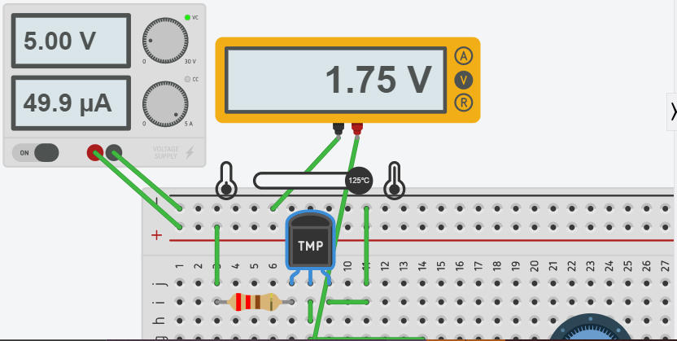

# Sensores

## :trophy: A.1.4 Actividad de aprendizaje

## Objetivo

Realizar un sensor medidor de temperatura a través de un circuito electrónico, utilizando un simulador, y  un **Transistor TMP36** lineal de temperatura y un **amplificador operacional LM741**.

## :blue_book: Instrucciones

- Se sugiere para el desarrollado de la presenta actividad, utilice uno de los siguientes simuladores: [Autodesk Tinkercad](https://www.tinkercad.com/), [Virtual BreadBoard](http://www.virtualbreadboard.com/), [Easy EDA](https://easyeda.com/) por lo cual habrá que familiarizarse antes, e incluso instalarse o registrarse dentro de la plataforma.
- Toda actividad o reto se deberá realizar utilizando el estilo **MarkDown con extension .md** y el entorno de desarrollo VSCode, debiendo ser elaborado como un documento **single page**, es decir si el documento cuanta con imágenes, enlaces o cualquier documento externo debe ser accedido desde etiquetas y enlaces, y debe ser nombrado con la nomenclatura **A1.4_NombreApellido_Equipo.pdf.**
- Es requisito que el .md contenga una etiqueta del enlace al repositorio de su documento en GITHUB, por ejemplo **Enlace a mi GitHub** y al concluir el reto se deberá subir a github.
- Desde el archivo **.md** exporte un archivo **.pdf** que deberá subirse a classroom dentro de su apartado correspondiente, sirviendo como evidencia de su entrega, ya que siendo la plataforma **oficial** aquí se recibirá la calificación de su actividad.
- Considerando que el archivo .PDF, el cual fue obtenido desde archivo .MD, ambos deben ser idénticos.
- Su repositorio ademas de que debe contar con un archivo **readme**.md dentro de su directorio raíz, con la información como datos del estudiante, equipo de trabajo, materia, carrera, datos del asesor, e incluso logotipo o imágenes, debe tener un apartado de contenidos o indice, los cuales realmente son ligas o **enlaces a sus documentos .md**, _evite utilizar texto_ para indicar enlaces internos o externo.
- Se propone una estructura tal como esta indicada abajo, sin embargo puede utilizarse cualquier otra que le apoye para organizar su repositorio.
  
```
- readme.md
  - blog
    - C0.1_x.md
    - C0.2_x.md
  - img
  - docs
    - A0.1_x.md
    - A0.2_x.md
    - A1.2_x.md
    - A1.3_x.md
```

## :pencil2: Desarrollo

1. Utilice el siguiente listado de materiales para la elaboración de la actividad

    | Cantidad | Descripción                       | Fuente de consulta |
    | -------- | --------------------------------- | ------------------ |
    | 1        | Sensor temperatura TMP36          | [TMP36](https://naylampmechatronics.com/sensores-temperatura-y-humedad/234-sensor-de-temperatura-analogico-lm35.html?search_query=lm35&results=4) |
    | 1        | Potenciómetro 10k                 | [Potenciómetro 10k](https://www.sparkfun.com/datasheets/Components/General/R12-0-.pdf) |
    | 2        | Resistencias de 220               | [Resistencias de 220](https://www.electronicaplugandplay.com/componentes-pasivos/resistencias/resistencias-de-carbon/product/77-resistencia-220-1-4-watt) |
    | 1        | Amplificador LM741                | [Amplificador LM741](https://www.carrod.mx/products/lm741-amplificador-operacional) |
    | 1        | Fuente de alimentación de 5Volts. |[Fuente variable stp3005d](https://static.rapidonline.com/pdf/554305_v1.pdf) |

    Para mayor información acceder a los siguientes enlaces:

    - Información y especificaciones del [Sensor TMP36](https://components101.com/sites/default/files/component_pin/TMP36-Sensor-Pinout.png)  
    - Información y especificaciones del [Amplificador operacional LM741](https://ortegamraul.files.wordpress.com/2014/03/741-interno.png)

2. Basado en la imagen ensamble mediante un simulador el circuito electrónico etapa 1, colocando el transistor LM35 en la posición indicada. 

<p align="center">
    
</p>

**Circuito ensamblado Etapa 1**

<p align="center">
    
</p>

3. Calcule, mida y registre los valores solicitados para Vout1, bajos las 3 condiciones requeridas en la tabla anexa.

| Numero | Condición | Voltaje Vout1 medido | Voltaje en R1 medido | Temperatura indicada |
| ------ | --------- | -------------------- | -------------------- | -------------------- |
| 1      | Mínima    | .0999V | 11mV | -40°C |
| 2      | Media     | .929V | 11mV | 43°C |
| 3      | Máxima    | 1.75V | 11mV | 125°C |

**Comprobando temperaturas**
Temperatura = (Vout - 0.5) * 100

**Sustituyendo**
Minima = (.0999V - 0.5) * 100 = -40.01°C
Media = (.929V - 0.5) * 100 = 42.9°C
Maxima = (1.75V - 0.5) * 100 = 125°C

#### Fotos

**Máximo**
<p align="center">
    
</p>

**Medio**
<p align="center">
    
</p>

**Mínimo**
<p align="center">
    
</p>


1. Utilizando la imagen del transistor TMP36 que corresponde a la etapa 1, conecte la terminal Vout1 a la terminal no inversora del LM741, y ensamble el circuito correspondiente a la etapa 2.

<p align="center">
    
</p>

5. **Que valor deberá tener R3 en el circuito Etapa 2, para lograr obtener Vout2 = 5 volts,** para la condición máxima de temperatura que el sensor es capaz de detectar? Como se puede observar la resistencia R3 corresponde a un potenciómetro, sin embargo se pueden hacer arreglos de resistencias para lograr un ajuste fino.  Cual cree que sea la razón por la cual se esta solicitando un **ajuste a 5 Volts**?

**Utilizamos una resistencias de 470 ohms que seria una simple resistencia comercial, lo que nos da un voltaje maximo de 4.5v, que aunque no se hacerca a los 5v nos aumenta el rango que valores que podemos tener los suficiente sin afectar la sensivilidad del dispositivo.**

**Se solicita el ajuste a 5v ya que lo que se esta haciendo es aumentar el rango de valores con los que se puede trabajar, aumentando la precision de los valores que se pueden obtener.**
   
6. Una vez que se ha ajustado el valor R3 dejalo asi y registre los valores solicitados para Vout2, para las 3 condiciones requeridas en la tabla anexa.

| Numero | Condición        | Voltaje en R2 medido | Voltaje en Vout2 medido | Temperatura indicada |
| ------ | ---------------- | -------------------- | ----------------------- | -------------------- |
| 1      | Condición mínima | 0.0999 V | 0.304 V | -40°C |
| 2      | Condición media  | 0.929 V | 2.82 V | 43°C |
| 3      | Condición máxima | 1.48 V | 4.5 V | 125°C |

7. Grafique Vout1 y Vout2, para las tres condiciones anteriores, considerando en "X" los valores de temperatura y para "Y" los valores de voltaje, y coloque dentro de este apartado.

**Grafica**

<p align="center">
    
</p>

#### Fotos

**Máximo**
<p align="center">
    
</p>

**Medio**
<p align="center">
    
</p>

**Mínimo**
<p align="center">
    
</p>

**Evidencias**

<p align="center">
    
</p>
<p align="center">
    
</p>
<p align="center">
    
</p>

####Conclusiones
**Fernando Esau Melendez Palafox**
En esta práctica utilizamos un sensor de temperatura MP36 y amplificador LM741 para medir el voltaje de salida; en una primera instancia sin amplificador nos entregó valores muy bajos, en contraste con la segunda medida donde aplicamos el amplificador, y nos entregó valores por encima de los anteriores, a excepción del primer valor donde le dimos una temperatura de -43 centígrados al sensor donde el valor era considerablemente menor que el valor entregado sin amplificador.

**Jaramillo Regino Hector Armando**
En esta práctica realiza un circuito un poco más complejo de los normal ya que eran 2 componentes interconectados, un amplificador operacional y un sensor de temperatura lo cuales tienen como función detectar una señal de temperatura y enviar un voltaje como respuesta, como la señal de voltaje es muy pequeña se utiliza el amplificador LM741 para que el voltaje aumente y se puede apreciar el cambio de voltaje. La práctica pide 5 voltios, pero lo más que logramos acercarnos fue con 4.5 voltios ya que si aumentábamos los niveles de resistencias perderíamos precisión del sensor.

**Cota Villa Edy Jesus Manuel**
En esta práctica vimos como utilizando un sensor de temperatura, que podía proveer rangos de valores de 0.0999V a 1.75V dependiendo de la temperatura, se le puede aumentar la precisión utilizando un acondicionador, aumentado el rango de valores de 0.304V a 4.5V, siendo esto un circuito integrado que llevan los modulos sensores de arduino normalmente.

___

### :bomb: Rubrica

| Criterios     | Descripción                                                                                  | Puntaje |
| ------------- | -------------------------------------------------------------------------------------------- | ------- |
| Instrucciones | Se cumple con cada uno de los puntos indicados dentro del apartado Instrucciones?            | 10      |
| Desarrollo    | Se respondió a cada uno de los puntos solicitados dentro del desarrollo de la actividad?     | 60      |
| Demostración  | El alumno se presenta durante la explicación de la funcionalidad de la actividad?            | 20      |
| Conclusiones  | Se incluye una opinión personal de la actividad  por cada uno de los integrantes del equipo? | 10      |

### :bookmark: Ligas

**Cota Villa Edy Jesus Manuel**
:school: [Repositorio](https://github.com/CotaVilla/Sistemas-Programables)
:memo: [Actividad](https://github.com/CotaVilla/Sistemas-Programables/blob/master/docs/A1.4_EdyCota_DreamTeam.md)

**Jaramillo Regino Hector Armando**
:school: [Repositorio](https://github.com/HectorJaramillo/JaramilloHector-SistemasProgramables)
:memo: [Actividad](https://github.com/HectorJaramillo/JaramilloHector-SistemasProgramables/blob/master/Blog/A1.4_HectorJaramillo_DreamTeam.md)

**Fernando Esau Melendez Palafox**
:school: [Repositorio](https://github.com/fernmelen/Sist.-Programables)
:memo: [Actividad](https://github.com/fernmelen/Sist.-Programables/blob/master/blog/A.1.4_FernandoMelendez_DreamTeam.md)
