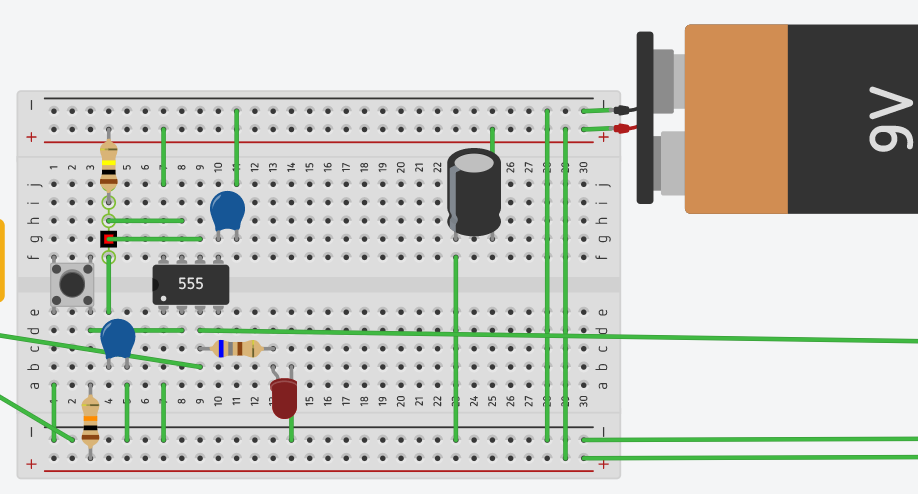
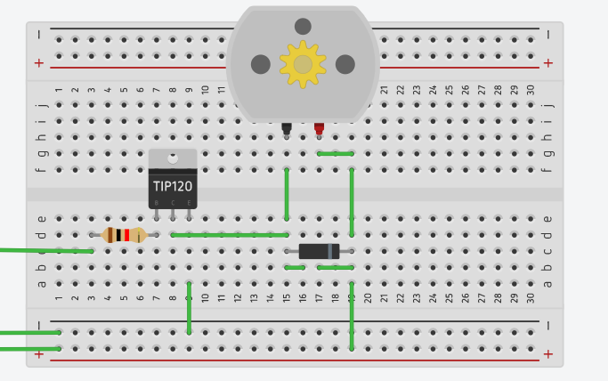
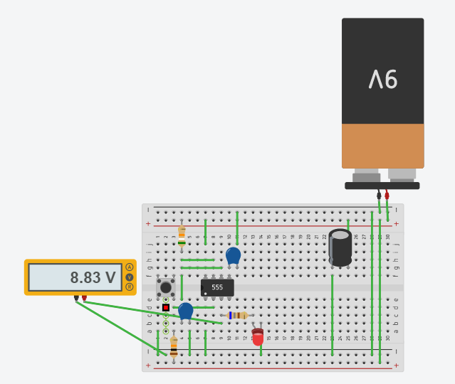
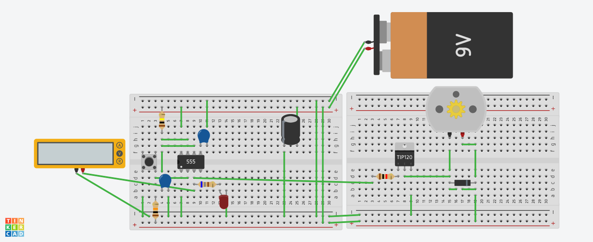
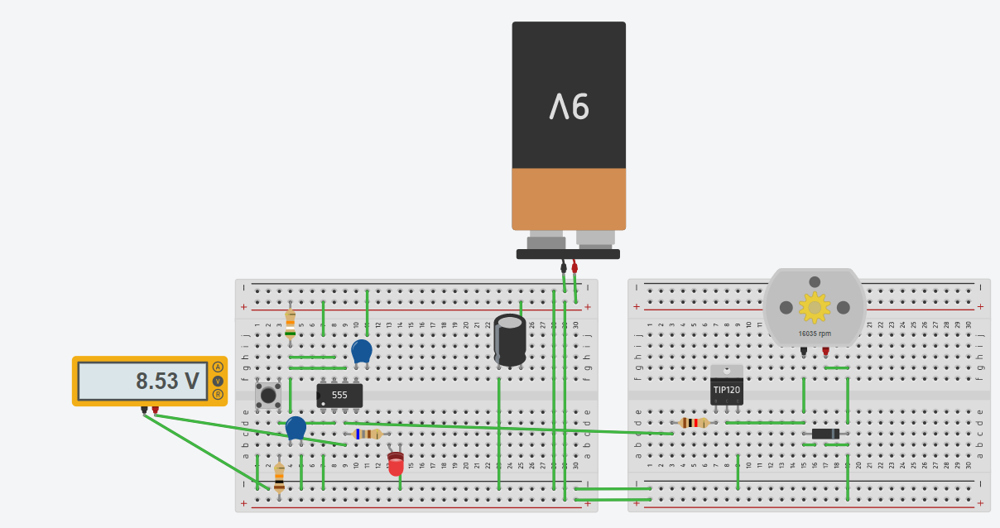
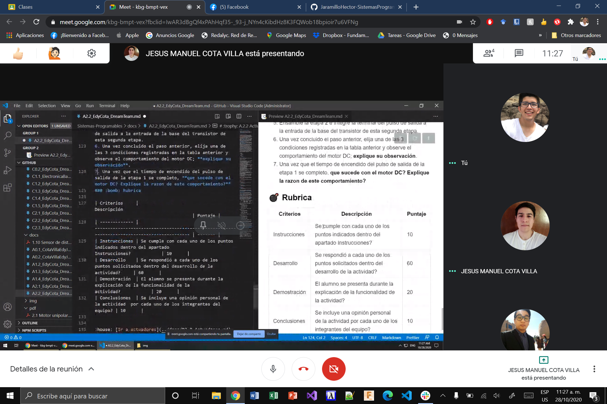

# Actuadores

# :trophy: A.2.2 Actividad de aprendizaje

 Realizar un sistema de control de arranque y encendido para un actuador eléctrico a través de un circuito electrónico, utilizando un simulador, un **Temporizador NE55s** y un **Motor de DC**.


### :blue_book: Instrucciones

- Se sugiere para el desarrollado de la presenta actividad, utilice uno de los siguientes simuladores: [Autodesk Tinkercad](https://www.tinkercad.com/), [Virtual BreadBoard](http://www.virtualbreadboard.com/), [Easy EDA](https://easyeda.com/) por lo cual habrá que familiarizarse antes, e incluso instalarse o registrarse dentro de la plataforma.
- Toda actividad o reto se deberá realizar utilizando el estilo **MarkDown con extension .md** y el entorno de desarrollo VSCode, debiendo ser elaborado como un documento **single page**, es decir si el documento cuanta con imágenes, enlaces o cualquier documento externo debe ser accedido desde etiquetas y enlaces, y debe ser nombrado con la nomenclatura **A2.2_NombreApellido_Equipo.pdf.**
- Es requisito que el .md contenga una etiqueta del enlace al repositorio de su documento en GITHUB, por ejemplo **Enlace a mi GitHub** y al concluir el reto se deberá subir a github.
- Desde el archivo **.md** exporte un archivo **.pdf** que deberá subirse a classroom dentro de su apartado correspondiente, sirviendo como evidencia de su entrega, ya que siendo la plataforma **oficial** aquí se recibirá la calificación de su actividad.
- Considerando que el archivo .PDF, el cual fue obtenido desde archivo .MD, ambos deben ser idénticos.
- Su repositorio ademas de que debe contar con un archivo **readme**.md dentro de su directorio raíz, con la información como datos del estudiante, equipo de trabajo, materia, carrera, datos del asesor, e incluso logotipo o imágenes, debe tener un apartado de contenidos o indice, los cuales realmente son ligas o **enlaces a sus documentos .md**, _evite utilizar texto_ para indicar enlaces internos o externo.
- Se propone una estructura tal como esta indicada abajo, sin embargo puede utilizarse cualquier otra que le apoye para organizar su repositorio.
  
```
- readme.md
  - blog
    - C2.1_x.md
    - C2.2_x.md
  - img
  - docs
    - A2.1_x.md
    - A2.2_x.md
```
### :pencil2: Desarrollo

1.Utilice el siguiente listado de materiales para la elaboración de la actividad

| Cantidad | Descripción                            | Link|
| --- | -------------------------------------- |-----|
| 1 | Circuito integrado LM555               |[LM555](https://www.mecatronicalatam.com/es/tutoriales/electronica/componentes-electronicos/555/)|
| 1 | Capacitor electrolítico de 47uf        |[Capacitor de 47uf](https://pygmalion.tech/producto/capacitor-electrolitico-47uf-25v/)|
| 1 | Condensador cerámico de 10nf           |[Condensador cerámico de 10nf](https://www.electronicaplugandplay.com/componentes-pasivos/product/144-condensador-ceramico-10nf-50v)|
| 1 | Fuente de voltaje de 9V                |[Batería Alcalina 9 V 6F22](https://www.carrod.mx/products/bateria-alcalina-9-v-6f22-steren)|
| 1 | Transistor de poder TIP122             |[TIP122](https://www.carrod.mx/products/transistor-tip122-to220)|
| 1 | Diodo 1N4001 o equivalente             |[1N4001](https://www.mouser.mx/ProductDetail/ON-Semiconductor/1N4001?qs=y2kkmE52mdO9hE9WqLHrvA==)|
| 1 | Mini Motor DC                          |[Mini Motor DC 3v 5v 6v Tipo 130](https://www.electrocomponentes.es/motores/mini-motor-dc-3v-5v-6v-tipo-130-diy-smart-car-565-.html)|
| 3 | Resistencias 680,1k,10k Ohmios de 1/4w |[Resistencias](http://www.juntadeandalucia.es/averroes/centros-tic/29009909/helvia/aula/archivos/_56/RESISTENCIAS-TABLAS.pdf)|
| 1 | Pulsador de disparo                    |[Boton MicroSwitch 4 pines](https://cdmxelectronica.com/producto/push-boton-microswitch-4-pines-664-3mm/)|
| 1 | Diodo Led Rojo                         |[Led Rojo 5mm](https://cdmxelectronica.com/producto/led-rojo-5mm-difuso/)|

1. Utilice el circuito electrónico de la imagen siguiente y ensamble la etapa 1 dentro del simulador.

<p align="center">
    
</p>

#### Circuito elaborado

**Parte 1:**
<p align="center">
    
</p>

**Parte 2:**
<p align="center">
    
</p>

2. Como se podrá observar en el circuito anterior existe un area identificada como "Red de tiempo" y otra "Filtro de desacople", **explique el proposito de ambos terminologias**.

**Red de tiempo:** se refiere al área donde se controlan los tiempos del temporalizador, aquí se encuentra los componentes que controlan el tiempo.

**Filtro de desacople:** pues es el área donde se encuentra el condensador, investigando dice que es el área donde se limpia la señal, ya que se desacoplar las señales de CA de una señal de CC.

3. Continuando con la imagen anterior, observe se muestra la ecuación Ct= 1.1 * R1 * C1, la cual es utilizada para establecer el tiempo de **encendido del pulso de salida**. Basándose en esa ecuación anterior calcule los valores de **R1 y C1** si se desea mantener encendido el pulso de salida, dada las 3 condiciones requeridas en la tabla anexa.

    | Numero | Condición  | Valor de R1 | Valor de C1 |
    | ------ | ---------- | ----------- | ----------- |
    | 1      | 3 segundos | 58kohm      | 47 µF       |
    | 2      | 5 segundos | 97kohm     | 47 µF       |
    | 3      | 8 segundos | 155komh     | 47 µF       |

Usando la formula Ct= 1.1 * R1 * C1 y tratando de usar resistencias y un condensador comercial queda:

##### Cálculo para 3s
    Cálculo de la resistencia exacta
        R = 3s / (1.1 * 0.000047 F)
        R = 58,027 ohms

    Resistencia comercial cercana 
        56komh + 2kohm = 58kohm

    Tiempo Calculado
        Ct= 1.1 * 58,000ohm * 0.000047F = 2.998s

##### Cálculo para 5s

    Cálculo de la resistencia exacta
        R = 5s / (1.1 * 0.000047 F)
        R = 96,711 ohms

    Resistencia comercial cercana
        82komh + 15kohm = 97kohm

    Tiempo Calculado
        Ct= 1.1 * 97,000ohm * 0.000047F = 5.014s

##### Cálculo para 8s

    Cálculo de la resistencia exacta
        R = 8s / (1.1 * 0.000047 F)
        R = 154,738 ohm

    Resistencia comercial cercana
        150komh + 5kohm = 155kohm

    Tiempo Calculado
        Ct= 1.1 * 155,000ohm * 0.000047F = 8.013s


4. Una vez que se halla completado la tabla anterior, inicie la simulación para cualquiera de las tres condiciones y observe el comportamiento del Led;  **explique su observación**.

**Realizamos la prueba tratando de que saliera la señal después de los 3s, para ello utilizamos en R1 una resistencia de 58kohm y en C1 un condensador de 47 µF, con esto logramos hacer que el foco se encienda 3 segundos después de presionar el botón, y si lo dejamos presionado sigue funcionando, el timer solo entra después de dejar de presionar el triger.**

**Completo:**
<p align="center">
    
</p>

5. Ensamble la etapa 2 e integre la terminal del pulso de salida a la entrada de la base del transistor de esta segunda etapa.

**Completo:**
<p align="center">
    
</p>

6. Una vez concluido el paso anterior, elija una de las 3 condiciones registradas en la tabla anterior y observe el comportamiento del motor DC; **explique su observación**.

**Lo modificamos para que funcionara 3 segundos después de presionar el botón, y si, el motor y el led reciben energía 3 segundos después de que el botón fue presionado.**

7. Una vez que el tiempo de encendido del pulso de salida de la etapa 1 se completo, **que sucede con el motor DC? Explique la razon de este comportamiento?**

**El motor se mueve al mismo tiempo que el led es prendido ya que recibe la energía al mismo tiempo.**

**Completo:**
<p align="center">
    
</p>

## Conclusiones

**Fernando Esau Melendez Palafox**
Dentro de esta practica utilizamos un circuito integrado LM555, con resistencias, diodos y un capacitor creamos una red de tiempo para controlar cuanto tiempo actúa el motor. Dentro del punto 3 de la practica calculamos que resistencias necesitábamos utilizar, buscábamos resistencias comerciales para complicar menos la practica; la formula utilizada fue de una practica anterior que involucraba una red de tiempo igual a esta y solo se despejaba para obtener los valores de las resistencias que necesitábamos para determinados tiempos que se solicitaban en la practica.

**Jaramillo Regino Hector Armando**
En la práctica realizamos un circuito un poco más complejo de lo normal, solo por la cuestión de los componentes, a la hora de hacer el circuito tuvimos problemas a la hora de hacer la conexión del diodo y del led ya que como el símbolo es muy parecido creímos que se ponían al revés, hasta que notamos que al encender la simulación, el led explotaba y tratamos de cambiar el valor de la resistencia, pero al ver que no funcionaba cambiamos el led y el diodo de lugar, eso fue lo que se nos complicó de la actividad, fuera de eso fue muy sencillo.


**Cota Villa Edy Jesus Manuel**
En esta práctica, lo que hicimos fue es utilizar un circuito integrado LM555 como si fuera un timer para un motor, para poder modificar el tiempo que se iba a dejar pasar energía utilizamos una resistencia y capacitor con diferentes valor para modificar la cantidad de segundos iba a pasar corriente, este tiempo aplicaba después de presionar el botón que funcionaba como triger, utilizamos el mismo capacitor para todos los casos, lo que variamos fue la resistencia y tratamos de seguir usando resistencias comerciales. Ah y como nos confundimos cual diodo era el del led, nos explotó como 8 veces. c:

### Evidencias
<p align="center">
    
</p>
<p align="center">
    
</p>


### :bomb: Rubrica
| Criterios     | Descripción                                                                                  | Puntaje |
| ------------- | -------------------------------------------------------------------------------------------- | ------- |
| Instrucciones | Se cumple con cada uno de los puntos indicados dentro del apartado Instrucciones?            | 10      |
| Desarrollo    | Se respondió a cada uno de los puntos solicitados dentro del desarrollo de la actividad?     | 60      |
| Demostración  | El alumno se presenta durante la explicación de la funcionalidad de la actividad?            | 20      |
| Conclusiones  | Se incluye una opinión personal de la actividad  por cada uno de los integrantes del equipo? | 10      |

### :bookmark: Ligas

**Cota Villa Edy Jesus Manuel**
:school: [Repositorio](https://github.com/CotaVilla/Sistemas-Programables)
:memo: [Actividad](https://github.com/CotaVilla/Sistemas-Programables/blob/master/docs/A2.2_EdyCota_DreamTeam.md)

**Jaramillo Regino Hector Armando**
:school: [Repositorio](https://github.com/HectorJaramillo/JaramilloHector-SistemasProgramables)
:memo: [Actividad](https://github.com/HectorJaramillo/JaramilloHector-SistemasProgramables/blob/master/Blog/A2.2_HectorJaramillo_DreamTeam.md)

**Fernando Esau Melendez Palafox**
:school: [Repositorio](https://github.com/fernmelen/Sist.-Programables)
:memo: [Actividad](https://github.com/fernmelen/Sist.-Programables/blob/master/blog/A2.2_FernandoMelendez_DreamTeam.md)