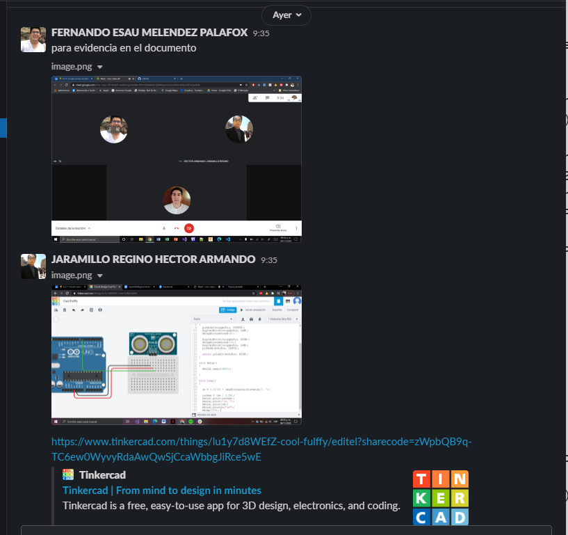

# :trophy: A.3.1 Actividad de aprendizaje

Circuito sensor de detección de objetos, utilizando un Arduino, un sensor ultrasonico y un Display I2C LCD 16x2.
___

## Instrucciones

* Realizar un sistema simulado, capaz de detectar la presencia y/o ausencia de un objeto, a través de un circuito electrónico, utilizando un Arduino, y un **Sensor Ultrasonico HC-SR04**.
* Toda actividad o reto se deberá realizar utilizando el estilo **MarkDown con extension .md** y el entorno de desarrollo VSCode, debiendo ser elaborado como un documento **single page**, es decir si el documento cuanta con imágenes, enlaces o cualquier documento externo debe ser accedido desde etiquetas y enlaces, y debe ser nombrado con la nomenclatura **A3.1_NombreApellido_Equipo.pdf.**
* Es requisito que el .md contenga una etiqueta del enlace al repositorio de su documento en GITHUB, por ejemplo **Enlace a mi GitHub** y al concluir el reto se deberá subir a github.
* Desde el archivo **.md** exporte un archivo **.pdf** que deberá subirse a classroom dentro de su apartado correspondiente, sirviendo como evidencia de su entrega, ya que siendo la plataforma **oficial** aquí se recibirá la calificación de su actividad.
* Considerando que el archivo .PDF, el cual fue obtenido desde archivo .MD, ambos deben ser idénticos.
* Su repositorio ademas de que debe contar con un archivo **readme**.md dentro de su directorio raíz, con la información como datos del estudiante, equipo de trabajo, materia, carrera, datos del asesor, e incluso logotipo o imágenes, debe tener un apartado de contenidos o indice, los cuales realmente son ligas o **enlaces a sus documentos .md**, _evite utilizar texto_ para indicar enlaces internos o externo.
* Se propone una estructura tal como esta indicada abajo, sin embargo puede utilizarse cualquier otra que le apoye para organizar su repositorio.
  
```
* readme.md
  - blog
    - C3.1_TituloActividad.md
    - C3.2_TituloActividad.md
    - C3.3_TituloActividad.md
    - C3.4_TituloActividad.md
    - C3.5_TituloActividad.md
    - C3.6_TituloActividad.md
    - C3.7_TituloActividad.md
    - C3.8_TituloActividad.md
  - img
  - docs
    - A3.1_TituloActividad.md
    - A3.2_TituloActividad.md
    - A3.3_TituloActividad.md
```
___

## Desarrollo

1. Utilizar el siguiente listado de materiales para la elaboración de la actividad

| Cantidad | Descripción                                                                                                                                                                                                                        |
| -------- | ---------------------------------------------------------------------------------------------------------------------------------------------------------------------------------------------------------------------------------- |
| 1        | Sensor [Ultrasonico HC-SR04](https://www.amazon.com.mx/SainSmart-HC-SR04-Ranging-Detector-Distance/dp/B004U8TOE6/ref=sr_1_5?__mk_es_MX=%C3%85M%C3%85%C5%BD%C3%95%C3%91&dchild=1&keywords=hc-sr04&qid=1599005012&sr=8-5)            |
| 1         | [Display LCD de 16x2](https://www.winstar.com.tw/es/products/character-lcd-display-module/16x2-lcd.html)
| 1        | [Fuente de voltaje de 5V](https://static.rapidonline.com/pdf/554305_v1.pdf)                                |
| 1        | [1 Potenciómetro 10k ](https://www.amazon.com.mx/Uxcell-a15011600ux0235-Linear-Rotary-Potentiometer/dp/B01DKCUVMQ/ref=sr_1_1?__mk_es_MX=%C3%85M%C3%85%C5%BD%C3%95%C3%91&dchild=1&keywords=potenciometro+10k&qid=1599005041&sr=8-1) |
| 1        | [Arduino UNO](https://www.amazon.com.mx/Progressive-Automations-LC-066-Arduino-Rev3/dp/B00WH5XOJK/ref=sr_1_7?__mk_es_MX=%C3%85M%C3%85%C5%BD%C3%95%C3%91&dchild=1&keywords=arduino+uno&qid=1599005073&sr=8-7)                       |

2. Basado en la imágen que se muestra, ensamble dentro del simulador a utilizar, el circuito electrónico indicado en la **Figura 1**.

<p align="center"> 
    <strong>Figura 1 Sensor Ultrasonico</strong>
    
</p>

Evidencia

<p align="center"> 
    
</p>

3. Realice el programa que permita a través de una de las entradas del Arduino, recibir el valor que registra el **Sensor Ultrasonico** al acercarse un objeto a distintas distancias.

#### Codigo
        int cm = 0;

        long sensor(int triggerPin, int echoPin)
        {
          pinMode(triggerPin, OUTPUT);
          digitalWrite(triggerPin, LOW);
          delayMicroseconds(2);
          digitalWrite(triggerPin, HIGH);
          delayMicroseconds(10);
          digitalWrite(triggerPin, LOW);
          pinMode(echoPin, INPUT);

          return pulseIn(echoPin, HIGH);
        }

        void setup()
        {
          Serial.begin(9600);

        }

        void loop()
        {
          cm = 0.01723 * sensor(7, 7);
          Serial.print(cm);
          Serial.println("cm");
          delay(100);
        }

4. Considerando que el sensor ultrasonico tiene un rango mínimo y máximo de detección basado en el tiempo de retorno de la señal sonica, que valores se obtienen en la simulación bajo las **siguientes condiciones:**

| Numero | Condición 1                   | Condición2                                 | El objeto es detectado? |
| ------ | ----------------------------- | ------------------------------------------ | ----------------------- |
| 1      | 5 cm de distancia al sensor   | 0 grados al eje perpendicular del sensor   |**Si lo detecta**
| 2      | 50 cm de distancia al sensor  | 35 grados al eje perpendicular del sensor  |**Si lo detecta**
| 3      | 100 cm de distancia al sensor | -35 grados al eje perpendicular del sensor | **Si lo detecta**
| 4      | 5 cm de distancia al sensor   | 90 grados al eje perpendicular del sensor  |**No lo detecta**
| 5      | 50 cm de distancia al sensor  | -60 grados al eje perpendicular del sensor |**Si lo detecta**
| 6      | 350 cm de distancia al sensor | 0 grados al eje perpendicular del sensor   |**No lo detecta**

5. Una vez completados los puntos anteriores, agregue a la Figura 1, **un Display I2C 16x2 LCD**, y coloque la imagen del circuito completado hasta este apartado.

<p align="center"> 
    
</p>

6. Al haber completado la integración del Display I2C, ajuste el programa que le permita a través del display mostrar el siguiente mensaje, **"Objetivo detectado a ? cm** , y en caso de no lograr la detección indicar el mensaje **"Objetivo fuera de rango"**
#### Codigo
    #include <LiquidCrystal.h>

    LiquidCrystal lcd(12, 11, 5, 4, 3, 2);
    int cm = 0;

    long sensor(int triggerPin, int echoPin)
    {
      pinMode(triggerPin, OUTPUT);
      digitalWrite(triggerPin, LOW);
      delayMicroseconds(2);
      
      digitalWrite(triggerPin, HIGH);
      delayMicroseconds(10);
      digitalWrite(triggerPin, LOW);
      pinMode(echoPin, INPUT);
      
      return pulseIn(echoPin, HIGH);
    }

    void setup()
    {
      Serial.begin(9600);
      lcd.begin(16, 2);
    }

    void loop()
    {
      cm = 0.01723 * sensor(7, 7);
      Serial.print(cm);
      Serial.println("cm");
      lcd.clear();
      if (cm == 336) {
        lcd.setCursor(0, 0);
        lcd.print("No Detectado");
      }
      else
      {
        lcd.setCursor(0, 0);
        lcd.print("Detectado a:");
        lcd.setCursor(0, 1);
        lcd.print(cm);
        lcd.print("cm");
      }
      delay(100);
    }

No alcanzaba el mensaje en la pantalla asi que lo modificamos un poco, nos quedo:

En caso de detectarlo dice **Detectado a: ?cm**

En caso de NO detectarlo dice **No detectado**

<p align="center"> 
    
</p>
<p align="center"> 
    
</p>

7. Coloque aqui evidencias que considere importantes durante el desarrollo de la actividad.

<p align="center"> 
    
</p>

<p align="center"> 
    
</p>

<p align="center"> 
    
</p>

#### Conclusiones

**Cota Villa Edy Jesus Manuel**
En esta actividad vimos como a tinkercak no le importan los tiempos de los pulsos, utilizamos un sensor ultrasonido de tres pines, el que tinkercad proveia y pues lo que vimos es que primero antes que nada fuera de rango el objeto muestra el valor mas alto que puede, me imagino porque asume que el objeto esta a una distancia muy lejana, y pues utilizando el valor que regresa y multiplicando por 0.01723 es como convertimos a cm, este valor es impreso en el monitor. Ya para utilizar el LCD integramos la libreria LiquidCrystal.h la cual tiene su metodo para ingresarle los pines con los que va a trabajar, ya despues nadamas tenemos que comenzar con lcd.begin(16, 2) y solo le mandas la informacion del sensor, es bastante facil y directo su uso gracias a la libreria.

**Fernando Esau Melendez Palafox**
El circuito integrado de esta practica consiste de dos fases, donde la primera fase solo conlleva medir con un sensor ultrasonico ciertas circunstancias solicitadas en la practica y tuvimos un poco de problemas en que punto de referencia utilizar para las medidas de los grados, lo que nos llevó a tener diferentes resultados que nuestros compañeros. En la segunda fase empezaron las complicaciones al querer aplicar una pantalla LCD, nos ayudamos de bastantes guías por la complejidad que presentaba el manejo de tantos pines. En su momento también cambiamos el sensor pero volvimos al primero con el que trabajamos de 3 pines; esto lo intentamos porque el código nos ocasionaba proble.as en unas condiciones de distancia que aplicamos para desplegar en la pantalla las leyendas de la distancia.

**Jaramillo Regino Hector Armando**
En la práctica realizamos un circuito integrado a una placa arduino en el cual la mayor complicación fue a la hora de conectar la pantalla LCD 16x2 ya que no estamos acostumbrados a trabajar con tantos pines y conexiones a la vez ya que en circuitos anteriores no hubo la necesidad de programar.En cuanto el código de arduino nos apoyamos en diferentes videos de circuitos ya hechos así como del pinout que encontramos en el datasheet de los componentes, otros problemas surgieron a la hora de usar el circuito porque  empezamos con el sensor ultrasónico de 3 pines, luego usamos  el de 4 pines y al final volvimos a usar el de 3, entonces tuvimos ciertos problemas en cuanto a la logística porque cambiamos varias veces de sensor.
___

### :bomb: Rubrica

| Criterios     | Descripción                                                                                  | Puntaje |
| ------------- | -------------------------------------------------------------------------------------------- | ------- |
| Instrucciones | Se cumple con cada uno de los puntos indicados dentro del apartado Instrucciones?            | 10      |
| Desarrollo    | Se respondió a cada uno de los puntos solicitados dentro del desarrollo de la actividad?     | 60      |
| Demostración  | El alumno se presenta durante la explicación de la funcionalidad de la actividad?            | 20      |
| Conclusiones  | Se incluye una opinión personal de la actividad  por cada uno de los integrantes del equipo? | 10      |

### :bookmark: Ligas

**Cota Villa Edy Jesus Manuel**
:school: [Repositorio](https://github.com/CotaVilla/Sistemas-Programables)
:memo: [Actividad](https://github.com/CotaVilla/Sistemas-Programables/blob/master/docs/A3.1_EdyCota_DreamTeam.md)

**Jaramillo Regino Hector Armando**
:school: [Repositorio](https://github.com/HectorJaramillo/JaramilloHector-SistemasProgramables)
:memo: [Actividad](https://github.com/HectorJaramillo/JaramilloHector-SistemasProgramables/blob/master/Blog/A3.1_HectorJaramillo_DreamTeam.md)

**Fernando Esau Melendez Palafox**
:school: [Repositorio](https://github.com/fernmelen/Sist.-Programables)
:memo: [Actividad](https://github.com/fernmelen/Sist.-Programables/blob/master/blog/A3.1_FernandoMelendez_DreamTeam.md)