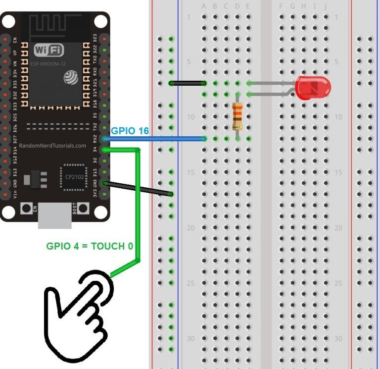
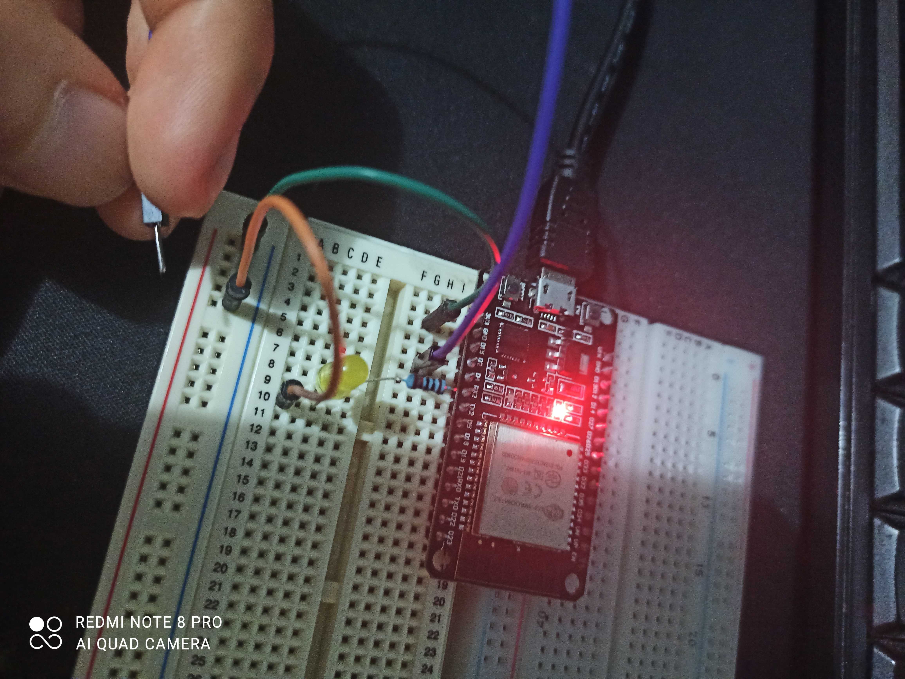
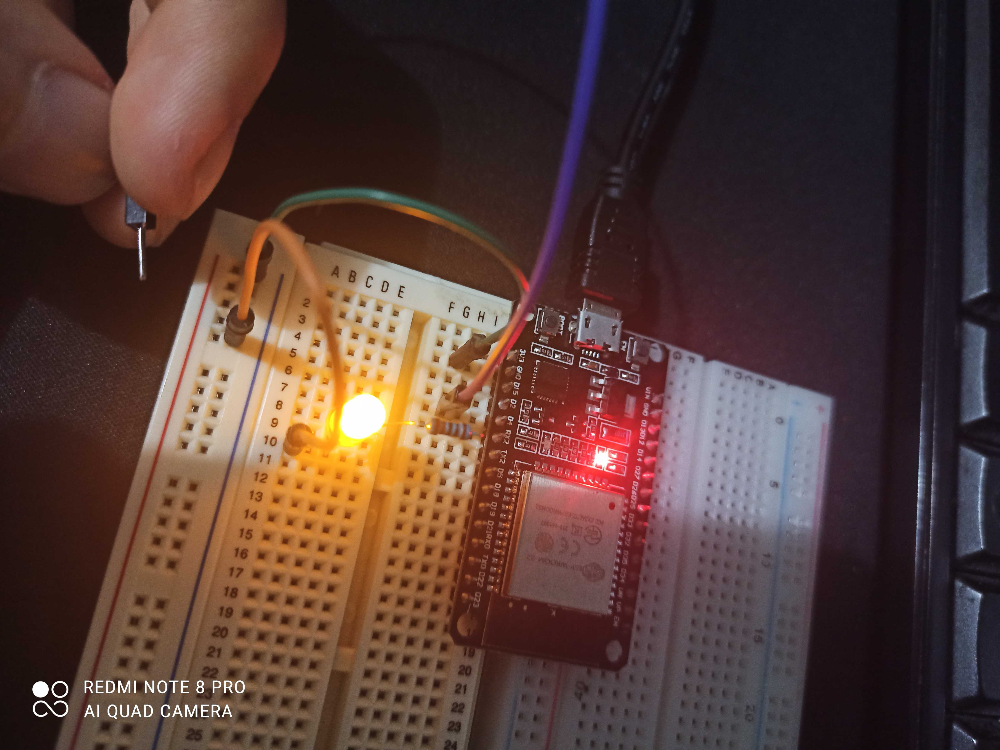
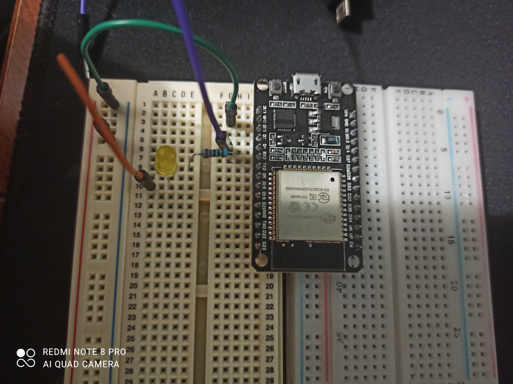
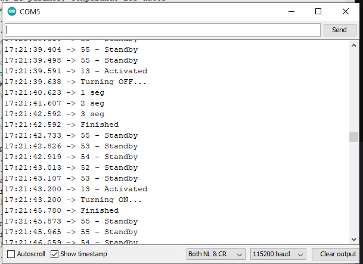
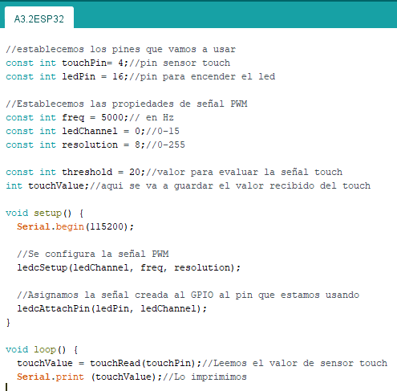
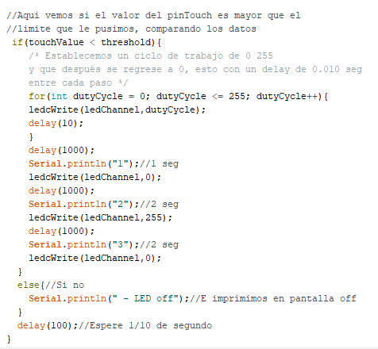
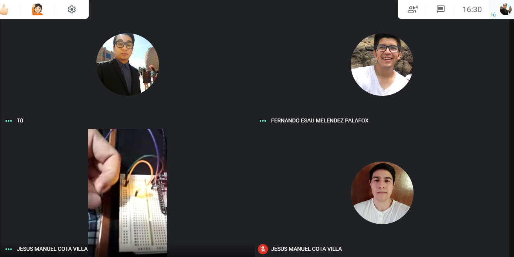
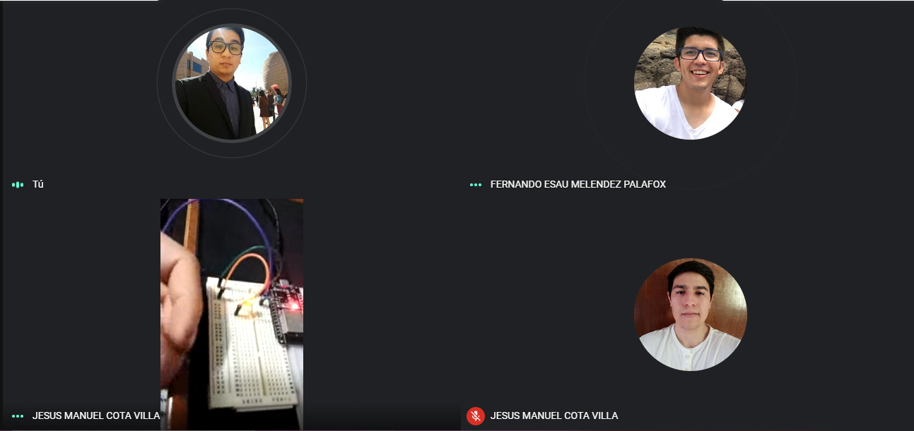

# :trophy: A.3.2 Actividad de aprendizaje

Circuito sensor de tacto a través de un NodeMCU ESP32
___

## Instrucciones

- Basado en la figura 1, ensamblar un sistema, capaz de responder al tacto, a través de un circuito electrónico, utilizando un NodeMCU **ESP32**, un  **Sensor de tacto capacitivo**.
- Toda actividad o reto se deberá realizar utilizando el estilo **MarkDown con extension .md** y el entorno de desarrollo VSCode, debiendo ser elaborado como un documento **single page**, es decir si el documento cuanta con imágenes, enlaces o cualquier documento externo debe ser accedido desde etiquetas y enlaces, y debe ser nombrado con la nomenclatura **A3.2_NombreApellido_Equipo.pdf.**
- Es requisito que el .md contenga una etiqueta del enlace al repositorio de su documento en GITHUB, por ejemplo **Enlace a mi GitHub** y al concluir el reto se deberá subir a github.
- Desde el archivo **.md** exporte un archivo **.pdf** que deberá subirse a classroom dentro de su apartado correspondiente, sirviendo como evidencia de su entrega, ya que siendo la plataforma **oficial** aquí se recibirá la calificación de su actividad.
- Considerando que el archivo .PDF, el cual fue obtenido desde archivo .MD, ambos deben ser idénticos.
- Su repositorio ademas de que debe contar con un archivo **readme**.md dentro de su directorio raíz, con la información como datos del estudiante, equipo de trabajo, materia, carrera, datos del asesor, e incluso logotipo o imágenes, debe tener un apartado de contenidos o indice, los cuales realmente son ligas o **enlaces a sus documentos .md**, _evite utilizar texto_ para indicar enlaces internos o externo.
- Se propone una estructura tal como esta indicada abajo, sin embargo puede utilizarse cualquier otra que le apoye para organizar su repositorio.
  
```
- readme.md
  - blog
    - C3.1_TituloActividad.md
    - C3.2_TituloActividad.md
    - C3.3_TituloActividad.md
    - C3.4_TituloActividad.md
    - C3.5_TituloActividad.md
    - C3.6_TituloActividad.md
    - C3.7_TituloActividad.md
    - C3.8_TituloActividad.md
  - img
  - docs
    - A3.1_TituloActividad.md
    - A3.2_TituloActividad.md
    - A3.3_TituloActividad.md
```
___

### Fuentes de apoyo para desarrollar la actividad

- [x] [Sensor de tacto capacitivo](https://randomnerdtutorials.com/esp32-touch-pins-arduino-ide/)
- [x] [Salida analogica PWM](https://randomnerdtutorials.com/esp32-pwm-arduino-ide/)

___

## Desarrollo

1.Utilice el siguiente listado de materiales para la elaboración de la actividad

| Cantidad | Descripción   | Link del componente                                                                               |
| -------- | -------------------------------------------------------------------------------------------------------------------------------------------------------------------------------------------------------------------------- |-------------------------------|
| 1        | Diodo led Rojo   | [Led Rojo](https://www.steren.com.mx/led-ultrabrillante-de-5-mm-color-rojo.html)
| 1        | Resistencia 330 ohms       |[Resistencia 330 ohms](https://www.electronicaplugandplay.com/componentes-pasivos/resistencias/resistencias-de-carbon/product/146-resistencia-330-1-4-watt)|                                                                                                                                                                                                |
| 1        | Fuente de voltaje de 5V |[Fuente de alimentación, 5V 3A](https://www.amazon.com.mx/AC-DC-fuente-alimentaci%C3%B3n-Black/dp/B078RXZM4C/ref=asc_df_B078RXZM4C/?tag=gledskshopmx-20&linkCode=df0&hvadid=450926494212&hvpos=&hvnetw=g&hvrand=17494429142433936024&hvpone=&hvptwo=&hvqmt=&hvdev=c&hvdvcmdl=&hvlocint=&hvlocphy=1010012&hvtargid=pla-436418104506&psc=1) |
| 1        | [NodeMCU ESP32](https://www.amazon.com.mx/ESP-32-ESP-32S-ESP-WROOM-32-ESP32-S-desarrollo/dp/B07TBFC75Z/ref=sr_1_2?__mk_es_MX=%C3%85M%C3%85%C5%BD%C3%95%C3%91&dchild=1&keywords=esp32&qid=1599003438&sr=8-2)                | [NodeMCU ESP32](https://www.naylampmechatronics.com/espressif-esp/384-nodemcu-32-esp32-wifi.html)|
| 1        | [BreadBoard](https://www.amazon.com.mx/Deke-Home-Breadboard-distribuci%C3%B3n-electr%C3%B3nica/dp/B086C9HK7V/ref=sr_1_22?__mk_es_MX=%C3%85M%C3%85%C5%BD%C3%95%C3%91&dchild=1&keywords=breadboard&qid=1599003455&sr=8-22)   |[BreadBoard](https://www.steren.com.mx/protoboard-de-ensamble-a-presion-1-bloque-y-2-tiras.html?gclid=CjwKCAiA-_L9BRBQEiwA-bm5frk85IfCFtAx8thMcZLCyNfldBcAPP5VFt1kUYyDjCzafKNTHLx8thoC_yEQAvD_BwE)|
| 1        | [Jumpers M/M](https://www.amazon.com.mx/ELEGOO-Macho-Hembra-Macho-Macho-Hembra-Hembra-Protoboard/dp/B06ZXSQ5WG/ref=sr_1_1?__mk_es_MX=%C3%85M%C3%85%C5%BD%C3%95%C3%91&dchild=1&keywords=jumper+wires&qid=1599003519&sr=8-1) |[Jumpers](https://articulo.mercadolibre.com.mx/MLM-771672534-20-cables-dupont-macho-macho-jumpers-arduino-raspberry-_JM?matt_tool=28238160)|
| 1        | Hoja de aluminio|[Hoja de Aluminio](https://articulo.mercadolibre.com.mx/MLM-819119940-lamina-de-aluminio-calibre-22-_JM?matt_tool=13215032&matt_word=&matt_source=google&matt_campaign_id=6557890688&matt_ad_group_id=78396653933&matt_match_type=&matt_network=u&matt_device=c&matt_creative=385554136782&matt_keyword=&matt_ad_position=&matt_ad_type=&matt_merchant_id=277128965&matt_product_id=MLM819119940&matt_product_partition_id=409933523277&matt_target_id=pla-409933523277&gclid=CjwKCAiA-_L9BRBQEiwA-bm5fiuh76duJbShItVgKnkEmu0fpUjsKlVCZ9nMDtbhSartIBLLCm0GYxoCkDIQAvD_BwE)|                                                                                                                                        
<p align="center"> 
    <strong>Figura 1 Circuito ESP32 IC L293 Motor DC</strong>
    
</p>

1. Una vez ensamblado el circuito anterior, realice un programa que permita al ensamble cumplir con las siguientes condiciones:
    - El sistema deberá ser capaz de encender y apagar **un led** al presionar el sensor de tacto.
    - El sistema deberá tener la característica que si el Led esta encendido, al tocar el sensor de tacto, este iniciara un secuencia de intermitencia de 3 segundos (es decir se apaga 1 segundo, se enciende un segundo y se apaga finalmente).
    - El sistema deberá contar con la característica que si el Led esta apagado, al tocar el sensor de tacto, este se encenderá poco a poco hasta llegar a su nivel máximo de iluminación.
2. Coloque aquí evidencias que considere importantes durante el desarrollo de la actividad.

## ***[Demostracion en video del circuito](https://www.youtube.com/watch?v=WGtM6kjEjVE&feature=youtu.be)***

### ***Circuito Armado***

<p align="center">
    
</p>
<p align="center">
    
</p>
<p align="center">
    
</p>

### ***Monitor Serial***
<p align="center">
    
</p>


<p align="center">
    
</p>

<p align="center">
    
</p>

### ***Evidencia de Reunion***
<p align="center">
    
</p>

<p align="center">
    
</p>

# ***Conclusiones***

## ***Cota Villa Edy Jesus Manuel***
En esta actividad lo que hicimos fue utilizar 2 pines, uno para enviar voltaje al led y otro para leer el touch, en nuestro caso no fue necesario utilizar papel aluminio, con el puro cable leía bien el sensor touch, lo que hicimos fue juntar las practicas C3.6 y la C3.7 en esta actividad, ya que para el primer punto que se pidió es necesario aumentar la intensidad de la luz lentamente usamos el PMW con un for para disimularlo, también teníamos una bandera para declarar cuando el led estaba encendido, entonces utilizando el valor del touch y la bandera, elegimos si encender lentamente el led, parpadear para apagar el led o no hacer nada.

## ***Fernando Esau Melendez Palafox***
Esta actividad presenta un parecido a la C3.8, con la diferencia de las condiciones en el código, donde en este caso debe parpadear dos veces una vez sea presionado el sensor de touch. El pin de touch le conectamos un jumper, para que al presionar y se accione el sensor y empiece a parpadear un par de veces el led. En esta practica se utiliza un led, una resistencia de 330 ohms y un cable en el pin de touch para alcanzar a presionar sin tener que meter la mano y descomponer otros componentes del ESP32.

## ***Jaramillo Regino Hector Armando***
En esta práctica realizamos un circuito con el módulo nodemcu esp32 en el cual tuvimos ciertos problemas en lograr entender lo que realmente pedía y realizamos la práctica erróneamente, por suerte preguntamos al maestro y ya nos explicó de manera más detallada como realmente tenía que funcionar el circuito. No tuvimos mucho problema en hacer la práctica ya que hicimos lo mismo en la actividad anterior y en cuanto al error de corrección de la práctica fue bastante sencillo ya que solo debíamos cambiar la condición para que realizará el funcionamiento que necesitábamos y en la realización del circuito solo utilizamos el esp32, 1 led, 1 resistencia y 3 jumpers.
___

### :bomb: Rubrica

| Criterios     | Descripción                                                                                  | Puntaje |
| ------------- | -------------------------------------------------------------------------------------------- | ------- |
| Instrucciones | Se cumple con cada uno de los puntos indicados dentro del apartado Instrucciones?            | 10      |
| Desarrollo    | Se respondió a cada uno de los puntos solicitados dentro del desarrollo de la actividad?     | 60      |
| Demostración  | El alumno se presenta durante la explicación de la funcionalidad de la actividad?            | 20      |
| Conclusiones  | Se incluye una opinión personal de la actividad  por cada uno de los integrantes del equipo? | 10      |

### :bookmark: Ligas

**Cota Villa Edy Jesus Manuel**

**Circuito Fisico**
:school: [Repositorio](https://github.com/CotaVilla/Sistemas-Programables)
:memo: [Actividad](https://github.com/CotaVilla/Sistemas-Programables/blob/master/docs/A3.2_EdyCota_DreamTeam.md)

**Jaramillo Regino Hector Armando**

:school: [Repositorio](https://github.com/HectorJaramillo/JaramilloHector-SistemasProgramables)
:memo: [Actividad](https://github.com/HectorJaramillo/JaramilloHector-SistemasProgramables/blob/master/Blog/A3.2_HectorJaramillo_DreamTeam.md)

**Fernando Esau Melendez Palafox**

:school: [Repositorio](https://github.com/fernmelen/Sist.-Programables)
:memo: [Actividad](https://github.com/fernmelen/Sist.-Programables/blob/master/blog/A3.2_FernandoMelendez_DreamTeam.md)
