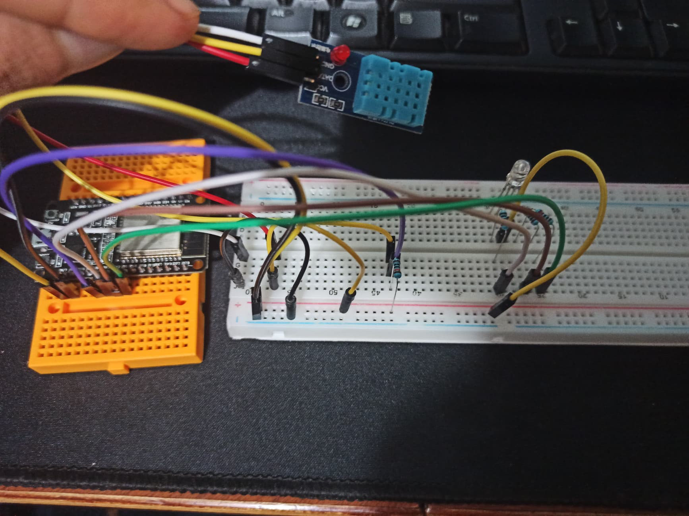
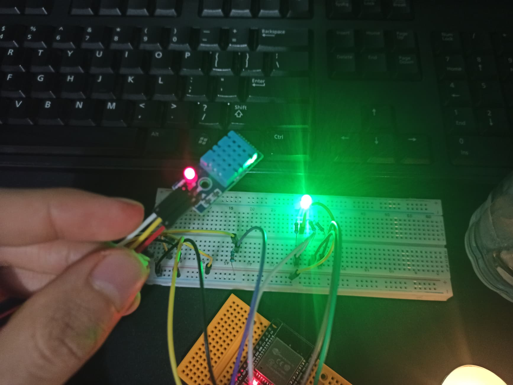
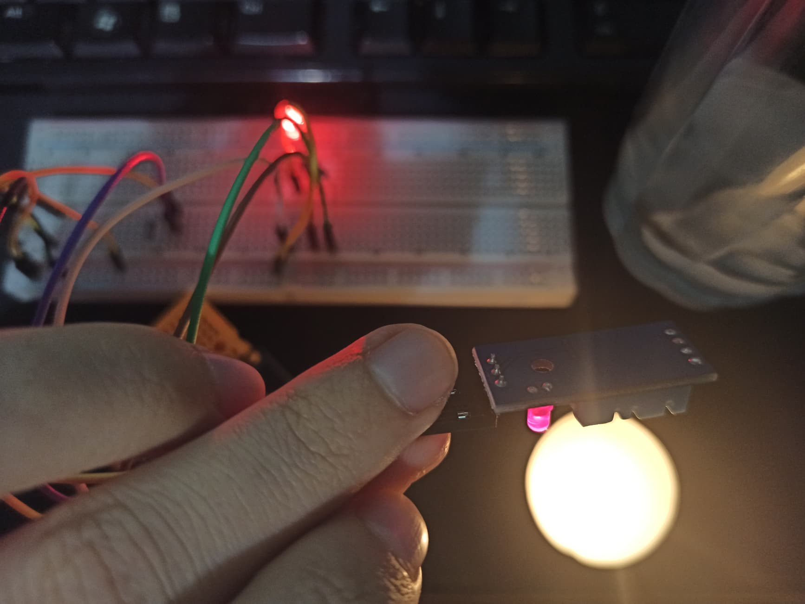
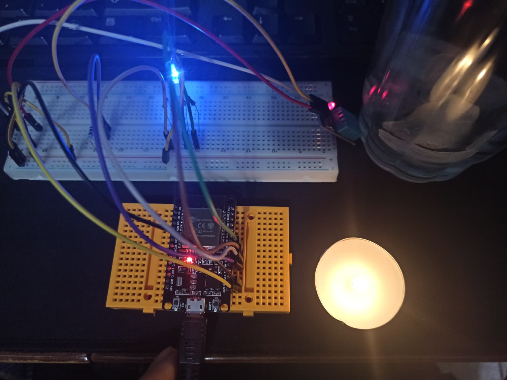
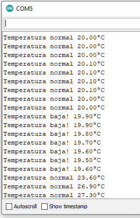
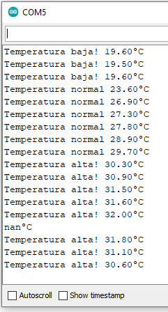
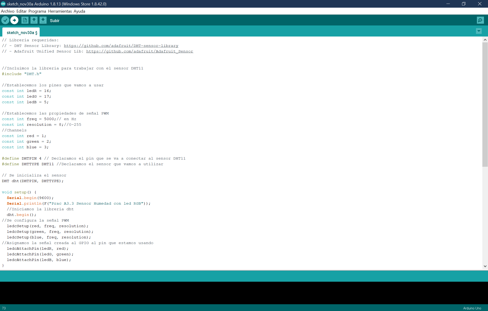
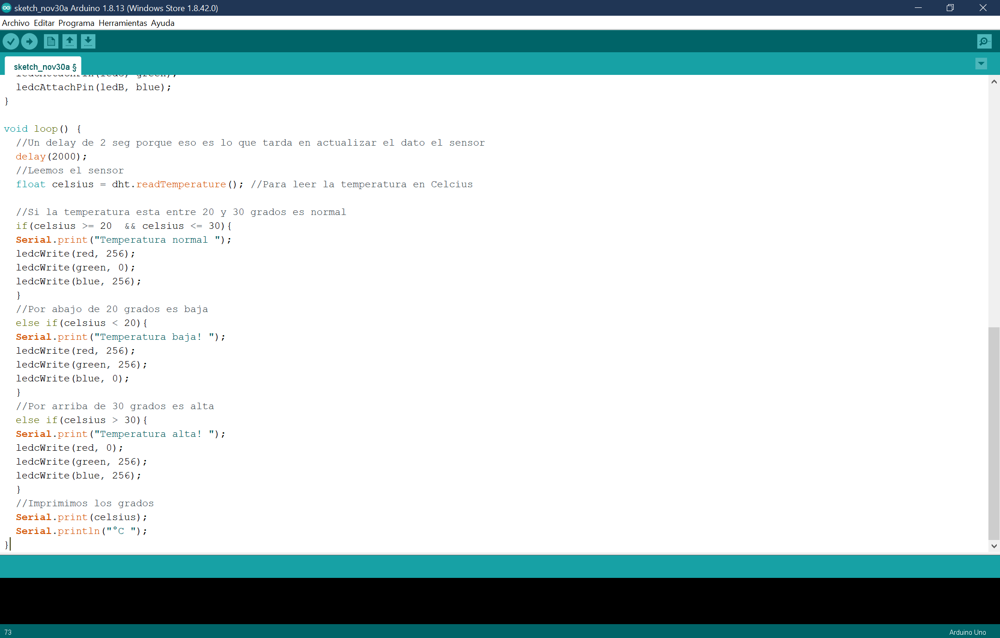
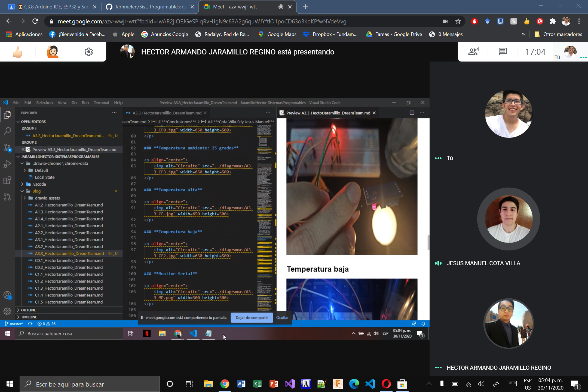
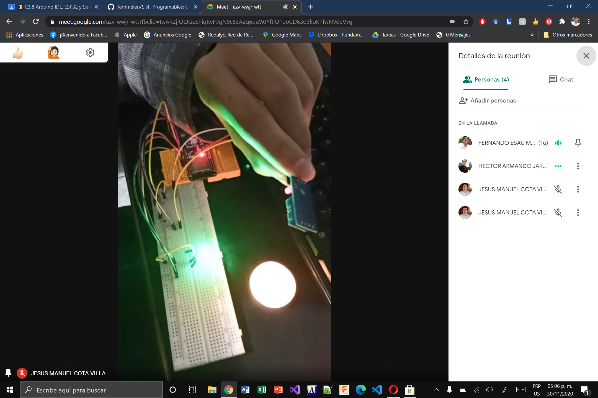

# :trophy: A.3.3 Actividad de aprendizaje

Circuito de medición de temperatura a través de un NodeMCU ESP32
___

## Instrucciones

- Basado en la figura 1, ensamblar un sistema, capaz de detectar la temperatura y humedad del ambiente, a través de un circuito electrónico, utilizando un NodeMCU **ESP32**, y un **Sensor DHT11/DHT22**.
- Toda actividad o reto se deberá realizar utilizando el estilo **MarkDown con extension .md** y el entorno de desarrollo VSCode, debiendo ser elaborado como un documento **single page**, es decir si el documento cuanta con imágenes, enlaces o cualquier documento externo debe ser accedido desde etiquetas y enlaces, y debe ser nombrado con la nomenclatura **A3.3_NombreApellido_Equipo.pdf.**
- Es requisito que el .md contenga una etiqueta del enlace al repositorio de su documento en GITHUB, por ejemplo **Enlace a mi GitHub** y al concluir el reto se deberá subir a github.
- Desde el archivo **.md** exporte un archivo **.pdf** que deberá subirse a classroom dentro de su apartado correspondiente, sirviendo como evidencia de su entrega, ya que siendo la plataforma **oficial** aquí se recibirá la calificación de su actividad.
- Considerando que el archivo .PDF, el cual fue obtenido desde archivo .MD, ambos deben ser idénticos.
- Su repositorio ademas de que debe contar con un archivo **readme**.md dentro de su directorio raíz, con la información como datos del estudiante, equipo de trabajo, materia, carrera, datos del asesor, e incluso logotipo o imágenes, debe tener un apartado de contenidos o indice, los cuales realmente son ligas o **enlaces a sus documentos .md**, _evite utilizar texto_ para indicar enlaces internos o externo.
- Se propone una estructura tal como esta indicada abajo, sin embargo puede utilizarse cualquier otra que le apoye para organizar su repositorio.
  
```
- readme.md
  - blog
    - C3.1_TituloActividad.md
    - C3.2_TituloActividad.md
    - C3.3_TituloActividad.md
    - C3.4_TituloActividad.md
    - C3.5_TituloActividad.md
    - C3.6_TituloActividad.md
    - C3.7_TituloActividad.md
    - C3.8_TituloActividad.md
  - img
  - docs
    - A3.1_TituloActividad.md
    - A3.2_TituloActividad.md
    - A3.3_TituloActividad.md
```

### Fuentes de apoyo para desarrollar la actividad:

   - [x] [Random Nerd Tutorial Touch pin](https://randomnerdtutorials.com/esp32-touch-pins-arduino-ide/)

   - [x] [Ejemplo de circuito con LED RGB Led](https://i0.wp.com/saber.patagoniatec.com/wp-content/uploads/2019/07/led-rgb-catodo-anado-comun.jpg)

___

## Desarrollo

1.Utilice el siguiente listado de materiales para la elaboración de la actividad

| Cantidad | Descripción | Link                                                                                                                                                                                                                        |
| -------- | ------------------------------------------------------------------------------------------------------------------------------------------------------------------------------------------------------------------------------------- |-------------------------|
| 1        | [Sensor temperatura y humedad DHT11](https://articulo.mercadolibre.com.mx/MLM-664315278-sensor-de-temperatura-y-humedad-dht11-cjumpers-arduino-pic-_JM#position=1&type=item&tracking_id=b203e8cd-c375-429a-9b75-8c57e8b35386) o DHT22 |[Sensor temperatura y humedad DHT11](https://www.naylampmechatronics.com/sensores-temperatura-y-humedad/57-sensor-de-temperatura-y-humedad-relativa-dht11.html)|
| 1        | Diodo led RGB   |[led RGB](https://articulo.mercadolibre.com.mx/MLM-579872893-led-rgb-5mm-_JM?matt_tool=18293428&matt_word=&matt_source=google&matt_campaign_id=6556629813&matt_ad_group_id=79019252139&matt_match_type=&matt_network=u&matt_device=c&matt_creative=385554255354&matt_keyword=&matt_ad_position=&matt_ad_type=&matt_merchant_id=114079120&matt_product_id=MLM579872893&matt_product_partition_id=422349491642&matt_target_id=pla-422349491642&gclid=Cj0KCQiAzZL-BRDnARIsAPCJs71lc99a8B2xzYwq1FGWCcb91rk8OmxHUk9avhz9XnzXRw-EB6k6MVQaAq6_EALw_wcB)|
| 1        | Resistencia 4.7 kohms |[Resistencia 4.7 kohms](https://www.steren.com.mx/resistencia-de-carbon-de-1-2-watt-al-5-de-tolerancia-de-4-7-kohms.html)|
| 3        | Resistencias 1 kohm |[Resistencia 1 kohm](https://www.steren.com.mx/resistencia-de-carbon-de-1-watt-al-5-de-tolerancia-de-1-kohm.html)|
| 1        | Fuente de voltaje de 5V |[Fuente de alimentación, 5V 3A](https://www.amazon.com.mx/AC-DC-fuente-alimentaci%C3%B3n-Black/dp/B078RXZM4C/ref=asc_df_B078RXZM4C/?tag=gledskshopmx-20&linkCode=df0&hvadid=450926494212&hvpos=&hvnetw=g&hvrand=17494429142433936024&hvpone=&hvptwo=&hvqmt=&hvdev=c&hvdvcmdl=&hvlocint=&hvlocphy=1010012&hvtargid=pla-436418104506&psc=1) |
| 1        | [NodeMCU ESP32](https://articulo.mercadolibre.com.mx/MLM-587686290-esp32-wifi-bluetooth-42-ble-nodemcu-esp8266-libro-gratis-_JM#position=1&type=item&tracking_id=84a6234b-5016-47eb-9950-39b49846ca72) |[NodeMCU ESP32](https://www.naylampmechatronics.com/espressif-esp/384-nodemcu-32-esp32-wifi.html)|
| 1        | BreadBoard |[BreadBoard](https://www.steren.com.mx/)|
| 1        | Jumpers M/M |[Jumpers](https://articulo.mercadolibre.com.mx/MLM-771672534-20-cables-dupont-macho-macho-jumpers-arduino-raspberry-_JM?matt_tool=28238160)|| 
       

1. Basado en las imágenes que se muestran en la **Figuras 1**, ensamble el circuito en un solo circuito electrónico, ide tal manera que se pueda obtener un sistema capaz de cumplir con las instrucciones antes solicitadas para esta actividad.
  

<p align="center"> 
    <strong>Figura 1 Circuito ESP32 y Sensor DHT</strong>
    
</p>

1.  Una vez ensamblado el circuito anterior, agregue un LED RGB y elabore el programa que le permita al LED RGB funcionar como indicador para las siguientes condiciones:
    - El sensor de temperatura en todo momento estará sensando, enviando el valor registrado por la terminal serial, por ejemplo "Temperatura ambiente: 25 grados" y el **LED RGB** estará encendido de color verde.
    - El sensor de temperatura al registrar un valor del ~20% por arriba de la temperatura ambiental, deberá mostrar el mensaje "Temperatura alta: ? grados" y el **LED RGB** se encenderá de color rojo.
    - El sensor de temperatura al registra un valor del ~20% por abajo de la temperatura ambiental, deberá mostrar el mensaje "Temperatura baja: ? grados" y el **LED RGB** se encenderá de color azul.
2. Coloque aquí evidencias que considere importantes durante el desarrollo de la actividad.


## ***[Demostración en video del circuito](https://www.youtube.com/watch?v=LCy5lfybstw&feature=youtu.be&fbclid=IwAR2owyQloqcnqEjfZA3gSN654jh-4_11BdCrK6vk5nYJ5Kx5Oz9lQoez1bI)***

### ***Circuito Armado***

<p align="center">
    
</p>

### **Temperatura ambiente: 25 grados**

<p align="center">
    
</p>

### **Temperatura alta**

<p align="center">
    
</p>

### **Temperatura baja**

<p align="center">
    
</p>

### **Monitor Serial**

<p align="center">
    
</p>

<p align="center">
    
</p>

### ***Codigo***

<p align="center">
    

<p align="center">
    

### ***Evidencia de Reunion***

<p align="center">
    
</p>

<p align="center">
    

# ***Conclusiones***

## ***Cota Villa Edy Jesus Manuel***

En la realización del circuito solo utilizamos el esp32, 1 led rgb, algunos jumpers y el protoboard la práctica estuvo algo complicada porque no me quedaba claro cómo se conectan los componentes entre sí, revise algunos ejemplos en internet pero la mayoría eran circuitos hechos con arduino y necesitábamos uno con esp32. En cuanto a la parte del código no creo que tuviéramos problemas haciéndolo, fue más complicado buscar un ejemplo en el cual basarnos para poder realizar el circuito.

## ***Fernando Esau Melendez Palafox***

Dentro de esta práctica implementamos un sensor DHT11 de temperatura e humedad y un LED RGB, para programar este sensor fue necesario agregar la librería al IDE Arduino, se necesitaba configurar los canales con los pines del led y configurar las condiciones necesarias para encender el color deseado. Si la temperatura se encuentra entre 20 y 30 celsius el led enciende en verde, menor a 20 grados enciende en azul y para mayor a 30 grados enciende rojo.

## ***Jaramillo Regino Hector Armando***

En esta práctica realizamos un circuito el cual funciona como un termómetro, este funciona encendiendo un led rgb dependiendo el rango de temperatura que detecta, nos encontramos con muchos problemas ya que no encontrábamos la manera en que se conectaba un rgb ánodo común con el nodemcu esp32 ya que todos los tutoriales que encontrábamos, ayudamos en la búsqueda de como hacer el circuito y el código para no dejar toda la carga a nuestro compañero que realiza el circuito físico.Dejando eso de lado fue bastante sencillo ya que el código eran condiciones sencillas las cuales sólo variaron un poco los valores de identificación del sensor.

___

### :bomb: Rubrica

| Criterios     | Descripción                                                                                  | Puntaje |
| ------------- | -------------------------------------------------------------------------------------------- | ------- |
| Instrucciones | Se cumple con cada uno de los puntos indicados dentro del apartado Instrucciones?            | 10      |
| Desarrollo    | Se respondió a cada uno de los puntos solicitados dentro del desarrollo de la actividad?     | 60      |
| Demostración  | El alumno se presenta durante la explicación de la funcionalidad de la actividad?            | 20      |
| Conclusiones  | Se incluye una opinión personal de la actividad  por cada uno de los integrantes del equipo? | 10      |

### :bookmark: Ligas

**Cota Villa Edy Jesus Manuel**

**Circuito Fisico**
:school: [Repositorio](https://github.com/CotaVilla/Sistemas-Programables)
:memo: [Actividad](https://github.com/CotaVilla/Sistemas-Programables/blob/master/docs/A3.3_EdyCota_DreamTeam.md)

**Jaramillo Regino Hector Armando**

:school: [Repositorio](https://github.com/HectorJaramillo/JaramilloHector-SistemasProgramables)
:memo: [Actividad](https://github.com/HectorJaramillo/JaramilloHector-SistemasProgramables/blob/master/Blog/A3.3_HectorJaramillo_DreamTeam.md)

**Fernando Esau Melendez Palafox**

:school: [Repositorio](https://github.com/fernmelen/Sist.-Programables)
:memo: [Actividad](https://github.com/fernmelen/Sist.-Programables/blob/master/blog/A3.3_FernandoMelendez_DreamTeam.md)