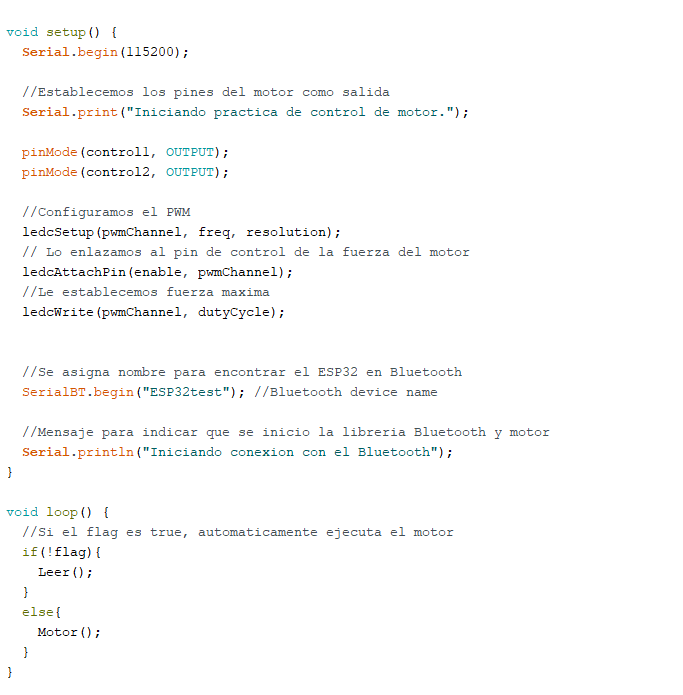

# :trophy: A4.1 Actividad de aprendizaje

Circuito de control para activar y desactivar un motor DC, utilizando  NodeMCU ESP32 por medio de Bluetooth
___

## Instrucciones

- Realizar un sistema ensamblado de control por medio de **Bluetooth**, capaz de control a un motor DC, utilizando un NodeMCU **ESP32**, un y un **IC L293D**.
- Toda actividad o reto se deberá realizar utilizando el estilo **MarkDown con extension .md** y el entorno de desarrollo VSCode, debiendo ser elaborado como un documento **single page**, es decir si el documento cuanta con imágenes, enlaces o cualquier documento externo debe ser accedido desde etiquetas y enlaces, y debe ser nombrado con la nomenclatura **A4.1_NombreApellido_Equipo.pdf.**
- Es requisito que el .md contenga una etiqueta del enlace al repositorio de su documento en GITHUB, por ejemplo **Enlace a mi GitHub** y al concluir el reto se deberá subir a github.
- Desde el archivo **.md** exporte un archivo **.pdf** que deberá subirse a classroom dentro de su apartado correspondiente, sirviendo como evidencia de su entrega, ya que siendo la plataforma **oficial** aquí se recibirá la calificación de su actividad.
- Considerando que el archivo .PDF, el cual fue obtenido desde archivo .MD, ambos deben ser idénticos.
- Su repositorio ademas de que debe contar con un archivo **readme**.md dentro de su directorio raíz, con la información como datos del estudiante, equipo de trabajo, materia, carrera, datos del asesor, e incluso logotipo o imágenes, debe tener un apartado de contenidos o indice, los cuales realmente son ligas o **enlaces a sus documentos .md**, _evite utilizar texto_ para indicar enlaces internos o externo.
- Se propone una estructura tal como esta indicada abajo, sin embargo puede utilizarse cualquier otra que le apoye para organizar su repositorio.
  
```
- readme.md
  - blog
    - C4.1_TituloActividad.md
    - C4.2_TituloActividad.md
    - C4.3_TituloActividad.md
    - C4.4_TituloActividad.md    
  - img
  - docs
    - A4.1_TituloActividad.md
    - A4.2_TituloActividad.md
    - A4.3_TituloActividad.md
```
___

### Fuentes de apoyo para desarrollar la actividad

- [x] [Random Nerd Tutorial DHT Humedad y temperatura](https://randomnerdtutorials.com/esp32-dht11-dht22-temperature-humidity-sensor-arduino-ide/)
- [x] [Motor DC con IC L293 y ESP32](https://www.hackster.io/Oniichan_is_ded/l293d-with-esp32-wemos-lolin-d32-v2-hacked-edition-ea2086)


___

## Desarrollo

1.Utilizar el siguiente listado de materiales para la elaboración de la actividad

| Cantidad | Descripción |Link del componente                                  |
| -------- | ---------------------------------------------------------------------------------------------------------------------------------------|-------------------------|
| 1        | [IC L293D]([https://www.amazon.com.mx/330ohms-M%C3%B3dulo-Sensor-Humedad-Temperatura/dp/B07Q4KWJQY/ref=sr_1_1?__mk_es_MX=%C3%85M%C3%85%C5%BD%C3%95%C3%91&dchild=1&keywords=sensor+dht11&qid=1599003418&sr=8-1)  |[IC L293D](https://articulo.mercadolibre.com.mx/MLM-550315566-puente-h-l293d-para-motores-a-pasos-arduino-pic-raspberry-_JM?matt_tool=48904454&matt_word=&matt_source=google&matt_campaign_id=11714912137&matt_ad_group_id=113017550359&matt_match_type=&matt_network=g&matt_device=c&matt_creative=482511924687&matt_keyword=&matt_ad_position=&matt_ad_type=pla&matt_merchant_id=116937574&matt_product_id=MLM550315566&matt_product_partition_id=353037831509&matt_target_id=pla-353037831509&gclid=Cj0KCQiA5bz-BRD-ARIsABjT4nijIcRFPT9y0pEsZNXUQZlgtd2nDztqEvtbAd0ezAaxMEQ8TcwSe2MaAqZGEALw_wcB)           |
| 1        | Fuente de voltaje de 5V |  [Fuente de alimentación, 5V 3A](https://www.amazon.com.mx/AC-DC-fuente-alimentaci%C3%B3n-Black/dp/B078RXZM4C/ref=asc_df_B078RXZM4C/?tag=gledskshopmx-20&linkCode=df0&hvadid=450926494212&hvpos=&hvnetw=g&hvrand=17494429142433936024&hvpone=&hvptwo=&hvqmt=&hvdev=c&hvdvcmdl=&hvlocint=&hvlocphy=1010012&hvtargid=pla-436418104506&psc=1)                                       |
| 1        | [NodeMCU ESP32](https://www.amazon.com.mx/ESP-32-ESP-32S-ESP-WROOM-32-ESP32-S-desarrollo/dp/B07TBFC75Z/ref=sr_1_2?__mk_es_MX=%C3%85M%C3%85%C5%BD%C3%95%C3%91&dchild=1&keywords=esp32&qid=1599003438&sr=8-2)|[NodeMCU ESP32](https://www.naylampmechatronics.com/espressif-esp/384-nodemcu-32-esp32-wifi.html)                |
| 1        | [BreadBoard](https://www.amazon.com.mx/Deke-Home-Breadboard-distribuci%C3%B3n-electr%C3%B3nica/dp/B086C9HK7V/ref=sr_1_22?__mk_es_MX=%C3%85M%C3%85%C5%BD%C3%95%C3%91&dchild=1&keywords=breadboard&qid=1599003455&sr=8-22) |[BreadBoard](https://www.steren.com.mx/)  |
| 1        | [Jumpers M/M](https://www.amazon.com.mx/ELEGOO-Macho-Hembra-Macho-Macho-Hembra-Hembra-Protoboard/dp/B06ZXSQ5WG/ref=sr_1_1?__mk_es_MX=%C3%85M%C3%85%C5%BD%C3%95%C3%91&dchild=1&keywords=jumper+wires&qid=1599003519&sr=8-1) | [Jumpers](https://articulo.mercadolibre.com.mx/MLM-771672534-20-cables-dupont-macho-macho-jumpers-arduino-raspberry-_JM?matt_tool=28238160)|
| 1| Motor Reductor | [Motor Reductor](https://www.steren.com.mx/motor-reductor-de-doble-eje-tipo-i-3-vcc.html?gclid=Cj0KCQiA5bz-BRD-ARIsABjT4ngV2Pjokkfzqpt7FUcr1nNsmxK2rf65gm_K-q8_rcBeaO0MWt4bXikaAthVEALw_wcB) |

1. Basado en las imágenes que se muestran en las **Figura 1**, ensamblar un circuito electrónico, con la finalidad de obtener un sistema capaz de cumplir con las instrucciones siguientes:
   
  + Por medio de la aplicación "Serial Bluetooth terminal" que puede ser descargada del play Store de google o incluso cualquier otra que considere, se deberá controlar el arranque y apagado de un motor DC, es decir se contara con dos peticiones, la cual una de ellas representara el **"START" y la otra opción "STOP"**
  + El motor debe ser capaz de girar a favor de las manecillas del reloj durante 5 segundos, al cumplirse ese tiempo debe frenar 1 segundo e invertirá su giro durante otros 5 segundos, es decir la actividad debe tener la secuencia siguiente: El **stop** puede ser ejecutado en cualquier instante, y el motor estará ejecutando 5s en forward, 1s stop, 5s reverse, 1s stop, 5s forward, 1s stop, 5s reverse,...
    
<p align="center"> 
    <strong>Figura 1 Circuito ESP32 IC L293 Motor DC</strong>
    
</p>

3. Coloque aquí la imagen del circuito ensamblado
   
## **Circuito Fisico**

<p align="center">
    
</p>

<p align="center">
    
</p>

4. Coloque en este lugar el programa creado dentro del entorno de Arduino

## **Codigo en Arduino IDE**

<p align="center">
    
</p>

<p align="center">
    
</p>

<p align="center">
    
</p>

<p align="center">
    
</p>

1. Coloque aquí evidencias que considere importantes durante el desarrollo de la actividad.
   
## ***[Demostración en video del circuito](https://www.youtube.com/watch?v=-09_L78QjHk&feature=youtu.be&fbclid=IwAR0b540OlYWlI9NqX9nFQNJibYci3JE5vjp7Msf0rWVHTfchgGAFisFRO_M)***

## **Codigo Fuente**

```C++
//Usamos la libreria para usar el bluetooth
#include "BluetoothSerial.h"

//If que checa si esta habilitado el bluetooth
#if !defined(CONFIG_BT_ENABLED) || !defined(CONFIG_BLUEDROID_ENABLED)
#error Bluetooth is not enabled! Please run make menuconfig to and enable it
#endif

BluetoothSerial SerialBT;

// Variables del mensaje
String message = "";
char incomingChar;

bool flag = false;//Bandera para desactivar el motor

// Pin para controlar la fuerza del motor
int enable = 4;
//2 pines para controlar la rotacion del motor
int control1 = 16;
int control2 = 17;

//Vamos a usar PWM para controlar la fuerza del motor
const int freq = 30000;
const int pwmChannel = 0;
const int resolution = 8;

//Fuerza del motor
int dutyCycle = 255;

 
void setup() {
  Serial.begin(115200);
  
  //Establecemos los pines del motor como salida
  Serial.print("Iniciando practica de control de motor.");  
  
  pinMode(control1, OUTPUT);
  pinMode(control2, OUTPUT);

  //Configuramos el PWM
  ledcSetup(pwmChannel, freq, resolution);
  // Lo enlazamos al pin de control de la fuerza del motor
  ledcAttachPin(enable, pwmChannel);
  //Le establecemos fuerza maxima
  ledcWrite(pwmChannel, dutyCycle);
  

  //Se asigna nombre para encontrar el ESP32 en Bluetooth
  SerialBT.begin("ESP32test"); //Bluetooth device name
  
  //Mensaje para indicar que se inicio la libreria Bluetooth y motor
  Serial.println("Iniciando conexion con el Bluetooth");
}

void loop() {
  //Si el flag es true, automaticamente ejecuta el motor
  if(!flag){
    Leer();
  }
  else{
    Motor();
  }
}

//Funcion para controlar le motor
void Motor(){
  //Valor para guardar el numero de ciclo en que sesta
  int n = 1 ;
  //Si la bandera es verdadera va a iniciar el motor
  while(flag){
    for (int i = 0; i < 600; i++) {
      //cada corrida tiene un delay de 20 milisegundos en total 12000 milisegundos
      Leer();
      if(!flag){
        digitalWrite(control1, LOW);
        digitalWrite(control2, LOW);
        break;
      }
      if(i < 250){
        digitalWrite(control1, HIGH);
        digitalWrite(control2, LOW);
        }
      
      if(i >= 250 && i < 300){
        digitalWrite(control1, LOW);
        digitalWrite(control2, LOW);
        }
         
      if(i >= 300 && i < 550 ){
        digitalWrite(control1, LOW); 
        digitalWrite(control2, HIGH);
        }
      
      if(i >= 550){
        digitalWrite(control1, LOW); 
        digitalWrite(control2, LOW);
        }
      }
      //Imprimimos que el ciclo termino
      Serial.println(String("Ciclo ") + n + " terminado");
      n++;
    }
}

//Funcion para leer el bluetooth
void Leer(){
  //De esta manerahacemos que lo que se escriba en una consola aparezca en la otra.
  if (SerialBT.available()) {
    //Guardamos el mensaje del celular
    char incomingChar = SerialBT.read();
    //Le ponemos que ignore los Enter
    if (incomingChar != '\n'){
      //Si no es solo un enter convertimos el mensaje a un string
      message += String(incomingChar);
    }
    else{
      message = "";
    }
    
    //Imprimimos el mensaje
    Serial.write(incomingChar);
    
    //Si llega ON u OFF cambiamos el flag
    if (message == "ON"){
      Serial.println("\nEncendido");
      flag = true;
    }
    else if (message == "OFF"){
      Serial.println("\nApagado");
      flag = false;
    }
  }
  delay(20);
}
```


## ***Evidencias de Reunion***
<p align="center">
    
</p>

<p align="center">
    
</p>

# ***Conclusiones***

## ***Cota Villa Edy Jesus Manuel***
Para el control de motores en esta practica utilizamos el circuito integrado L293d conectando dos jumpers para la dirección del motor, dos para la energía del motor (5v). Dentro de la programación utilizamos librerías de Bluetooth para el control de los motores a travez del celular, se hace uso de las librerías para establecer la conexión, configuramos todos los parámetros pwm con los pines conectados al motor, utilizamos un método Leer() para verificar el estado de una bandera activada con el celular, al tener activada la bandera movemos el motor a la derecha, se detiene y después a la izquierda. El código es largo para el manejo de todo el control remoto del motor por medio de Bluetooth, agregando que tuvimos problemas con el funcionamiento del chip debido a que nuestro pin enable tenia que enviar una señal alta, eso se soluciona en una línea de código donde se envía un parámetro de 255 a ese pin.

## ***Fernando Esau Melendez Palafox***
En conclusión de esta práctica para el control de motores a través de Bluetooth; tuvimos problemas a la hora de la programación, no era tan complicado los métodos pero tienen demasiadas configuraciones para funcionar y una que nos estaba fallando era enviar una señal alta al pin enable que estábamos usando, una vez solucionado ese problema todos nuestros métodos son fáciles de explicar. A grandes rasgos, primero configuramos y habilitamos el modulo Bluetooth del ESP32, después verificamos el estado de una bandera para saber a que metodo ir; en caso de estar en falso la bandera (predeterminado) manda entra en un ciclo para leer lo que se recibe del celular en el Bluetooth, al recibir la palabra ON, cambia la bandera a verdadero y se inicia con el metodo llamado Motor() y ese metodo usando condiciones y ciclos activa el motor hacia un lado, lo detiene y después lo gira para el lado contrario y termina, después de devuelve al primer metodo que elige que hacer dependiendo de la bandera. Y en eso consiste el funcionamiento del motor según las condiciones que se le programaron


## ***Jaramillo Regino Hector Armando***
En esta práctica tuvimos diversas complicaciones ya que no teníamos el componente L293D y tuvimos que ir a comprarlo de imprevisto después algunos problemas en la realización del código, esto por que nos fallaban ciertos comandos lógicos a la hora de controlar las interrupciones dentro del proceso de giro del motor, para facilitar el proceso y no tener complicaciones a la hora de realizar las interrupciones utilizamos banderas y de esa manera solo tuvimos que mandar a llamar los métodos desde el loop con un if, mientras que en el método del motor agregamos que la interrupción pueda presentarse durante la ejecución del ciclo del motor. Ensamblar el circuito no fue tan complicado, en lo que tardamos más fue en encontrar información de como hacer funcionar el código y en cuanto a la asignación de voltaje del motor, en el primer intento le asignamos muy poco y solo giraba si lo estimulamos.
___

### :bomb: Rubrica

| Criterios     | Descripción                                                                                  | Puntaje |
| ------------- | -------------------------------------------------------------------------------------------- | ------- |
| Instrucciones | Se cumple con cada uno de los puntos indicados dentro del apartado Instrucciones?            | 10      |
| Desarrollo    | Se respondió a cada uno de los puntos solicitados dentro del desarrollo de la actividad?     | 60      |
| Demostración  | El alumno se presenta durante la explicación de la funcionalidad de la actividad?            | 20      |
| Conclusiones  | Se incluye una opinión personal de la actividad  por cada uno de los integrantes del equipo? | 10      |


### :bookmark: Ligas

**Cota Villa Edy Jesus Manuel**

**Circuito Fisico**
:school: [Repositorio](https://github.com/CotaVilla/Sistemas-Programables)
:memo: [Actividad](https://github.com/CotaVilla/Sistemas-Programables/blob/master/docs/A4.1_EdyCota_DreamTeam.md)

**Jaramillo Regino Hector Armando**

:school: [Repositorio](https://github.com/HectorJaramillo/JaramilloHector-SistemasProgramables)
:memo: [Actividad](https://github.com/HectorJaramillo/JaramilloHector-SistemasProgramables/blob/master/Blog/A4.1_HectorJaramillo_DreamTeam.md)

**Fernando Esau Melendez Palafox**

:school: [Repositorio](https://github.com/fernmelen/Sist.-Programables)
:memo: [Actividad](https://github.com/fernmelen/Sist.-Programables/blob/master/blog/A4.1_FernandoMelendez_DreamTeam.md)