# :trophy: A4.2 Actividad de aprendizaje

Circuito sensor de iluminación y actuación de luz NodeMCU ESP32 por medio de Wi-Fi
___

## Instrucciones

- Realizar un sistema de medición y actuación de luz ambiental, utilizando el protocolo de comunicación **Wi-FI**, asi como un NodeMCU **ESP32**, un sensor  **LDR**, un diodo LED.
- Toda actividad o reto se deberá realizar utilizando el estilo **MarkDown con extension .md** y el entorno de desarrollo VSCode, debiendo ser elaborado como un documento **single page**, es decir si el documento cuanta con imágenes, enlaces o cualquier documento externo debe ser accedido desde etiquetas y enlaces, y debe ser nombrado con la nomenclatura **A4.2_NombreApellido_Equipo.pdf.**
- Es requisito que el .md contenga una etiqueta del enlace al repositorio de su documento en GITHUB, por ejemplo **Enlace a mi GitHub** y al concluir el reto se deberá subir a github.
- Desde el archivo **.md** exporte un archivo **.pdf** que deberá subirse a classroom dentro de su apartado correspondiente, sirviendo como evidencia de su entrega, ya que siendo la plataforma **oficial** aquí se recibirá la calificación de su actividad.
- Considerando que el archivo .PDF, el cual fue obtenido desde archivo .MD, ambos deben ser idénticos.
- Su repositorio ademas de que debe contar con un archivo **readme**.md dentro de su directorio raíz, con la información como datos del estudiante, equipo de trabajo, materia, carrera, datos del asesor, e incluso logotipo o imágenes, debe tener un apartado de contenidos o indice, los cuales realmente son ligas o **enlaces a sus documentos .md**, _evite utilizar texto_ para indicar enlaces internos o externo.
- Se propone una estructura tal como esta indicada abajo, sin embargo puede utilizarse cualquier otra que le apoye para organizar su repositorio.
  
```
- readme.md
  - blog
    - C4.1_TituloActividad.md
    - C4.2_TituloActividad.md
    - C4.3_TituloActividad.md
    - C4.4_TituloActividad.md    
  - img
  - docs
    - A4.1_TituloActividad.md
    - A4.2_TituloActividad.md
    - A4.3_TituloActividad.md
```
___

### Fuentes de apoyo para desarrollar la actividad

   - [x] [ESP32 Web Server](https://randomnerdtutorials.com/esp32-web-server-arduino-ide/)
   - [x] [LDR con ESP32](https://www.youtube.com/watch?v=A3qcN2mzv0Q)
   
___

## Desarrollo

1.Utilizar el siguiente listado de materiales para la elaboración de la actividad

| Cantidad | Descripción    | Link del Componente |
| -------- | -------------- | ------------------- |
| 1        | [Modulo Sensor LDR]([https://articulo.mercadolibre.com.mx/MLM-623282168-modulo-sensor-de-luz-ldr-_JM)    |[Fotoresistencia LDR](https://www.naylampmechatronics.com/sensores-luz-y-sonido/241-sensor-ldr-5528.html)|
| 1 | Rele de 3.3v |[Relevador](https://www.naylampmechatronics.com/drivers/297-modulo-relay-1-canal-5vdc.html?search_query=rele&results=12)|
| 1 | Bombilla  |[Bombilla](https://www.amazon.com.mx/Tecnolite-HEL-15W-65-T2-L%C3%A1mpara-Fluorescente/dp/B00YURRWZA/ref=asc_df_B00YURRWZA/?tag=gledskshopmx-20&linkCode=df0&hvadid=417495562991&hvpos=&hvnetw=g&hvrand=2259812758146766028&hvpone=&hvptwo=&hvqmt=&hvdev=c&hvdvcmdl=&hvlocint=&hvlocphy=1010012&hvtargid=pla-893416765360&psc=1)|
| 1        | Fuente de voltaje de 5V    | [Fuente de alimentación, 5V 3A](https://www.amazon.com.mx/AC-DC-fuente-alimentaci%C3%B3n-Black/dp/B078RXZM4C/ref=asc_df_B078RXZM4C/?tag=gledskshopmx-20&linkCode=df0&hvadid=450926494212&hvpos=&hvnetw=g&hvrand=17494429142433936024&hvpone=&hvptwo=&hvqmt=&hvdev=c&hvdvcmdl=&hvlocint=&hvlocphy=1010012&hvtargid=pla-436418104506&psc=1)  |
| 1        | [NodeMCU ESP32](https://www.amazon.com.mx/ESP-32-ESP-32S-ESP-WROOM-32-ESP32-S-desarrollo/dp/B07TBFC75Z/ref=sr_1_2?__mk_es_MX=%C3%85M%C3%85%C5%BD%C3%95%C3%91&dchild=1&keywords=esp32&qid=1599003438&sr=8-2)|[NodeMCU ESP32](https://www.naylampmechatronics.com/espressif-esp/384-nodemcu-32-esp32-wifi.html)              |
| 1        | [BreadBoard](https://www.amazon.com.mx/Deke-Home-Breadboard-distribuci%C3%B3n-electr%C3%B3nica/dp/B086C9HK7V/ref=sr_1_22?__mk_es_MX=%C3%85M%C3%85%C5%BD%C3%95%C3%91&dchild=1&keywords=breadboard&qid=1599003455&sr=8-22) |[BreadBoard](https://www.steren.com.mx/protoboard-de-ensamble-deslizable-1-bloque-y-2-tiras.html)   |
| 1        | [Jumpers M/M](https://www.amazon.com.mx/ELEGOO-Macho-Hembra-Macho-Macho-Hembra-Hembra-Protoboard/dp/B06ZXSQ5WG/ref=sr_1_1?__mk_es_MX=%C3%85M%C3%85%C5%BD%C3%95%C3%91&dchild=1&keywords=jumper+wires&qid=1599003519&sr=8-1) | [Jumpers](https://articulo.mercadolibre.com.mx/MLM-771672534-20-cables-dupont-macho-macho-jumpers-arduino-raspberry-_JM?matt_tool=28238160)|

1. Basado en la imágen que se muestran en las **Figura 1**, ensamble un circuito electrónico y agregue un Led y un rele a una de las terminales del dispositivo, de tal manera que se pueda obtener un sistema capaz de cumplir con las instrucciones siguiente:
    - Se deberá utilizar el NodeMCU como un **standalone Web server**, el cual deberá proveer una interface visual, que mostrara una imagen representando un comportamiento de "ON y OFF" dependiendo de la condición de iluminación ambiental.
    - El sensor de iluminación deberá estar midiendo la cantidad de luz que existen en el ambiente.
    - Al momento de detectar el sensor LDR, ausencia de luz deberá mostrar en la interface Web un estado "ON", y en caso contrario deberá representarse el estado "OFF".
    - Al circuito de la figura 1 se le deberá agregar un relevador en serie con una bombilla, que sera activada en condición opuesta al estado "ON" y "OFF", es decir una vez que el sensor detecto poca o nula iluminación activara el rele y por consecuencia encenderá la bombilla, y en caso contrario lo apagara.

[Fuente de apoyo Random Nerd Tutorial](https://randomnerdtutorials.com/esp32-web-server-arduino-ide/)
    
<p align="center"> 
    <strong>Figura 1 Circuito ESP32 Sensor LDR iluminacion</strong>
    
</p>

3. Coloque aquí la imagen del circuito ensamblado
   
<p align="center">
    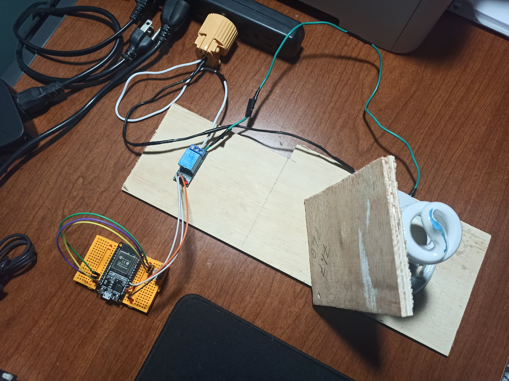
</p>
<p align="center">
    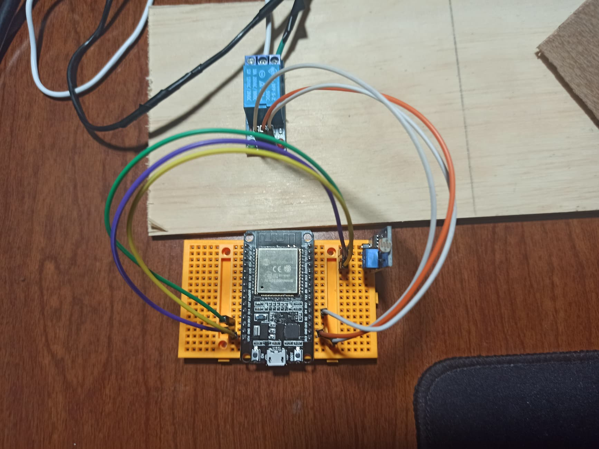
</p>
<p align="center">
    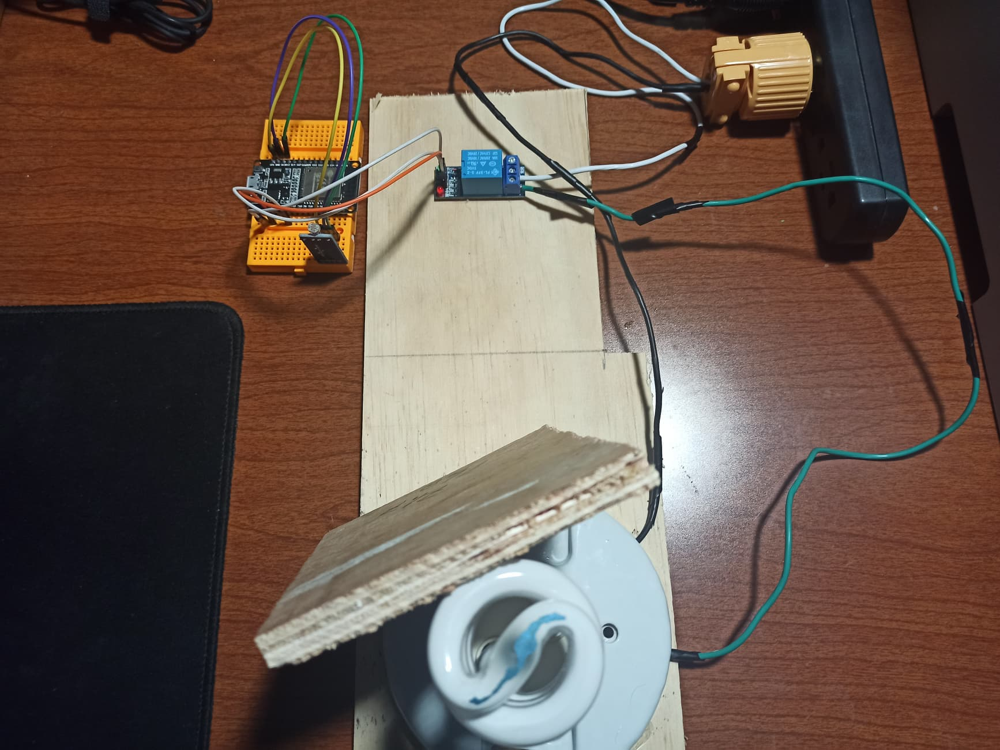
</p>

4. Coloque en este lugar el programa creado dentro del entorno de Arduino

<p align="center">
    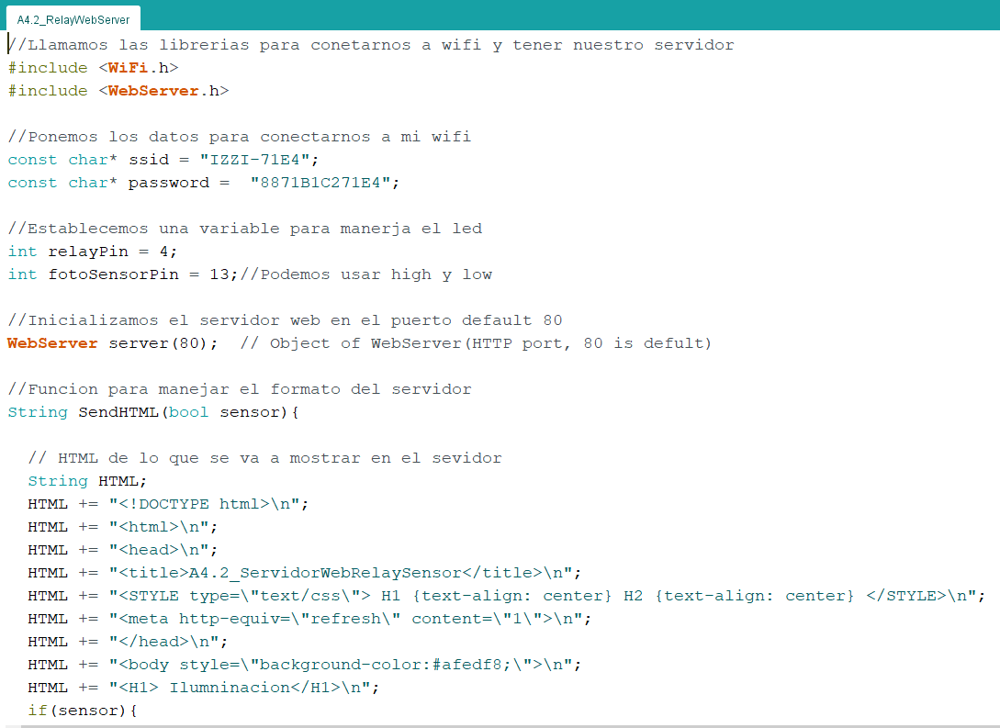
</p>
<p align="center">
    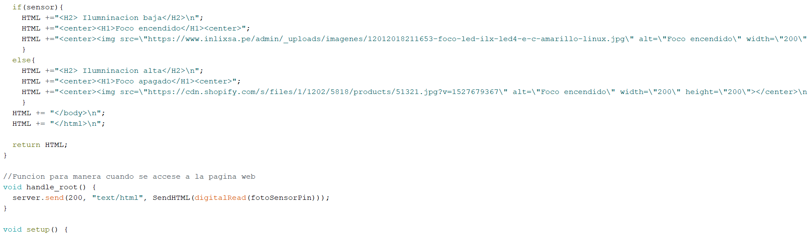
</p>
<p align="center">
    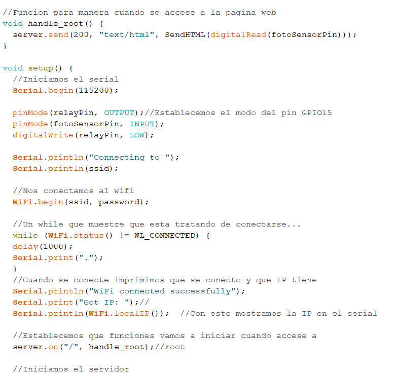
</p>
<p align="center">
    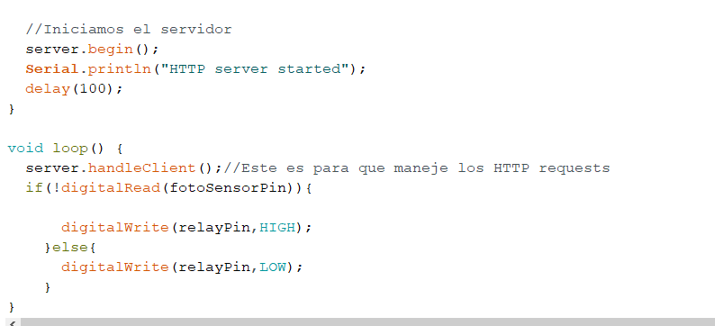
</p>

5. Coloque aquí evidencias que considere importantes durante el desarrollo de la actividad.

## ***[Demostración en video del circuito](https://www.youtube.com/watch?fbclid=IwAR06sEVjbzD2_Uthkwgc_NwvY7_-KpQDXTNvvHAbCFVvD13LdwtfDIH1xP4&v=YL52Pu4rstM&feature=youtu.be)***

## **Evidencias de Reunion**

<p align="center">
    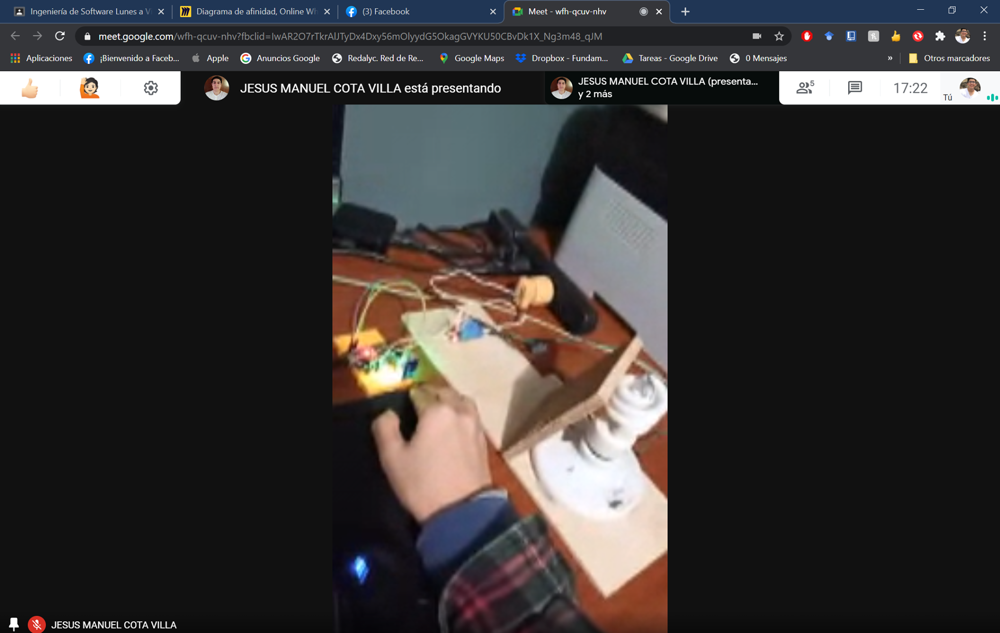
</p>

<p align="center">
    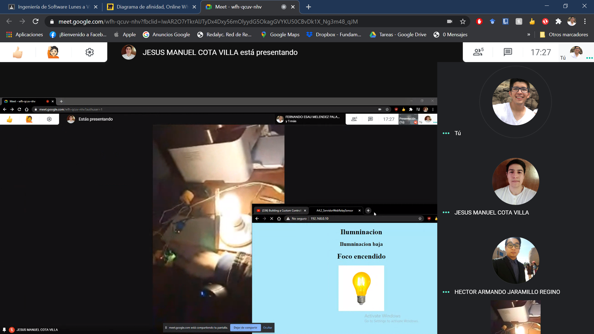
</p>

<p align="center">
    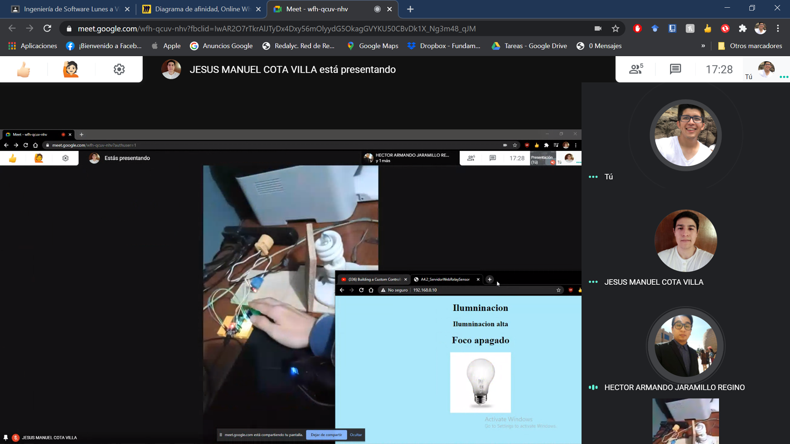
</p>

<p align="center">
    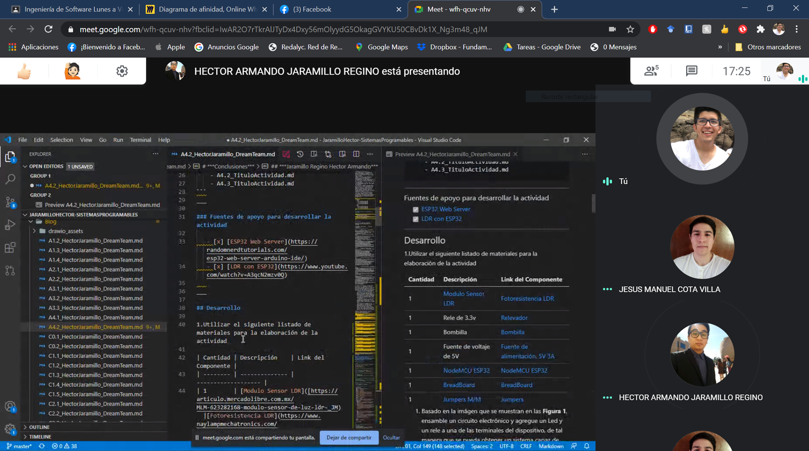
</p>

## **Codigo Fuente**

```C++
//Llamamos las librerias para conetarnos a wifi y tener nuestro servidor
#include <WiFi.h>
#include <WebServer.h>

//Ponemos los datos para conectarnos a mi wifi
const char* ssid = "IZZI-71E4";
const char* password =  "8871B1C271E4";

//Establecemos una variable para manerja el led
int relayPin = 4;
int fotoSensorPin = 13;//Podemos usar high y low

//Inicializamos el servidor web en el puerto default 80
WebServer server(80);  // Object of WebServer(HTTP port, 80 is defult)

//Funcion para manejar el formato del servidor
String SendHTML(bool sensor){
  
  // HTML de lo que se va a mostrar en el sevidor
  String HTML;
  HTML += "<!DOCTYPE html>\n";
  HTML += "<html>\n";
  HTML += "<head>\n";
  HTML += "<title>A4.2_ServidorWebRelaySensor</title>\n";
  HTML += "<STYLE type=\"text/css\"> H1 {text-align: center} H2 {text-align: center} </STYLE>\n";
  HTML += "<meta http-equiv=\"refresh\" content=\"1\">\n";
  HTML += "</head>\n";
  HTML += "<body style=\"background-color:#afedf8;\">\n";
  HTML += "<H1> Ilumninacion</H1>\n";
  if(sensor){
    HTML +="<H2> Ilumninacion baja</H2>\n";
    HTML +="<center><H1>Foco encendido</H1><center>";
    HTML +="<center></center>\n";
    }
  else{
    HTML +="<H2> Ilumninacion alta</H2>\n";
    HTML +="<center><H1>Foco apagado</H1><center>";
    HTML +="<center></center>\n";
    }
  HTML += "</body>\n";
  HTML += "</html>\n";

  return HTML;
}

//Funcion para manera cuando se accese a la pagina web
void handle_root() {
  server.send(200, "text/html", SendHTML(digitalRead(fotoSensorPin)));
}

void setup() {
  //Iniciamos el serial
  Serial.begin(115200);
  
  pinMode(relayPin, OUTPUT);//Establecemos el modo del pin GPIO15
  pinMode(fotoSensorPin, INPUT);
  digitalWrite(relayPin, LOW);
  
  Serial.println("Connecting to ");
  Serial.println(ssid);

  //Nos conectamos al wifi
  WiFi.begin(ssid, password);

  //Un while que muestre que esta tratando de conectarse...
  while (WiFi.status() != WL_CONNECTED) {
  delay(1000);
  Serial.print(".");
  }
  //Cuando se conecte imprimimos que se conecto y que IP tiene
  Serial.println("WiFi connected successfully");
  Serial.print("Got IP: ");//
  Serial.println(WiFi.localIP());  //Con esto mostramos la IP en el serial

  //Establecemos que funciones vamos a iniciar cuando accese a
  server.on("/", handle_root);//root

  //Iniciamos el servidor
  server.begin();
  Serial.println("HTTP server started");
  delay(100); 
}

void loop() {
  server.handleClient();//Este es para que maneje los HTTP requests
  if(!digitalRead(fotoSensorPin)){

      digitalWrite(relayPin,HIGH);
    }else{
      digitalWrite(relayPin,LOW);
    }
}
```
# ***Conclusiones***

## ***Cota Villa Edy Jesus Manuel***
En este circuito vimos como podemos utilizar un relay para manejar un foco a partir de las señales de un fotoresistor, haciendo un sistema un un poco mas inteligente para automatizar el encendido y apagado de un foco que puede estar conectado a un enchufe de nuestro hogar y siendo manejado con un relay podemos permitir o bloquear el pase de energia hacia el foco, la practica fue un tanto peligrosa ya que estamos trabajando con la corriente de nuestro hogar, pero demuestra como funciona el control automatico de dispositivos en el hogar, ademas integrando una interface visual en el internet se puede convertir facilmente en un proyecto de domotica.

## ***Fernando Esau Melendez Palafox***
Para la actividad utilizamos el ESP32 con un fotoresistor y un Relay que activa un foco, utilizando protocolo WiFi para comunicar a una página web creada a través del código. Lo difícil en la práctica empezaba en la programación, se utilizan librerías de WiFi para la creación de un servidor para establecer la comunicación entre el EPS32 y cualquier dispositivo con navegador web. Se programaron los html dentro del código en Arduino IDE, luego por un método estos se envían al servidor para desplegar en la página web el estado del foco. La condición principal esta en la lectura del foto resistor; depende su lectura se enciende o apaga el foco y se hace todo el proceso de desplegar en la página web el estado del foco junto con una imagen.

## ***Jaramillo Regino Hector Armando***
En esta práctica un circuito que permite encender un foco al no detectar iluminación y apagarse al volverla a detectar, el cual se puede implementar en lámparas autónomas como las que hay en las calles. En la realización del código tuvimos algunos problemas ya que algunos métodos non se ejecutaban correctamente ya que el programa no los detectaba asi que tuvimos que cambiar de lugar  varias veces los métodos hasta que corrieran de manera normal.Utilizamos el fotoresistor LDR que ya habíamos utilizado anteriormente, un relay para controlar una fuente de energía externa, el módulo esp32 y un foco para hacer el circuito, tuvimos algunos problemas en la ejecución del circuito ya que el foco cambiaba el estado del circuito por lo que optamos por  agregar un objeto que impidiera el paso de la luz y así no alterar el funcionamiento del circuito.
___

### :bomb: Rubrica

| Criterios     | Descripción                                                                                  | Puntaje |
| ------------- | -------------------------------------------------------------------------------------------- | ------- |
| Instrucciones | Se cumple con cada uno de los puntos indicados dentro del apartado Instrucciones?            | 10      |
| Desarrollo    | Se respondió a cada uno de los puntos solicitados dentro del desarrollo de la actividad?     | 60      |
| Demostración  | El alumno se presenta durante la explicación de la funcionalidad de la actividad?            | 20      |
| Conclusiones  | Se incluye una opinión personal de la actividad  por cada uno de los integrantes del equipo? | 10      |

### :bookmark: Ligas

**Cota Villa Edy Jesus Manuel**

**Circuito Fisico**
:school: [Repositorio](https://github.com/CotaVilla/Sistemas-Programables)
:memo: [Actividad](https://github.com/CotaVilla/Sistemas-Programables/blob/master/docs/A4.2_EdyCota_DreamTeam.md)

**Jaramillo Regino Hector Armando**

:school: [Repositorio](https://github.com/HectorJaramillo/JaramilloHector-SistemasProgramables)
:memo: [Actividad](https://github.com/HectorJaramillo/JaramilloHector-SistemasProgramables/blob/master/Blog/A4.2_HectorJaramillo_DreamTeam.md)

**Fernando Esau Melendez Palafox**

:school: [Repositorio](https://github.com/fernmelen/Sist.-Programables)
:memo: [Actividad](https://github.com/fernmelen/Sist.-Programables/blob/master/blog/A4.2_FernandoMelendez_DreamTeam.md)