# :trophy: A5.2 Actividad de aprendizaje

Sistema sensor y actuacion del color de un objeto, e interface visual
___

## Instrucciones

- Realizar un sistema de identificacion de color utilizando un sensor de RGB TCS34725, un nodeMCU ESP32, un actuador Servomotor SG90, cualquier protocolo de comunicación y una interface visual que puede ser desarrollada por el equipo o apoyandose de otras como Node-red por ejemplo.
- Toda actividad o reto se deberá realizar utilizando el estilo **MarkDown con extension .md** y el entorno de desarrollo VSCode, debiendo ser elaborado como un documento **single page**, es decir si el documento cuanta con imágenes, enlaces o cualquier documento externo debe ser accedido desde etiquetas y enlaces, y debe ser nombrado con la nomenclatura **A5.2_NombreApellido_Equipo.pdf.**
- Es requisito que el .md contenga una etiqueta del enlace al repositorio de su documento en GITHUB, por ejemplo **Enlace a mi GitHub** y al concluir el reto se deberá subir a github.
- Desde el archivo **.md** exporte un archivo **.pdf** que deberá subirse a classroom dentro de su apartado correspondiente, sirviendo como evidencia de su entrega, ya que siendo la plataforma **oficial** aquí se recibirá la calificación de su actividad.
- Considerando que el archivo .PDF, el cual fue obtenido desde archivo .MD, ambos deben ser idénticos.
- Su repositorio ademas de que debe contar con un archivo **readme**.md dentro de su directorio raíz, con la información como datos del estudiante, equipo de trabajo, materia, carrera, datos del asesor, e incluso logotipo o imágenes, debe tener un apartado de contenidos o indice, los cuales realmente son ligas o **enlaces a sus documentos .md**, _evite utilizar texto_ para indicar enlaces internos o externo.
- Se propone una estructura tal como esta indicada abajo, sin embargo puede utilizarse cualquier otra que le apoye para organizar su repositorio.
  
```
- readme.md
  - blog
    - C5.1_TituloActividad.md
    - C5.2_TituloActividad.md    
  - img
  - docs
    - A5.1_TituloActividad.md
    - A5.2_TituloActividad.md    
```

___

## Desarrollo

1. Utilizar el siguiente listado de materiales para la elaboración de la actividad

| Cantidad | Descripción    |Link|
| -------- | -------------- |------------------|
| 1        | Sensor RGB TCS34725 |[Sensor RGB TCS34725](https://articulo.mercadolibre.com.mx/MLM-834373487-adafruit-sensor-de-color-rgb-tcs34725-con-filtro-ir-_JM?matt_tool=48904454&matt_word=&matt_source=google&matt_campaign_id=11714912137&matt_ad_group_id=113017550359&matt_match_type=&matt_network=g&matt_device=c&matt_creative=482511924687&matt_keyword=&matt_ad_position=&matt_ad_type=pla&matt_merchant_id=109134901&matt_product_id=MLM834373487&matt_product_partition_id=353037831509&matt_target_id=pla-353037831509&gclid=Cj0KCQiA9P__BRC0ARIsAEZ6irgPaugfDRNHwe7eXBNrn109bgYgE5nRkEpLg0Kzaf1NRWLIRJwZ4AEaAs3IEALw_wcB)|
| 1 | Servomotor SG90  |[Servomotor SG90](https://articulo.mercadolibre.com.mx/MLM-627498833-micro-servomotor-tower-pro-sg90-electronica-arduino-robotica-_JM?matt_tool=48904454&matt_word=&matt_source=google&matt_campaign_id=11714912137&matt_ad_group_id=113017550359&matt_match_type=&matt_network=g&matt_device=c&matt_creative=482511924687&matt_keyword=&matt_ad_position=&matt_ad_type=pla&matt_merchant_id=137512391&matt_product_id=MLM627498833&matt_product_partition_id=353037831509&matt_target_id=pla-353037831509&gclid=Cj0KCQiA9P__BRC0ARIsAEZ6irhn1B7Rzu3OeNURlrIu8eilA9Q2-eRcLIV22oHAl7wWpWfe3vhgBKQaAo5qEALw_wcB)|
| 1        | Fuente de voltaje de 5V  |[Fuente de alimentación, 5V 3A](https://www.amazon.com.mx/AC-DC-fuente-alimentaci%C3%B3n-Black/dp/B078RXZM4C/ref=asc_df_B078RXZM4C/?tag=gledskshopmx-20&linkCode=df0&hvadid=450926494212&hvpos=&hvnetw=g&hvrand=17494429142433936024&hvpone=&hvptwo=&hvqmt=&hvdev=c&hvdvcmdl=&hvlocint=&hvlocphy=1010012&hvtargid=pla-436418104506&psc=1)                                                                                                                               |
| 1        | [NodeMCU ESP32](https://www.amazon.com.mx/ESP-32-ESP-32S-ESP-WROOM-32-ESP32-S-desarrollo/dp/B07TBFC75Z/ref=sr_1_2?__mk_es_MX=%C3%85M%C3%85%C5%BD%C3%95%C3%91&dchild=1&keywords=esp32&qid=1599003438&sr=8-2)                |[NodeMCU ESP32](https://www.naylampmechatronics.com/espressif-esp/384-nodemcu-32-esp32-wifi.html)     |
| 1        | [BreadBoard](https://www.amazon.com.mx/Deke-Home-Breadboard-distribuci%C3%B3n-electr%C3%B3nica/dp/B086C9HK7V/ref=sr_1_22?__mk_es_MX=%C3%85M%C3%85%C5%BD%C3%95%C3%91&dchild=1&keywords=breadboard&qid=1599003455&sr=8-22)   |[BreadBoard](https://www.steren.com.mx/protoboard-de-ensamble-deslizable-1-bloque-y-2-tiras.html) |
| 1        | [Jumpers M/M](https://www.amazon.com.mx/ELEGOO-Macho-Hembra-Macho-Macho-Hembra-Hembra-Protoboard/dp/B06ZXSQ5WG/ref=sr_1_1?__mk_es_MX=%C3%85M%C3%85%C5%BD%C3%95%C3%91&dchild=1&keywords=jumper+wires&qid=1599003519&sr=8-1) |[Jumpers](https://articulo.mercadolibre.com.mx/MLM-771672534-20-cables-dupont-macho-macho-jumpers-arduino-raspberry-_JM?matt_tool=28238160)|

1. Basado en las imágenes que se muestran en las **Figura 1**, realizar un sistema capaz de cumplir con las siguientes condiciones:
   
   - La primer fase de la actividad consistira en, al colocar un objeto frente al sensor RGB, este debera identificar que color tiene (es recomendable utiizar objetos de color Rojo, Verde, y Azul para mayor precision), el cual debera mostrar en un interface visual que color fue detectado.
   - La segunda fase, consistira en agregar un actuador que y un identificador de color apoyandose de una banda de colores como se muestra en la imagen 1; al conocer el color del objeto el actuador debera apuntar al color que se esta detectando.

 <p align="center"> 
    <strong>Figura 1 Circuito ESP32 Sensor de color y Servomotor</strong>
    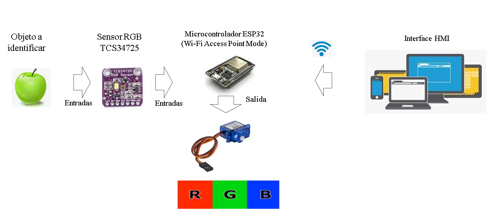
</p>

3. Coloque aquí la imagen del circuito ensamblado
   <p align="center">
    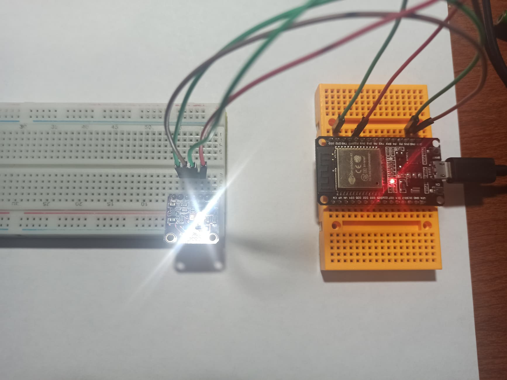
</p>
  <p align="center">
    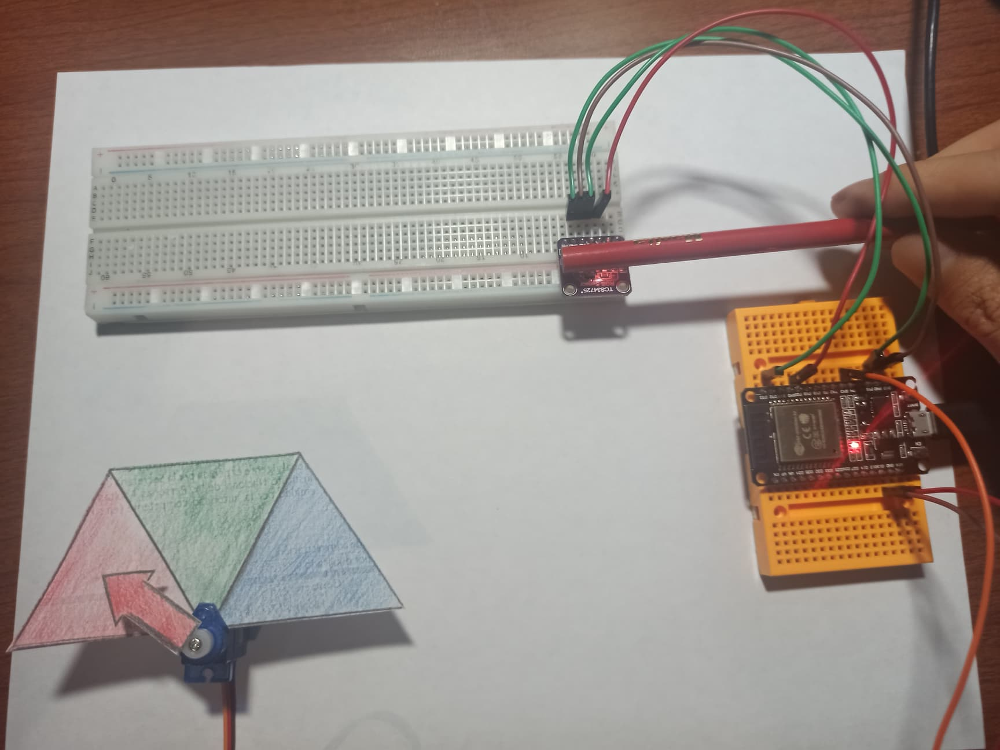
</p>
  <p align="center">
    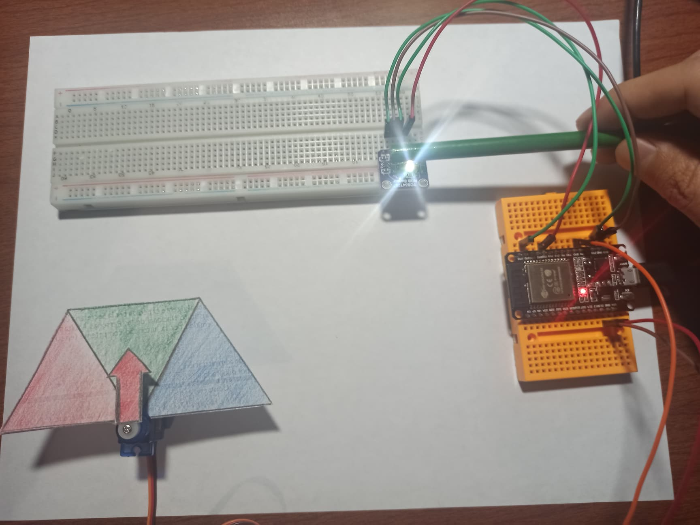
</p>
  <p align="center">
    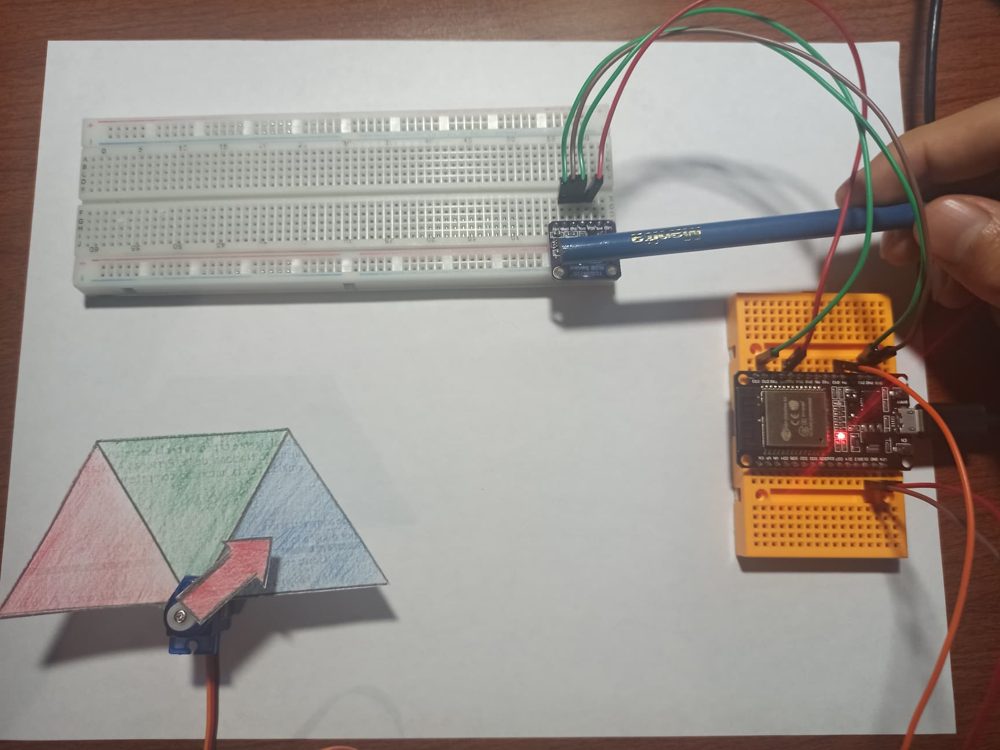
</p>
4. Coloque en este lugar el programa creado dentro del entorno de Arduino
   
## **Codigo para Esp32**
```C++
#include <Wire.h>
#include "Adafruit_TCS34725.h"
#include <EasyColor.h>
#include <Servo_ESP32.h>
#include <WiFi.h>
#include <PubSubClient.h>

static const int servoPin = 4;

Adafruit_TCS34725 tcs = Adafruit_TCS34725(TCS34725_INTEGRATIONTIME_50MS, TCS34725_GAIN_1X);
EasyColor::HSVRGB HSVConverter;
Servo_ESP32 servo;

const char* ssid = "IZZI-71E4";
const char* password = "8871B1C271E4";
const char* mqtt_server = "192.168.0.2";

WiFiClient espClient;
PubSubClient client(espClient);

void connectar_wifi() {

  delay(10);
  Serial.println();
  Serial.print("Conectandose a ");
  Serial.println(ssid);

  WiFi.mode(WIFI_STA);
  WiFi.begin(ssid, password);
  
  while (WiFi.status() != WL_CONNECTED) {
    WiFi.begin(ssid, password);
    delay(500);
    Serial.print(".");
  }

  Serial.println("");
  Serial.println("WiFi conectado!");
  Serial.println("Dirección IP: ");
  Serial.println(WiFi.localIP());
}

void reconnect() {
  // Loop until we're reconnected
  while (!client.connected()) {
    Serial.print("Attempting MQTT connection...");
    
    // Create a random client ID
    String clientId = "ESP32_NodeMCU";
    
    // Attempt to connect
    if (client.connect(clientId.c_str())) {
      Serial.println("connected");
    } else {
      Serial.print("fallo, rc=");
      Serial.print(client.state());
      Serial.println(" Tratando de nuevo en 5 seg.");
      // Wait 5 seconds before retrying
      delay(5000);
    }
  }
}

void enviar_color(float hue){
  String mensaje = (String)hue + ",";
  if (hue < 15 || hue > 345 )
  {
      Serial.println("Color: Rojo");
      servo.write(150);
      mensaje += "Rojo";
  }
  else if (hue > 100&& hue < 150)
  {
      Serial.println("Color: Verde");
      servo.write(90);
      mensaje += "Verde";
  }
  else if (hue > 180 && hue < 250)
  {
      Serial.println("Color: Azul");
      servo.write(35);
      mensaje += "Azul";
  }
    Serial.print("Enviando : ");
    Serial.println(mensaje);
    Serial.println();
    client.publish("Color", mensaje.c_str());
}

void setup()
{
  Serial.begin(115200);
  servo.attach(servoPin);
  
  Serial.println("Buscando módulo TCS34725");
  if (!tcs.begin())
  {
    Serial.println(".");
    while (1) delay(1000);
  }
  Serial.println("Módulo TCS34725 encontrado!");
  Serial.println("Acomodando Servo...");
  servo.write(90);

  connectar_wifi();

  client.setServer(mqtt_server, 1883);
  
  delay(1000);
}

void loop()
{
  uint16_t clear, red, green, blue;

  if (!client.connected()) {
    reconnect();
  }
  else
  {
    client.loop();

    tcs.setInterrupt(false);
    delay(60); // Cuesta 50ms capturar el color
    tcs.getRawData(&red, &green, &blue, &clear);
    tcs.setInterrupt(true);
  
    // Hacer rgb medición relativa
    uint32_t sum = clear;
    float r, g, b;
    r = red; r /= sum;
    g = green; g /= sum;
    b = blue; b /= sum;
  
    // Escalar rgb a bytes
    r *= 256; g *= 256; b *= 256;
    Serial.print("RGB: ");Serial.print(r);Serial.print(",");Serial.print(g);Serial.print(",");Serial.println(b);
    
    rgb in_rgb;
    hsv out_hsv;
    
    in_rgb.r=r;
    in_rgb.g=g;
    in_rgb.b=b;
  
    out_hsv = HSVConverter.RGBtoHSV(in_rgb, out_hsv);
    Serial.print("HSV: ");Serial.print(out_hsv.h);Serial.print(",");Serial.print(out_hsv.s);Serial.print(",");Serial.println(out_hsv.v);
    enviar_color(out_hsv.h);
    
    delay(1000);
  }
}
```

## **Codigo Node Red**

```C++
//Primera funcion:
msg.payload = "hsv("+msg.payload+", 40%, 100)"
return msg;

//Segunda Funcion:
var outputMsgs = [];
var values = msg.payload.trim().split(",");
for(var v in values){
outputMsgs.push({payload:values[v]});
}
return outputMsgs;

```

## **Codigo Json**

```C++
[{"id":"5fbc4548.f7d46c","type":"tab","label":"Main","disabled":false,"info":""},{"id":"39906858.599f88","type":"mqtt in","z":"5fbc4548.f7d46c","name":"","topic":"Color","qos":"2","datatype":"auto","broker":"dc5884e.bf32378","x":130,"y":340,"wires":[["1ebc8b1c.a2c405","ae6b9ea5.353d1"]]},{"id":"ae6b9ea5.353d1","type":"function","z":"5fbc4548.f7d46c","name":"","func":"var outputMsgs = [];\nvar values = msg.payload.trim().split(\",\");\nfor(var v in values){\noutputMsgs.push({payload:values[v]});\n}\nreturn outputMsgs;","outputs":2,"noerr":0,"initialize":"","finalize":"","x":340,"y":340,"wires":[["efe89b1.e386268"],["ef7ed395.d02bc","f3518160.f560e"]]},{"id":"1ebc8b1c.a2c405","type":"ui_text","z":"5fbc4548.f7d46c","group":"da8c8862.f26bb8","order":1,"width":0,"height":0,"name":"Entrada","label":"Mensaje recibido:","format":"{{msg.payload}}","layout":"col-center","x":340,"y":260,"wires":[]},{"id":"ef7ed395.d02bc","type":"ui_text","z":"5fbc4548.f7d46c","group":"510b4fd6.9ebb5","order":1,"width":0,"height":0,"name":"Color","label":"Color:","format":"{{msg.payload}}","layout":"col-center","x":550,"y":400,"wires":[]},{"id":"c64fc6d8.3ec278","type":"ui_colour_picker","z":"5fbc4548.f7d46c","name":"","label":"Recibido","group":"da8c8862.f26bb8","format":"hsv","outformat":"string","showSwatch":true,"showPicker":true,"showValue":true,"showHue":false,"showAlpha":false,"showLightness":true,"square":"false","dynOutput":"false","order":2,"width":"6","height":"4","passthru":false,"topic":"","x":780,"y":280,"wires":[[]]},{"id":"efe89b1.e386268","type":"function","z":"5fbc4548.f7d46c","name":"","func":"msg.payload = \"hsv(\"+msg.payload+\", 40%, 100%)\"\nreturn msg;","outputs":1,"noerr":0,"initialize":"","finalize":"","x":560,"y":280,"wires":[["c64fc6d8.3ec278"]]},{"id":"f3518160.f560e","type":"change","z":"5fbc4548.f7d46c","name":"","rules":[{"t":"change","p":"payload","pt":"msg","from":"Rojo","fromt":"str","to":"hsv(0, 90%, 90%)","tot":"str"},{"t":"change","p":"payload","pt":"msg","from":"Verde","fromt":"str","to":"hsv(125, 90%, 90%)","tot":"str"},{"t":"change","p":"payload","pt":"msg","from":"Azul","fromt":"str","to":"hsv(240, 90%, 90%)","tot":"str"}],"action":"","property":"","from":"","to":"","reg":false,"x":580,"y":340,"wires":[["5f8bda9d.29b5f4"]]},{"id":"5f8bda9d.29b5f4","type":"ui_colour_picker","z":"5fbc4548.f7d46c","name":"","label":"Equivalente","group":"510b4fd6.9ebb5","format":"hsv","outformat":"string","showSwatch":true,"showPicker":true,"showValue":true,"showHue":false,"showAlpha":false,"showLightness":true,"square":"false","dynOutput":"false","order":2,"width":"6","height":"3","passthru":false,"topic":"","x":790,"y":340,"wires":[[]]},{"id":"dc5884e.bf32378","type":"mqtt-broker","name":"","broker":"192.168.0.2","port":"1883","clientid":"TEST","usetls":false,"compatmode":false,"keepalive":"60","cleansession":true,"birthTopic":"","birthQos":"0","birthPayload":"","closeTopic":"","closeQos":"0","closePayload":"","willTopic":"","willQos":"0","willPayload":""},{"id":"da8c8862.f26bb8","type":"ui_group","name":"Recibido","tab":"b26cb679.d9e858","order":1,"disp":true,"width":"6","collapse":false},{"id":"510b4fd6.9ebb5","type":"ui_group","name":"Informacion","tab":"b26cb679.d9e858","order":2,"disp":true,"width":"6","collapse":false},{"id":"b26cb679.d9e858","type":"ui_tab","name":"A5.2 Dream Team","icon":"dashboard","disabled":false,"hidden":false}]
```

5. Coloque aquí evidencias que considere importantes durante el desarrollo de la actividad.

## ***[Demostración en video del circuito](https://www.youtube.com/watch?fbclid=IwAR0dusjpNLZxEoN91AS0-3KbMSa9Cp0Wwuyog2xyXDHXGokWx5LSK0SHk4I&v=R63jNu5mNn4&feature=youtu.be)***

## **Interfaz móvil**

</p>
  <p align="center">
    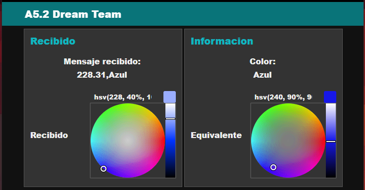
</p>

</p>
  <p align="center">
    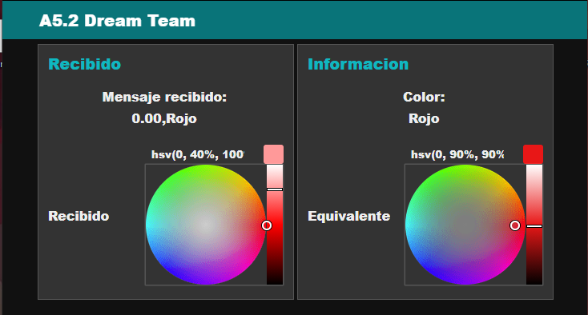
</p>

## **Node Red**
</p>
  <p align="center">
    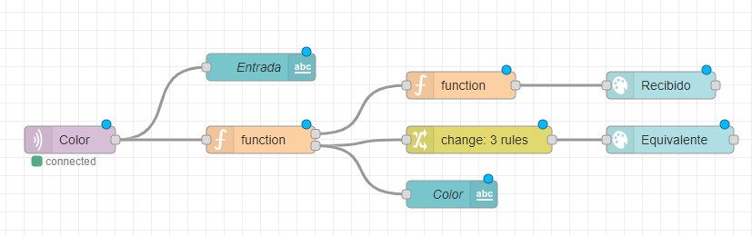
</p>

</p>
  <p align="center">
    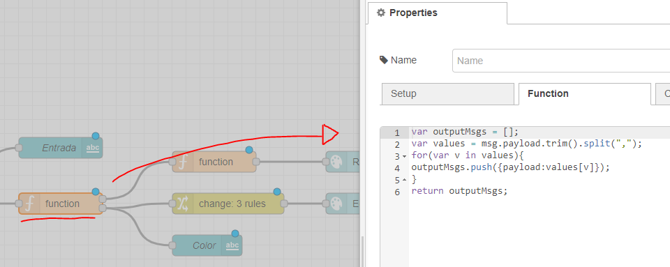
</p>

</p>
  <p align="center">
    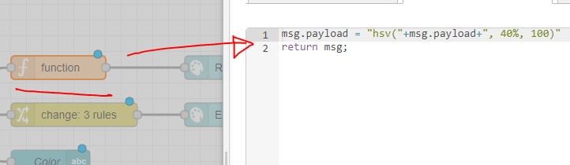
</p>

## **Monitor Serial**
</p>
  <p align="center">
    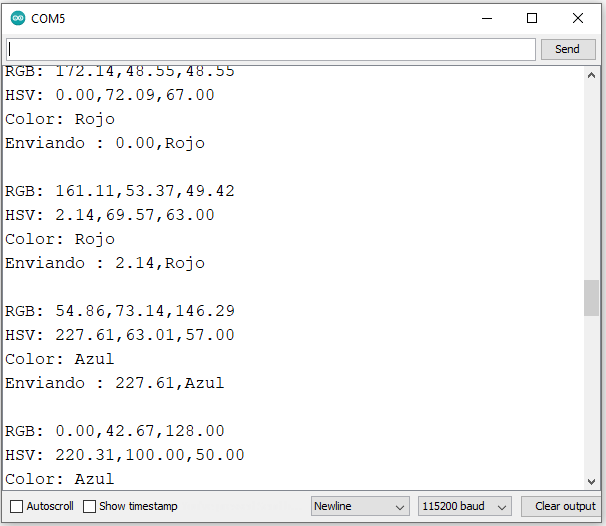
</p>

## **Evidencia de Reunion**

</p>
  <p align="center">
    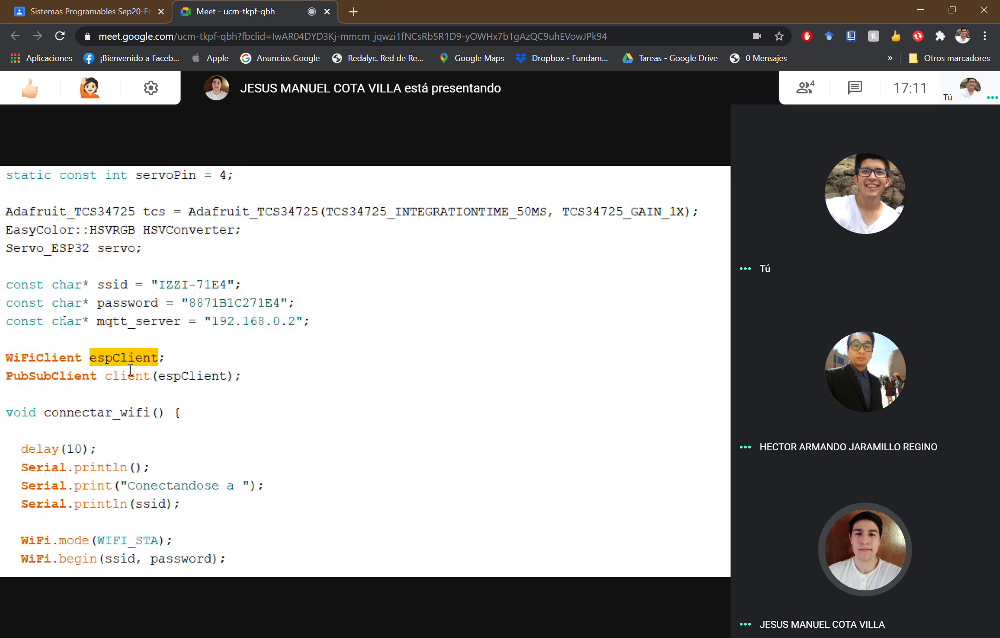
</p>
</p>
  <p align="center">
    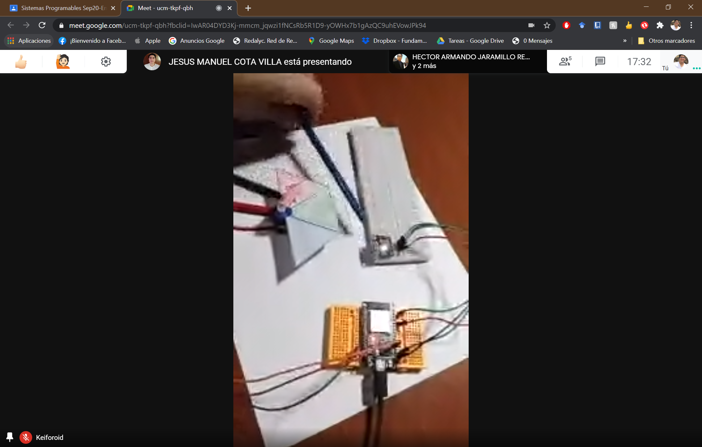
</p>

</p>
  <p align="center">
    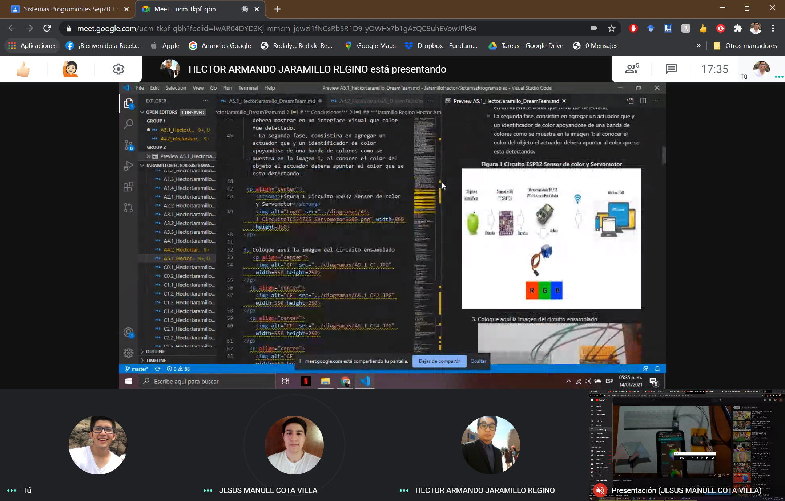
</p>

</p>
  <p align="center">
    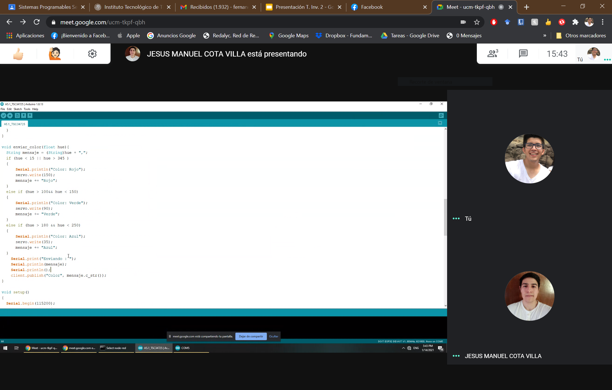
</p>


6. Para la demostracion de la actividad deberan utilizarse mas de un objeto para poder cubrir minimo tres colores.

# ***Conclusiones***

## ***Cota Villa Edy Jesus Manuel***
En esta actividad vimos cómo utilizar un módulo sensor de color alimentado por una fuente de 3V, que regresaba los valores con el formato de color RBG, por lo que tuvimos que convertirlo a otro formato HVS que nos facilitaba saber qué color se estaba viendo para la toma de decisiones, buscar una librería que nos sirviera para la plataforma DOIT ESP32 DEVKIT V1 nos tomó un rato, pero finalmente la encontramos, y de ahí utilizamos solamente el HUE para la toma de colores y dependiendo de HUE, decidir qué color estamos viendo, entre Rojo, Verde y Azul, mostrando el resultado dentro de un dashboard de Node-Red, así como con un servomotor SG90 alimentado por 5V que apunta al color que se le coloco enfrente al sensor de color cuando se detecta como cualquiera de los tres colores, la conexión al Node-Red se pudo realizar con mqtt, que es una de las manera más empleadas para conectar dispositivos como el esp32 a la plataforma.

## ***Fernando Esau Melendez Palafox***
En esta última practica incorpora lo solicitado en varias prácticas anteriores, lo complejo en su mayoría radica en el código de Arduino IDE. Se comienza por utilizar un modulo con sensor RGB, y un servomotor conectado al ESP32; con esto se logra programar para conectar con node red enlazando la computadora con el ESP por medio del WIFI, usando la computadora como servidor y el ESP como cliente, en nuestro código se emplean todos los métodos de conexión, y de lectura del sensor, pero lo divertido empieza en las conversiones de formato RGB a HSV debido a que el RGB maneja tres valores para determinar el color resultante y el HSV maneja uno para determinar el color y los otros son para determinar la presencia de blanco o presencia de negro. Que son ignorados por el código. Después se procede a mandar esta información al node red y que se despliegue en la interfaz con un modulo que hace split de la información para separar la información que se recibe y desplegar los colores, con su leyenda cuando se detecta rojo, verde o azul. El servo motor lo único que hace es tomar cierto ángulo para indicar en una hoja de papel el color que se detecta. Con el código mandamos los grados que deseamos mover el servo según el caso del color detectado.

## ***Jaramillo Regino Hector Armando***
En esta práctica realizamos un circuito con el sensor RGB y el modulo esp32 en el  cual realizamos la deteccion de color y en conjunto con node red creamos un interfaz para el servidor web con  nodos, en lugar de utilizar el formato RGB usamos el formato HSV ya que el formato RGB toma 3 muestras de color, mientras que el hsv solo necesita una por lo que hace mas sencilla la deteccion, si el color es rojo azul, verde o rojo sin importar el tipo, ya sea claro o oscuro lo detecta como el color general, esto hace mas sencilla la tarea de tomar la lectura de los colores y que no haya una gran discrepancia en las tonalidades, como si fuera una media y lo despliega en la interfaz, si llega a detectar algun color ajeno a esa gamma de colores se mostrará el color detectado pero en el apartado de color equivalente no sufrira ningun cambio. Me parecio bastante entretenido ver el servomotor, trabajando en conjunto con con el sensor y el es32 lo cual fue basatnte interactivo y verlo en el telefeno bue bastante agradable.

___

### :bomb: Rubrica

| Criterios     | Descripción                                                                                  | Puntaje |
| ------------- | -------------------------------------------------------------------------------------------- | ------- |
| Instrucciones | Se cumple con cada uno de los puntos indicados dentro del apartado Instrucciones?            | 10      |
| Desarrollo    | Se respondió a cada uno de los puntos solicitados dentro del desarrollo de la actividad?     | 60      |
| Demostración  | El alumno se presenta durante la explicación de la funcionalidad de la actividad?            | 20      |
| Conclusiones  | Se incluye una opinión personal de la actividad  por cada uno de los integrantes del equipo? | 10      |

### :bookmark: Ligas

**Cota Villa Edy Jesus Manuel**

**Circuito Fisico**
:school: [Repositorio](https://github.com/CotaVilla/Sistemas-Programables)
:memo: [Actividad](https://github.com/CotaVilla/Sistemas-Programables/blob/master/docs/A5.1_EdyCota_DreamTeam.md)

**Jaramillo Regino Hector Armando**

:school: [Repositorio](https://github.com/HectorJaramillo/JaramilloHector-SistemasProgramables)
:memo: [Actividad](https://github.com/HectorJaramillo/JaramilloHector-SistemasProgramables/blob/master/Blog/A5.1_HectorJaramillo_DreamTeam.md)

**Fernando Esau Melendez Palafox**

:school: [Repositorio](https://github.com/fernmelen/Sist.-Programables)
:memo: [Actividad](https://github.com/fernmelen/Sist.-Programables/blob/master/blog/A5.1_FernandoMelendez_DreamTeam.md)