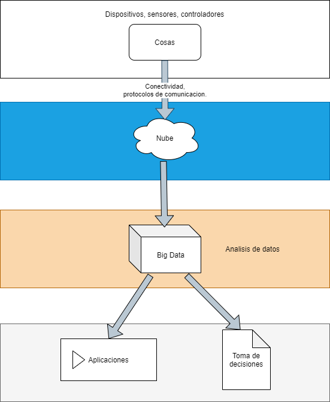

## :trophy: C0.2 Reto en clase

**Conceptos de Industria 4.0 e IOT**

### :blue_book: Instrucciones

- De acuerdo con la información presentada y el video mostrado por el asesor, contestar las preguntas indicadas en la tabla del apartado desarrollo.
- Al concluir el reto se deberá subir en formato PDF a la plataforma con la nomenclatura **C0.2_NombreApellido_Equipo.pdf.**
- Se deberá publicar el reto dentro del repositorio Git personal de cada estudiante, utilizando el estilo MarkDown y el entorno de desarrollo VSCode.
- Es recomendable crear el repositorio siguiente una estructura tal como:
```
- readme.md
  - blog
    - C0.1_x.md
    - C0.2_x.md
  - img
  - docs
    - A0.1_x.md
    - A0.2_x.md
```
  
### :pencil2: Desarrollo

1. Responde a las siguientes preguntas:

| Numero | Pregunta                                            | Respuesta  |
| ------ | --------------------------------------------------- | ---------  |
| 1.1      | A que esta referido el termino Industria conectada? | Se refiere a tener sistemas automatizados, donde gran parte de las acciones requeridas por la empresa sean automaticas; ya sea por software o hardware programado para colaborar con el trabajo. |
| 1.2      | ¿Qué es un sistema en tiempo real?                  | Un sistema se compone de elementos en conjunto trabajando por un mismo objetivo final. Dentro de la tematica del video se refiere un sistema electronico trabajando en colaboracion con el entorno de la empresa. |
| 1.3      | Mencione que tecnologías envuelven el concepto Industria 4.0    | Automatizacion, interconectividad, inteligencia artificial, machine learning entre otras. |
| 1.4      | Referente al tema automatización industria, en que consiste el nivel de campo?                        | Consiste en los niveles de la piramide de automatizacion, donde segun lo complejo del sistema va ascendiendo de nivel, empezando en el primero con los sensores y hardware poco complejo. |
| 1.5      | Elabore un diagrama de capas que muestre la arquitectura de un ecosistema tecnológico para IOT?                       |            |
| 1.6      | Que es un sistema de control embebido?         | Los sistemas embebido les podria llamar como una computadora pequeña, cuenta con un procesador, sus respectivas memorias RAM y ROM; con la diferencia que la mayoria cuentan con pines GPIO para el control de dispositivos o experimentacion con otros dispositivos creados por uno mismo, con el proposito de programar poryectos generalmente de robotica. |
| 1.7      | Que tecnologías observa en el video referentes al concepto Industria 4.0?         | Automatizacion, machine learning y robotica. |
| 1.8      | Basado en el video que ha ofrecido la robótica en la industria?        | Optimizacion de tiempos, efectividad en tareas, disminucion de costos y mayor control de procesos. |

1. Instale la extension [Draw.io integration](https://marketplace.visualstudio.com/items?itemName=hediet.vscode-drawio) dentro de visual studio code y elabore el diagrama solicitado siguiendo las instrucciones para esta actividad.

    :arrow_forward: [Extension de visual studio code - Draw.io integration](https://www.youtube.com/watch?v=Y47ZlxoDWNI)

2. Coloque el diagrama que se solicita dentro del punto 1.5 en este apartado.
   -Ejemplo de un diagrama de flujo utilizando draw.io



:house: [Ir a inicio](../readme.md)