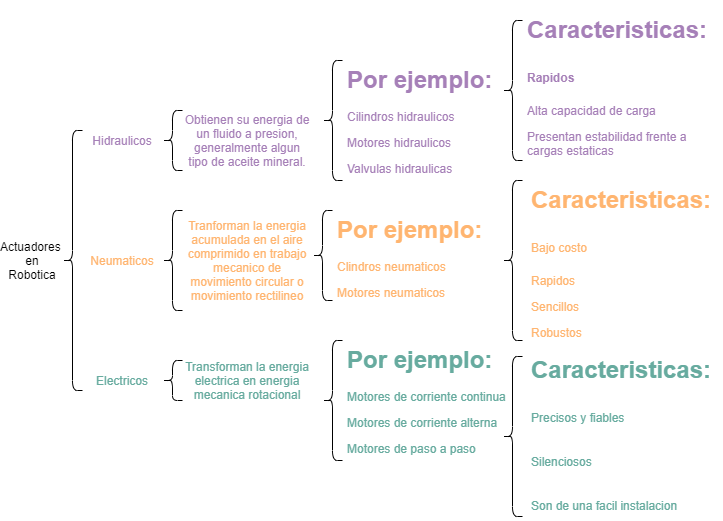

# Actuadores

## :trophy: C2.1 Reto en clase

**Actuadores Neumatico e Hidraulicos, y sus tipos**

### :blue_book: Instrucciones

- De acuerdo con la información presentada por el asesor referente al tema actuadores y a los videos observados sobre el mismo tema, elabore lo que se solicita dentro del apartado desarrollo.
- Toda actividad o reto se deberá realizar utilizando el estilo **MarkDown con extension .md** y el entorno de desarrollo VSCode, debiendo ser elaborado como un documento **single page**, es decir si el documento cuanta con imágenes, enlaces o cualquier documento externo debe ser accedido desde etiquetas y enlaces.
- Es requisito que el archivo .md contenga una etiqueta del enlace al repositorio de su documento en Github, por ejemplo **Enlace a mi GitHub**
- Al concluir el reto el reto se deberá subir a github el archivo .md creado.
- Desde el archivo **.md** se debe exportar un archivo **.pdf** con la nomenclatura **C2.1_NombreAlumno_Equipo.pdf**, el cual deberá subirse a classroom dentro de su apartado correspondiente, para que sirva como evidencia de su entrega; siendo esta plataforma **oficial** aquí se recibirá la calificación de su actividad por individual.
- Considerando que el archivo .pdf, fue obtenido desde archivo .md, ambos deben ser idénticos y mostrar el mismo contenido.
- Su repositorio ademas de que debe contar con un archivo **readme**.md dentro de su directorio raíz, con la información como datos del estudiante, equipo de trabajo, materia, carrera, datos del asesor, e incluso logotipo o imágenes, debe tener un apartado de contenidos o indice, los cuales realmente son ligas o **enlaces a sus documentos .md**, _evite utilizar texto_ para indicar enlaces internos o externo.
- Se propone una estructura tal como esta indicada abajo, sin embargo puede utilizarse cualquier otra que le apoye para organizar su repositorio.  
``` 
| readme.md
| | blog
| | | C2.1_x.md
| | | C2.2_x.md
| | | C2.3_x.md
| | img
| | docs
| | | A2.1_x.md
| | | A2.2_x.md
```

### :pencil2: Desarrollo

Listado de preguntas:

1. Basándose en el video [actuadores en Robótica](https://www.youtube.com/watch?v=e_6rjEGWqoY), realice un cuadro sinóptico sobre la clasificación de los actuadores.

2. De acuerdo con el video [descripcion de los actuadores industriales](https://www.youtube.com/watch?v=mFsPxpFHajM) realice una matriz comparativa indicando clasificacion, subclasificacion, principio de funcionamiento, ventajas y desventajas.

| Actuadores | Clasificacion | Subclasificacion | Ventajas | Desventajas |
|------------|---------------|------------------|----------|-------------|
| Electricos | Cortan o permiten el paso del fluido electrico. | Actuadores electricos (motores), Actuadores electricos (Electrovalvulas) | Amplio rango de potencia. Control de velocidad preciso. Permite el control de par preciso. Es reversible. | Su construccion es menos robusta. Requiere mayor mantenimiento. Mayor tamaño por unidad de potencia. |
| Neumaticos | Permiten o impiden el paso de un gas. | Actuadores neumaticos lineales, Actuadores neumaticos rotativos. | Rentable, Facil de usar e instalar, Facil de mantener, Requisitos tecnicos relativamente bajos para el personal. | Poca estabilidad, Carece de un rendimiento suficiente de compensacion, Gran zona muerta, Gran diferencia de retorno. |
| Hidraulicos | Permiten o impiden el paso de un liquido. | Actuadores hidraulicos lineales, Actuadores hidraulicos rotativos. | Gran empuje de salida, Buena resistencia de desplazamiento, Control preciso, Velocidad de respuesta rapida, Operacion estable. | Alto costo, Gran volumen, Requiere de estaciones hidraulicas y oleoductos para funcionar. |


1. De acuerdo con el video [Neumática Industrial](https://www.youtube.com/watch?v=Wee85cI6wwQ&t=394s), explique como trabaja un sistema Neumático?

R= Los sistemas neumaticos son muy utilizados en la industria para operaciones repetitivas, estos se comprenden de los siguientes componentes: El compresor que se ancarga de presurizar el aire del ambiente en un tanque para mandarlo con una presion deseada, el siguiente componente se llama FRL (Filtro Regulador Lubricador) que se encarga de limpiar el aire de toda particula de oxicdo agua o cualquier otro residuo tambien se encarga de controlar la presion que sale de este filtro, el siguiente componente es una valvula de control direccional que contiene una serie de vias internas para mandar el aire por medio de un canal y al mismo tiempo sacar el aire que regresa del actuador todo esto controlado por un controlador PLC, por ultimo el actuador recibe el aire de dos extremos en este caso de movimiento lineal; recibe aire de un extremo para moverse y recive aire del lado contrario para regresar a su posision inicial.

### :bomb: Rubrica

| Criterios     | Descripción                                                                                  | Puntaje |
| ------------- | -------------------------------------------------------------------------------------------- | ------- |
| Instrucciones | Se cumple con cada uno de los puntos indicados dentro del apartado Instrucciones?            | 20 |
| Desarrollo    | Se respondió a cada uno de los puntos solicitados dentro del desarrollo de la actividad?     | 80      |

:house: [Ir a Readme](../readme.md)

:cloud: [Ir a repositorio de GitHub](https://github.com/fernmelen/Sist.-Programables/blob/master/blog/C2.1_FernandoMelendez_DreamTeam.md)