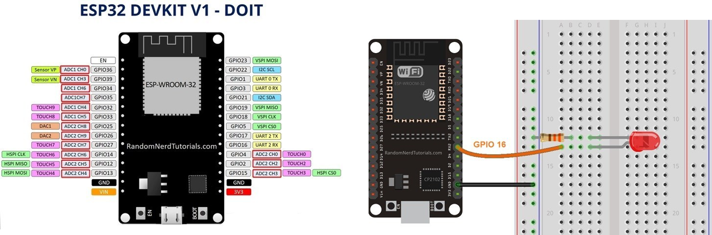
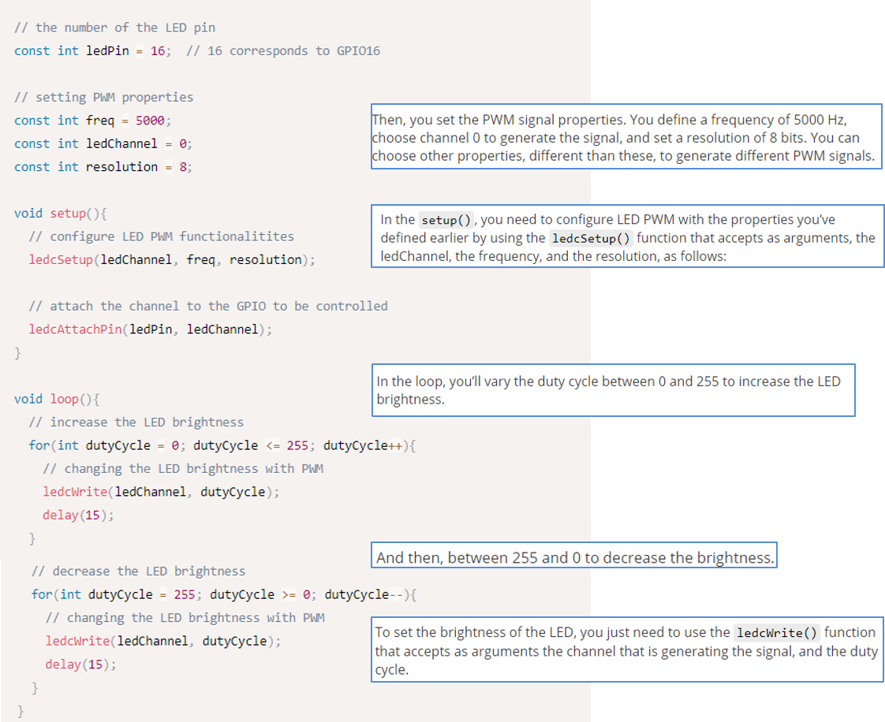

# :trophy: C3.7 Programación Microcontrolador NodeMCU ESP32

Arduino y modulador de ancho de pulso PWM con salida analógica

___

## :blue_book: Instrucciones

- De acuerdo con la información presentada por el asesor referente al tema, desarrollar lo que se indica dentro del apartado siguiente.
- Toda actividad o reto se deberá realizar utilizando el estilo **MarkDown con extension .md** y el entorno de desarrollo VSCode, debiendo ser elaborado como un documento **single page**, es decir si el documento cuanta con imágenes, enlaces o cualquier documento externo debe ser accedido desde etiquetas y enlaces.
- Es requisito que el archivo .md contenga una etiqueta del enlace al repositorio de su documento en Github, por ejemplo **Enlace a mi GitHub**
- Al concluir el reto el reto se deberá subir a github el archivo .md creado.
- Desde el archivo **.md** se debe exportar un archivo **.pdf** con la nomenclatura **C3.7_NombreAlumno_Equipo.pdf**, el cual deberá subirse a classroom dentro de su apartado correspondiente, para que sirva como evidencia de su entrega; siendo esta plataforma **oficial** aquí se recibirá la calificación de su actividad por individual.
- Considerando que el archivo .pdf, fue obtenido desde archivo .md, ambos deben ser idénticos y mostrar el mismo contenido.
- Su repositorio ademas de que debe contar con un archivo **readme**.md dentro de su directorio raíz, con la información como datos del estudiante, equipo de trabajo, materia, carrera, datos del asesor, e incluso logotipo o imágenes, debe tener un apartado de contenidos o indice, los cuales realmente son ligas o **enlaces a sus documentos .md**, _evite utilizar texto_ para indicar enlaces internos o externo.
- Se propone una estructura tal como esta indicada abajo, sin embargo puede utilizarse cualquier otra que le apoye para organizar su repositorio.  


``` 
| readme.md
| | blog
| | | C3.1_TituloActividad.md
| | | C3.2_TituloActividad.md
| | | C3.3_TituloActividad.md
| | | C3.4_TituloActividad.md
| | | C3.5_TituloActividad.md
| | | C3.6_TituloActividad.md
| | | C3.7_TituloActividad.md
| | | C3.8_TituloActividad.md
| | img
| | docs
| | | A3.1_TituloActividad.md
| | | A3.2_TituloActividad.md
```

___

## :pencil2: Desarrollo

1. Ensamble el circuito mostrado en la figura siguiente.

<p align="center">
    
</p>


Circuito de simulador con Arduino UNO, resistencia de 330 omhs y diodo led rojo, conectando el anodo del diodo al pin 8 y la resistencia a tierra, para despues conectar el catodo del led a la resistencia.


Evidencia de mi compañero de equipo Jesus Cota Villa del circuito conectaco con ESP32.


2. Analice y escriba el programa que se muestra a continuación.

<p align="center">
    
</p>

Fuente de consulta: [Random Nerd Tutorials](https://randomnerdtutorials.com/esp32-pwm-arduino-ide/)


Modificacion del codigo anterior para lograr su funcionamiento en Arduino. Se emplean dos ciclos de incremento y decremento for del 0 al 255, despues dentro de esos ciclos se utiliza la funcion analogWrite para mandarle el valor dentro de cada ciclo y que vaya en incremento o decremento segun el ciclo.

3. Inserte aquí las imágenes que considere como evidencias para demostrar el resultado obtenido.


Simulacion corriendo con Led encendido.

Simulacion corriendo con Led apagado.


Ecidencia de compañero Jesus Cota Villa de ESP32 logrando el incremento y decremento de intensidad de luz.

___

### :bomb: Rubrica

| Criterios     | Descripción                                                                                  | Puntaje |
| ------------- | -------------------------------------------------------------------------------------------- | ------- |
| Instrucciones | Se cumple con cada uno de los puntos indicados dentro del apartado Instrucciones?            | 20 |
| Desarrollo    | Se respondió a cada uno de los puntos solicitados dentro del desarrollo de la actividad?     | 80      |

:house: [Ir a readme](../readme.md)

:cloud: [Ir a repositorio de GitHub](https://github.com/fernmelen/Sist.-Programables/blob/master/blog/C3.7_FernandoMelendez_DreamTeam.md)