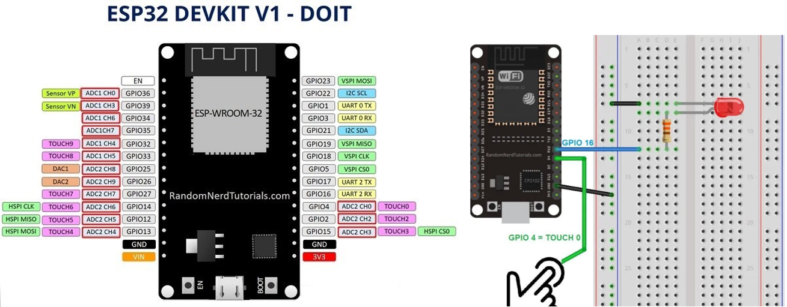
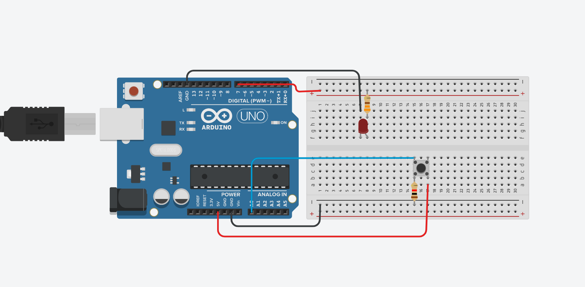
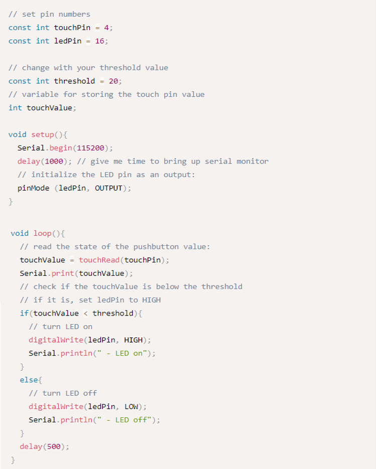
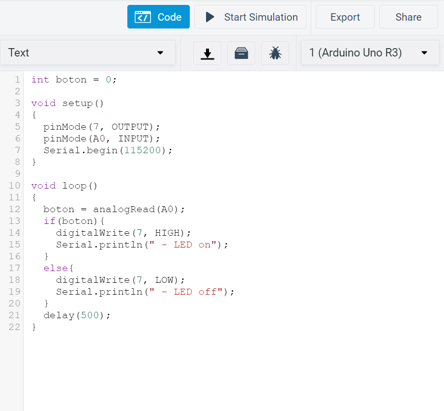
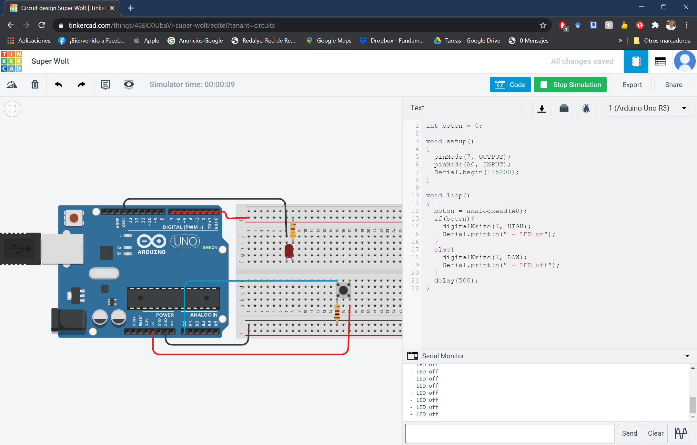
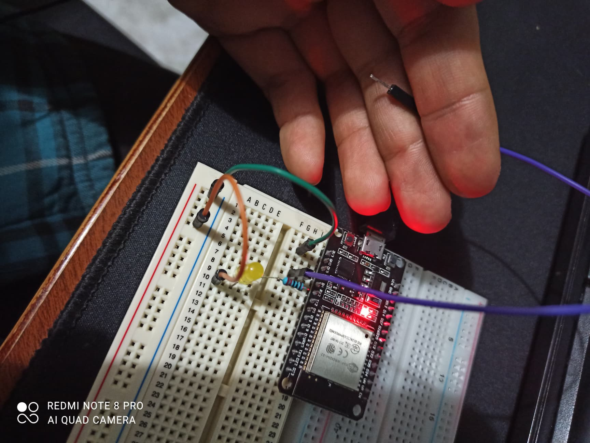
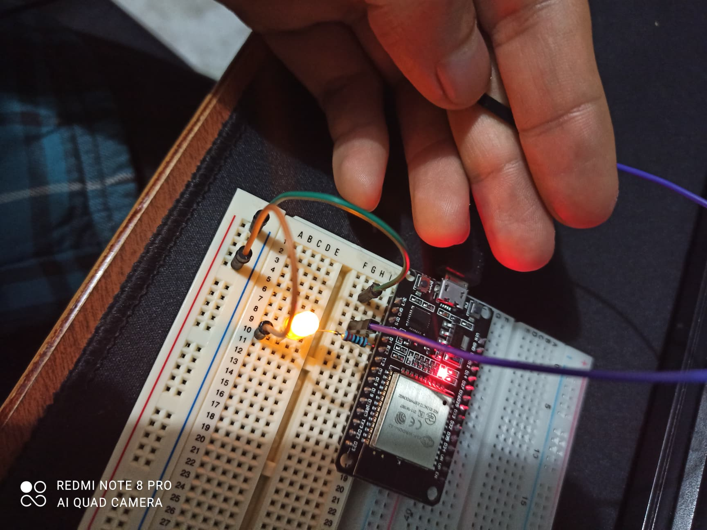
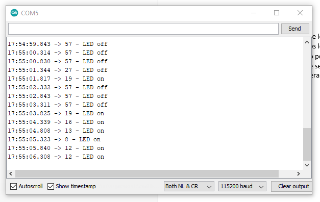

# :trophy: C3.8 Programación Microcontrolador NodeMCU ESP32

Arduino y sensor de tacto integrado al NodeMCU ESP32

## :blue_book: Instrucciones

- De acuerdo con la información presentada por el asesor referente al tema, desarrollar lo que se indica dentro del apartado siguiente.
- Toda actividad o reto se deberá realizar utilizando el estilo **MarkDown con extension .md** y el entorno de desarrollo VSCode, debiendo ser elaborado como un documento **single page**, es decir si el documento cuanta con imágenes, enlaces o cualquier documento externo debe ser accedido desde etiquetas y enlaces.
- Es requisito que el archivo .md contenga una etiqueta del enlace al repositorio de su documento en Github, por ejemplo **Enlace a mi GitHub**
- Al concluir el reto el reto se deberá subir a github el archivo .md creado.
- Desde el archivo **.md** se debe exportar un archivo **.pdf** con la nomenclatura **C3.8_NombreAlumno_Equipo.pdf**, el cual deberá subirse a classroom dentro de su apartado correspondiente, para que sirva como evidencia de su entrega; siendo esta plataforma **oficial** aquí se recibirá la calificación de su actividad por individual.
- Considerando que el archivo .pdf, fue obtenido desde archivo .md, ambos deben ser idénticos y mostrar el mismo contenido.
- Su repositorio ademas de que debe contar con un archivo **readme**.md dentro de su directorio raíz, con la información como datos del estudiante, equipo de trabajo, materia, carrera, datos del asesor, e incluso logotipo o imágenes, debe tener un apartado de contenidos o indice, los cuales realmente son ligas o **enlaces a sus documentos .md**, _evite utilizar texto_ para indicar enlaces internos o externo.
- Se propone una estructura tal como esta indicada abajo, sin embargo puede utilizarse cualquier otra que le apoye para organizar su repositorio.  


``` 
| readme.md
| | blog
| | | C3.1_TituloActividad.md
| | | C3.2_TituloActividad.md
| | | C3.3_TituloActividad.md
| | | C3.4_TituloActividad.md
| | | C3.5_TituloActividad.md
| | | C3.6_TituloActividad.md
| | | C3.7_TituloActividad.md
| | | C3.8_TituloActividad.md
| | img
| | docs
| | | A3.1_TituloActividad.md
| | | A3.2_TituloActividad.md
```


## :pencil2: Desarrollo

1. Basado en el siguiente circuito y ensamblarlo, utilizando alguno de los simulados propuesto, explicando el resultado que se desea obtener del mismo.

<p align="center">
    
</p>

**Circuito armado en simulador adaptado para funcionar en Arduino con PushButton**


**Circuito armado por compañero Jesus Cota en ESP32 con sensor Touch**


2. Analice y escriba el programa que se muestra a continuación.

<p align="center">
    
</p>

Fuente de consulta: [Random Nerd Tutorials](https://randomnerdtutorials.com/esp32-touch-pins-arduino-ide/)



La adaptación del código para funcionar en Arduino fueron solamente los metodos, pero la estructura de funcionamiento se queda basicamente igual. Explicando como funciona, como variable local tengo un entero con nombre boton que va almacenar lo que la linea 12 del codigo lea. En el bloque setup() configuro los pines, el pin 7 utilizado para el led comosalida y el pin A0 utilizado para el boton como entrada. Dentro del bloque loop() empieza con la lectura del pin A0 utilizando el comando analogRead y guardando el valor en la variable llamada boton, despues se abre una condición, donde se evalúa el estado de la variable boton, cuando la variable es verdadero o igual a 1 se ejecutan los comandos de encender el led y se escribe en consola la leyenda de LED on; y si la condición no se cumple ejecuta los comandos de apagar el led y escribir una leyenda de LED off en consola. Por último la instruccion de delay para detener la ejecución por 500 milisegundos.

1. Inserte aquí las imágenes que considere como evidencias para demostrar el resultado obtenido.

**Ejecución del simulador sin presionar el botón**


**Ejecución del simulador presionando el botón**


**Evidencia de compañero Jesus Cota de ESP32 sin presionar el sensor Touch**


**Evidencia de compañero Jesus Cota de ESP32 presionando el sensor Touch**


**Evidencia de compañero Jesus Cota de resultados en consola de ESP32**


### :bomb: Rubrica

| Criterios     | Descripción                                                                                  | Puntaje |
| ------------- | -------------------------------------------------------------------------------------------- | ------- |
| Instrucciones | Se cumple con cada uno de los puntos indicados dentro del apartado Instrucciones?            | 20 |
| Desarrollo    | Se respondió a cada uno de los puntos solicitados dentro del desarrollo de la actividad?     | 80      |

:house: [Ir a microcontroladores](../docs/D3.0_Microcontroladores.md)
