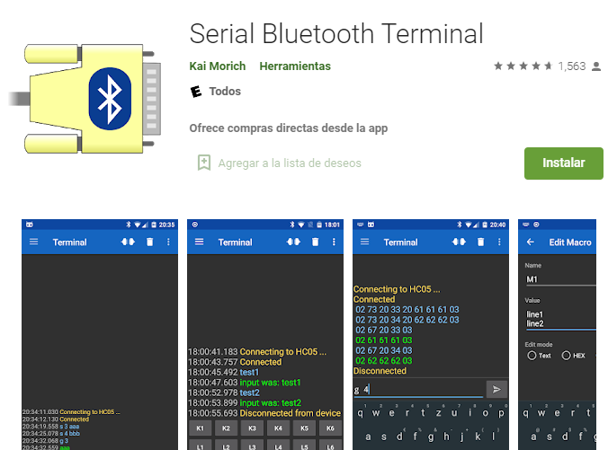
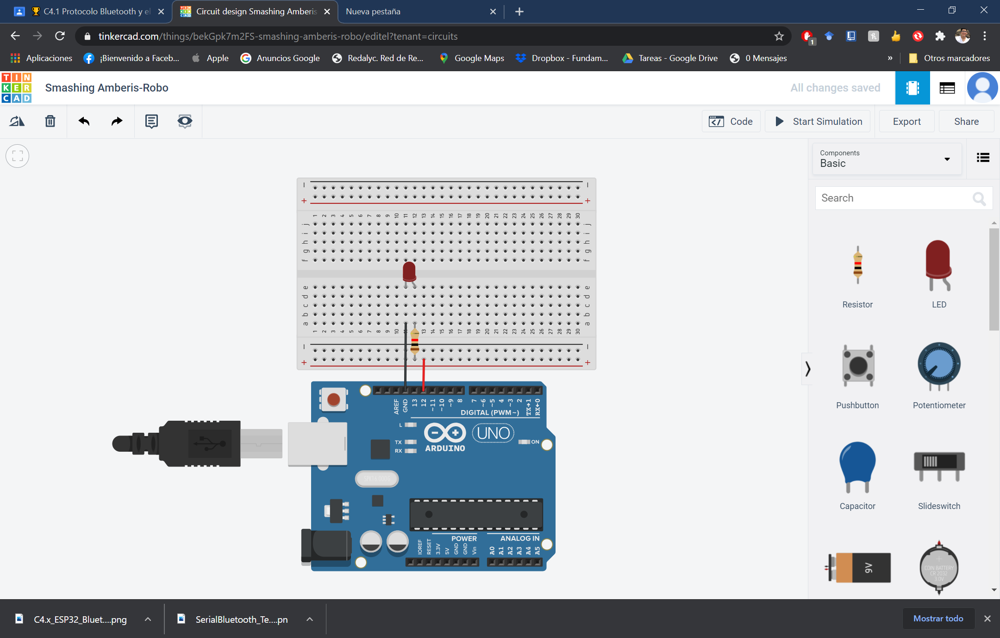
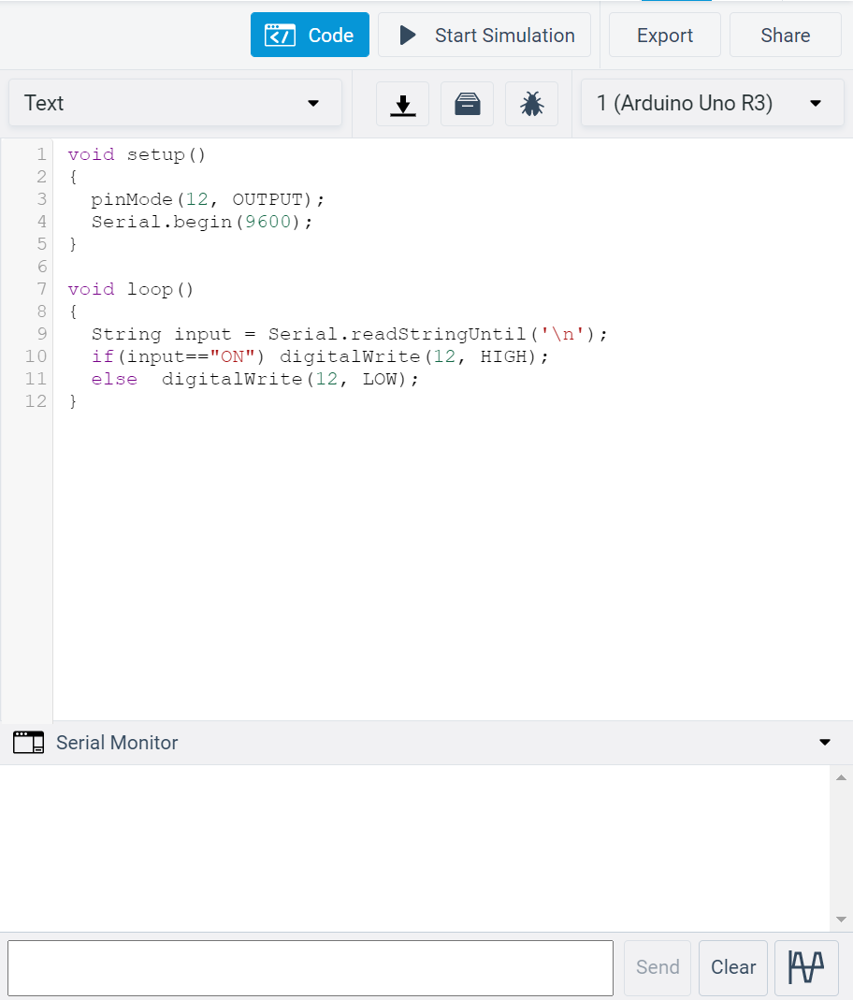
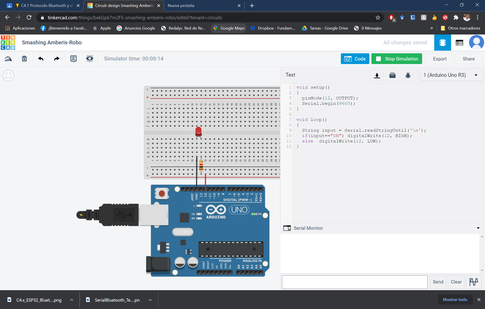
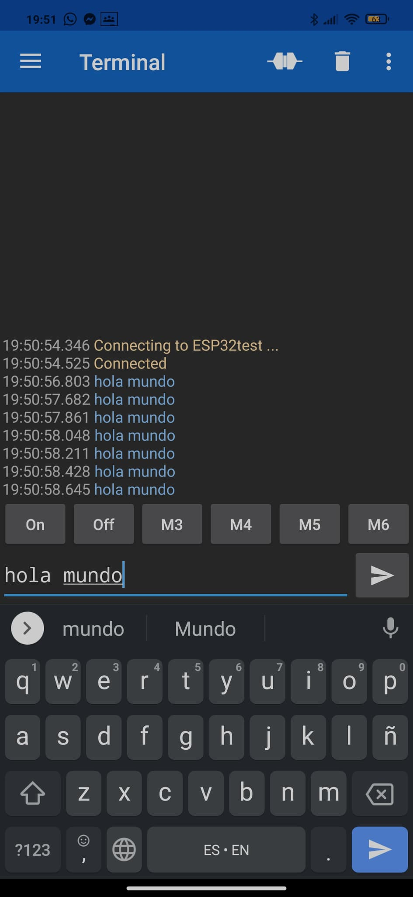
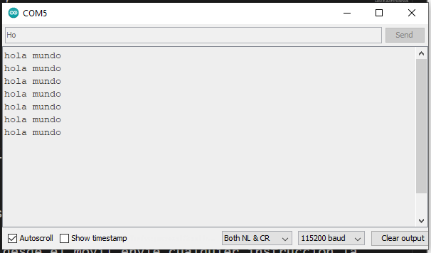
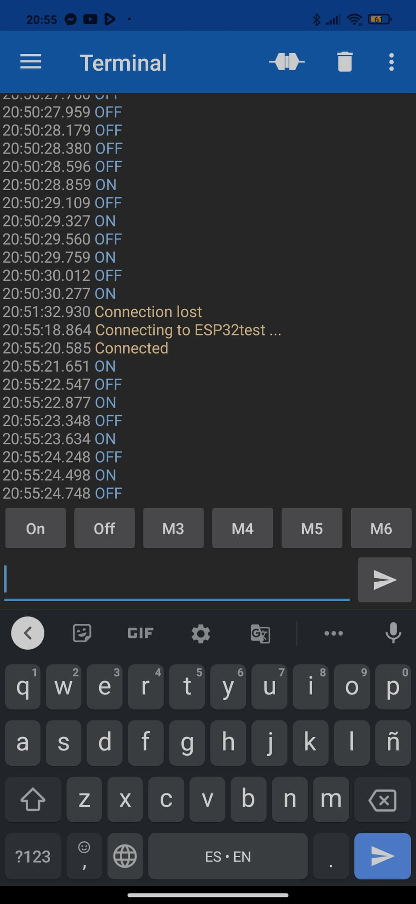
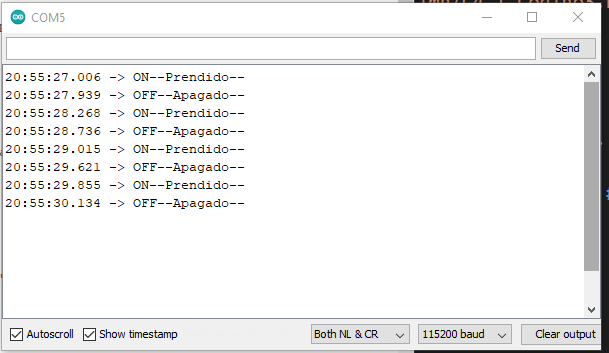
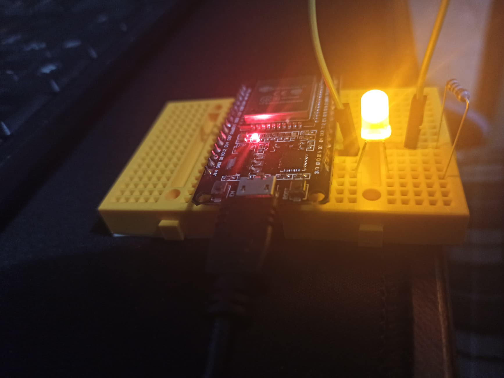
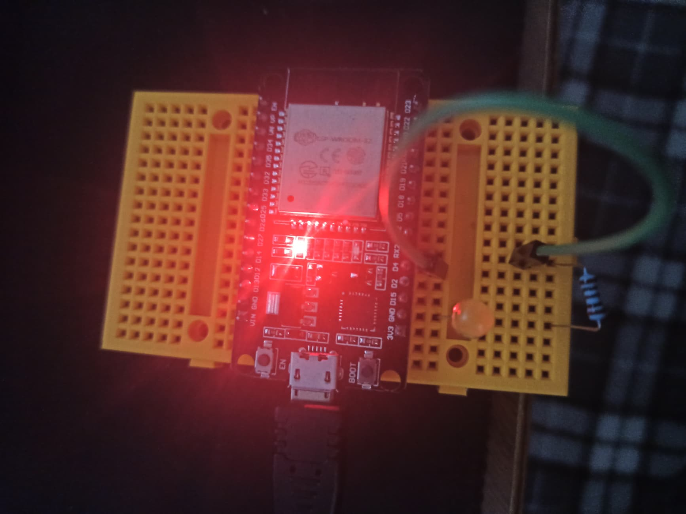

# :trophy: C4.1 Programación Microcontrolador NodeMCU ESP32

Comunicación por medio del protocolo Bluetooth y el NodeMCU ESP32

## :blue_book: Instrucciones

- De acuerdo con la información presentada por el asesor referente al tema, desarrollar lo que se indica dentro del apartado siguiente.
- Toda actividad o reto se deberá realizar utilizando el estilo **MarkDown con extension .md** y el entorno de desarrollo VSCode, debiendo ser elaborado como un documento **single page**, es decir si el documento cuanta con imágenes, enlaces o cualquier documento externo debe ser accedido desde etiquetas y enlaces.
- Es requisito que el archivo .md contenga una etiqueta del enlace al repositorio de su documento en Github, por ejemplo **Enlace a mi GitHub**
- Al concluir el reto el reto se deberá subir a github el archivo .md creado.
- Desde el archivo **.md** se debe exportar un archivo **.pdf** con la nomenclatura **C4.1_NombreAlumno_Equipo.pdf**, el cual deberá subirse a classroom dentro de su apartado correspondiente, para que sirva como evidencia de su entrega; siendo esta plataforma **oficial** aquí se recibirá la calificación de su actividad por individual.
- Considerando que el archivo .pdf, fue obtenido desde archivo .md, ambos deben ser idénticos y mostrar el mismo contenido.
- Su repositorio ademas de que debe contar con un archivo **readme**.md dentro de su directorio raíz, con la información como datos del estudiante, equipo de trabajo, materia, carrera, datos del asesor, e incluso logotipo o imágenes, debe tener un apartado de contenidos o indice, los cuales realmente son ligas o **enlaces a sus documentos .md**, _evite utilizar texto_ para indicar enlaces internos o externo.
- Se propone una estructura tal como esta indicada abajo, sin embargo puede utilizarse cualquier otra que le apoye para organizar su repositorio.  


``` 
| readme.md
| | blog
| | | C4.1_TituloActividad.md
| | | C4.2_TituloActividad.md
| | | C4.3_TituloActividad.md
| | | C4.4_TituloActividad.md
| | | C4.5_TituloActividad.md
| | img
| | docs
| | | A4.1_TituloActividad.md
| | | A4.2_TituloActividad.md
```

## :pencil2: Desarrollo

1. Busque en Play Store la app "Serial Bluetooth terminal" e instale a su dispositivo movil.

   
<p align="center">
    
</p>

2. Apóyese del siguiente circuito, colocando una resistencia y un diodo led en seria a una de las terminales del Nodemcu ESP32 de tal forma que puede general una señal digital.

<p align="center">
    
</p>

### Circuito con adaptacion para simulador con Arduino


Conectamos el pin #12 a una resistencia y a un led. y el pin de tierra para encender y apagar con el comando correspondiente en la terminal.

### Circuito en ESP32 por compañero Jesus Cota


1. Analice y utilice el código que se indica a continuación para emparejar su dispositivo movil con el dispositivo ESP32 via bluetooth


```C++
//This example code is in the Public Domain (or CC0 licensed, at your option.)
//By Evandro Copercini - 2018
//
//This example creates a bridge between Serial and Classical Bluetooth (SPP)
//and also demonstrate that SerialBT have the same functionalities of a normal Serial

#include "BluetoothSerial.h"

#if !defined(CONFIG_BT_ENABLED) || !defined(CONFIG_BLUEDROID_ENABLED)
#error Bluetooth is not enabled! Please run `make menuconfig` to and enable it
#endif

BluetoothSerial SerialBT;

void setup() {
  Serial.begin(115200);
  SerialBT.begin("ESP32test"); //Bluetooth device name
  Serial.println("The device started, now you can pair it with bluetooth!");
}

void loop() {
  if (Serial.available()) {
    SerialBT.write(Serial.read());
  }
  if (SerialBT.available()) {
    Serial.write(SerialBT.read());
  }
  delay(20);
}
```

Adaptacion del codigo para leer entradas desde el serializador del simulador.
Se comienza por el bloque setup iniciando el serial y configurando el pin #12 conectado al led. Despues en el bloque loop se declara una bariable de tipo string y procedemos a leer el contenido dentro del serializador con el comando que se encuentra en la linea 9. LAs condiciones para encender o apagar el led son simpoles solamente comparan la variable string con la lapabla ON para entrar a la condicion donde se prende el led y de lo contrario entra a un bloque else donde se apaga el led.

4. Compile y cargue el programa a su dispositivo NodeMCU-ESP32
5. Empareje su dispositivo movil con el ESP32, y utilice la app bajada del play store para establecer la comunicación.
6. Abra la terminal serial del IDE de Arduino, y desde el movil envíe cualquier instrucción la cual se deberá observar en la terminal serial del IDE Arduino.
7. Una vez realizado lo anterior, agregue instrucciones al programa para que le indique al ESP32 que encienda o apague el LED que ha sido colocado en el circuito desde su dispositivo movil y la app instalada.
8. Inserte aquí las imágenes que considere como evidencias para demostrar el resultado obtenido.
   
### Evidencia en simulador con Arduino 
Evidencia de circuito funcionando y con el led encendido al insertar la palabra dentro del serial.


Evidencia de led apagado cuando se ingresa la palabra OFF o cualquier leyenda que no sea la palabra ON.


### Evidencia en ESP32 por compañero [Jesus Cota](https://github.com/CotaVilla/Sistemas-Programables/blob/master/blog/C4.1_EdyCota_DreamTeam.md)
Evidencia de aplicacion conectada con ESP32 y muestra de que se estan enviando los mensajes por Bluetooth.


Evidencia de que los mensajes llegan al serializador dentro de la computadora.


Evidencia de que se estan enviando los mensajes de ON y OFF al presionar los botones dentro de la aplicacion.


Evidencia de que se estan recibiento los mensajes al presionar los botones ON y OFF.


Evidencia de que se enciende el led sin problemas por medio del modulo Bluetooth conectado al celular.


Evidencia de led apagado.

### :bomb: Rubrica

| Criterios     | Descripción                                                                                  | Puntaje |
| ------------- | -------------------------------------------------------------------------------------------- | ------- |
| Instrucciones | Se cumple con cada uno de los puntos indicados dentro del apartado Instrucciones?            | 20 |
| Desarrollo    | Se respondió a cada uno de los puntos solicitados dentro del desarrollo de la actividad?     | 80      |

:house: [Ir a readme](https://github.com/fernmelen/Sist.-Programables/blob/master/readme.md)

:cloud: [Ir a repositorio de GitHub](https://github.com/fernmelen/Sist.-Programables/blob/master/blog/C4.1_FernandoMelendez_DreamTeam.md)