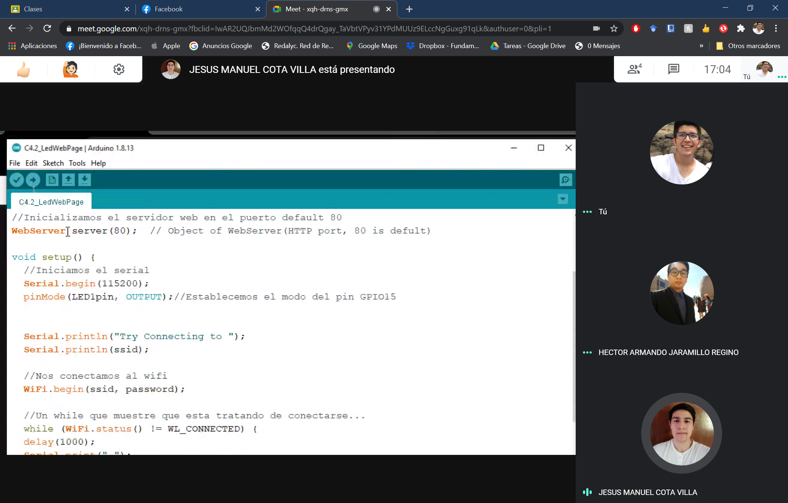

# :trophy: C4.2 Programación Microcontrolador NodeMCU ESP32

Comunicación por medio de la conexión Wi-Fi

___

## :blue_book: Instrucciones

- De acuerdo con la información presentada por el asesor referente al tema, desarrollar lo que se indica dentro del apartado siguiente.
- Toda actividad o reto se deberá realizar utilizando el estilo **MarkDown con extension .md** y el entorno de desarrollo VSCode, debiendo ser elaborado como un documento **single page**, es decir si el documento cuanta con imágenes, enlaces o cualquier documento externo debe ser accedido desde etiquetas y enlaces.
- Es requisito que el archivo .md contenga una etiqueta del enlace al repositorio de su documento en Github, por ejemplo **Enlace a mi GitHub**
- Al concluir el reto el reto se deberá subir a github el archivo .md creado.
- Desde el archivo **.md** se debe exportar un archivo **.pdf** con la nomenclatura **C4.2_NombreAlumno_Equipo.pdf**, el cual deberá subirse a classroom dentro de su apartado correspondiente, para que sirva como evidencia de su entrega; siendo esta plataforma **oficial** aquí se recibirá la calificación de su actividad por individual.
- Considerando que el archivo .pdf, fue obtenido desde archivo .md, ambos deben ser idénticos y mostrar el mismo contenido.
- Su repositorio ademas de que debe contar con un archivo **readme**.md dentro de su directorio raíz, con la información como datos del estudiante, equipo de trabajo, materia, carrera, datos del asesor, e incluso logotipo o imágenes, debe tener un apartado de contenidos o indice, los cuales realmente son ligas o **enlaces a sus documentos .md**, _evite utilizar texto_ para indicar enlaces internos o externo.
- Se propone una estructura tal como esta indicada abajo, sin embargo puede utilizarse cualquier otra que le apoye para organizar su repositorio.  


``` 
| readme.md
| | blog
| | | C4.1_TituloActividad.md
| | | C4.2_TituloActividad.md
| | | C4.3_TituloActividad.md
| | | C4.4_TituloActividad.md
| | | C4.5_TituloActividad.md
| | img
| | docs
| | | A4.1_TituloActividad.md
| | | A4.2_TituloActividad.md
```
___

## :pencil2: Desarrollo

1. Basado en el siguiente circuito, ensamblarlo, utilizando los elementos electrónicos observados.

<p align="center">
    
</p>

Fuente de consulta: [Random Nerd Tutorials]()

2. Analice y apóyese del programa que se muestra a continuación para elaborar el reto.

```C++
/*
 WiFi Web Server Simple
 */

#include <WiFi.h>
#include <WebServer.h>

const char* ssid = "<identificador>";
const char* password =  "<password>";

WebServer server(80);  // Object of WebServer(HTTP port, 80 is defult)

void setup() {
  Serial.begin(115200);
  Serial.println("Try Connecting to ");
  Serial.println(ssid);

  // Connect to your wi-fi modem
  WiFi.begin(ssid, password);

  // Check wi-fi is connected to wi-fi network
  while (WiFi.status() != WL_CONNECTED) {
  delay(1000);
  Serial.print(".");
  }
  Serial.println("");
  Serial.println("WiFi connected successfully");
  Serial.print("Got IP: ");
  Serial.println(WiFi.localIP());  //Show ESP32 IP on serial

  server.on("/", handle_root);

  server.begin();
  Serial.println("HTTP server started");
  delay(100); 
}

void loop() {
  server.handleClient();
}

// HTML & CSS contents which display on web server
String HTML = "<!DOCTYPE html>\
<html>\
<body>\
<h1>Mi Primer Servidor Web with ESP32 - Station Mode &#128522;</h1>\
</body>\
</html>";

// Handle root url (/)
void handle_root() {
  server.send(200, "text/html", HTML);
}
```

3. Pruebe y observe los resultados obtenidos explicándolos en esta sección.

4. Al programa anterior agregue las instrucciones necesarias para que se despliegue en la interface un botón que permita encender y apagar un Led tal como se muestra en la figura 1.

```C++
/*
 WiFi Web Server Simple
 */
//Llamamos las librerias para conetarnos a wifi y tener nuestro servidor
#include <WiFi.h>
#include <WebServer.h>

//Ponemos los datos para conectarnos a mi wifi
const char* ssid = "IZZI-71E4";
const char* password =  "8871B1C271E4";

//Establecemos una variable para manerja el led
int LED1pin = 15;
bool LED1status = LOW;//Podemos usar high y low

//Inicializamos el servidor web en el puerto default 80
WebServer server(80);  // Object of WebServer(HTTP port, 80 is defult)

void setup() {
  //Iniciamos el serial
  Serial.begin(115200);
  pinMode(LED1pin, OUTPUT);//Establecemos el modo del pin GPIO15

  
  Serial.println("Try Connecting to ");
  Serial.println(ssid);

  //Nos conectamos al wifi
  WiFi.begin(ssid, password);

  //Un while que muestre que esta tratando de conectarse...
  while (WiFi.status() != WL_CONNECTED) {
  delay(1000);
  Serial.print(".");
  }
  //Cuando se conecte imprimimos que se conecto y que IP tiene
  Serial.println("");
  Serial.println("WiFi connected successfully");
  Serial.print("Got IP: ");//
  Serial.println(WiFi.localIP());  //Con esto mostramos la IP en el serial

  //Establecemos que funciones vamos a iniciar cuando accese a
  server.on("/", handle_root);//root
  server.on("/led1on", handle_led1on);//A /led1on
  server.on("/led1off", handle_led1off);//A /led1off

  //Iniciamos el servidor
  server.begin();
  Serial.println("HTTP server started");
  delay(100); 
}

void loop() {
  server.handleClient();//Este es para que maneje los HTTP requests
}

//Funcion para manejar el formato del servidor
String SendHTML(uint8_t led1stat){
  // HTML de lo que se va a mostrar en el sevidor
  String HTML = "<!DOCTYPE html> ";
  HTML +="<html>\n";
  HTML +="<head>\n";
  HTML +="<title>LED Control</title>\n";
  HTML +="</head>\n";
  HTML +="<body>\n";
  HTML +="<h1>Mi Primer Servidor Web with ESP32 - Station Mode &#128522;</h1>\n";
  HTML +="<h3>Control Led</h3>\n";
    
  if(led1stat)
    {HTML +="<p>LED1 Status: ON</p><form method=\"get\" action=\"/led1off\"><button type=\"submit\">OFF</form>";}
  else
    {HTML +="<p>LED1 Status: OFF</p><form method=\"get\" action=\"/led1on\"><button type=\"submit\">ON</form>";}
  
  HTML +="</body>\n";
  HTML +="</html>\n";

  return HTML;
}

//Funcion para manera cuando se requiera apagar el led
void handle_led1off() {
  LED1status = LOW;
  Serial.println("GPIO15 Status: OFF");
  digitalWrite(LED1pin, LED1status);
  server.send(200, "text/html", SendHTML(false)); 
}

//Funcion para manera cuando se requiera encender el led
void handle_led1on() {
  LED1status = HIGH;
  Serial.println("GPIO15 Status: ON");
  digitalWrite(LED1pin, LED1status);
  server.send(200, "text/html", SendHTML(true)); 
}

//Funcion para manera cuando se accese a la pagina web
void handle_root() {
  server.send(200, "text/html", SendHTML(LED1status));
}
```

5. Inserte aquí las imágenes que considere como evidencias para demostrar el resultado obtenido.

## ***[Demostración en video del circuito](https://www.youtube.com/watch?v=GCFBDWdnoRc&feature=youtu.be&fbclid=IwAR0NdqXxEptjlh2mgV_ZLEPmZITJG8R_JrTjWjT6VDw0ABKIKO9ibyvkiJc)***

## **Monitor Serial**

<p align="center">
    
</p>

## **Circuito**

<p align="center">
    
</p>

## **Evidencia de Reunion**

<p align="center">
    
</p>

<p align="center">
    
</p>

<p align="center">
    
</p>

___

### :bomb: Rubrica

| Criterios     | Descripción                                                                                  | Puntaje |
| ------------- | -------------------------------------------------------------------------------------------- | ------- |
| Instrucciones | Se cumple con cada uno de los puntos indicados dentro del apartado Instrucciones?            | 20 |
| Desarrollo    | Se respondió a cada uno de los puntos solicitados dentro del desarrollo de la actividad?     | 80      |


### :bookmark: Ligas

**Cota Villa Edy Jesus Manuel**

**Circuito Fisico**
:school: [Repositorio](https://github.com/CotaVilla/Sistemas-Programables)
:memo: [Actividad](https://github.com/CotaVilla/Sistemas-Programables/blob/master/docs/C4.2_EdyCota_DreamTeam.md)

**Jaramillo Regino Hector Armando**

:school: [Repositorio](https://github.com/HectorJaramillo/JaramilloHector-SistemasProgramables)
:memo: [Actividad](https://github.com/HectorJaramillo/JaramilloHector-SistemasProgramables/blob/master/Blog/C4.2_HectorJaramillo_DreamTeam.md)

**Fernando Esau Melendez Palafox**

:school: [Repositorio](https://github.com/fernmelen/Sist.-Programables)
:memo: [Actividad](https://github.com/fernmelen/Sist.-Programables/blob/master/blog/C4.2_FernandoMelendez_DreamTeam.md)