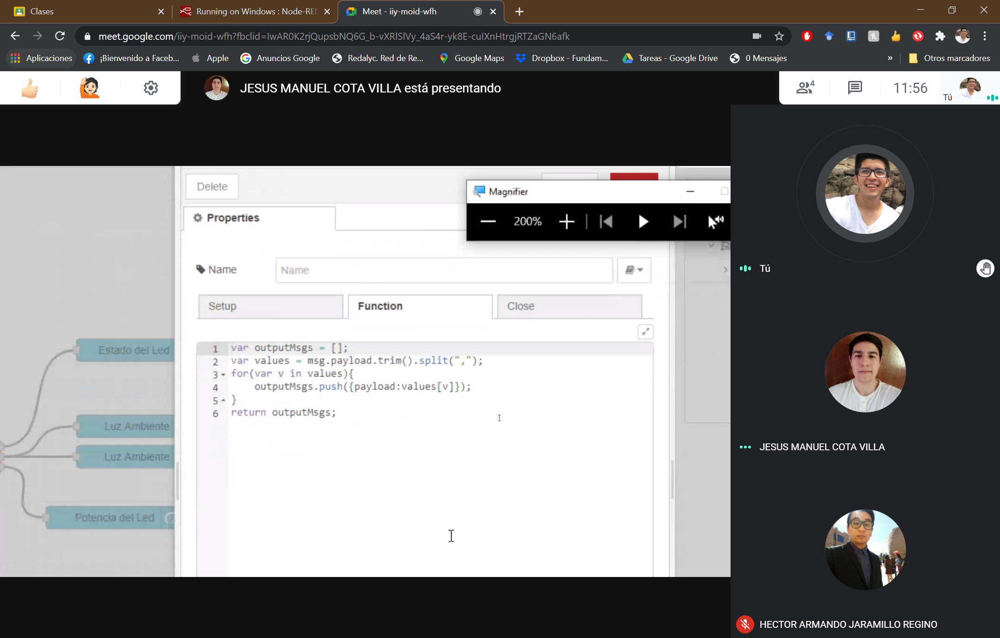

# :trophy: C5.2 Interface Node-RED y NodeMCU ESP32

Arquitectura Cliente-Servidor, utilizando interface Node-red, ESP32 y un actuador
___

## :blue_book: Instrucciones

- De acuerdo con la información presentada por el asesor referente al tema, desarrollar lo que se indica dentro del apartado siguiente.
- Toda actividad o reto se deberá realizar utilizando el estilo **MarkDown con extension .md** y el entorno de desarrollo VSCode, debiendo ser elaborado como un documento **single page**, es decir si el documento cuanta con imágenes, enlaces o cualquier documento externo debe ser accedido desde etiquetas y enlaces.
- Es requisito que el archivo .md contenga una etiqueta del enlace al repositorio de su documento en Github, por ejemplo **Enlace a mi GitHub**
- Al concluir el reto el reto se deberá subir a github el archivo .md creado.
- Desde el archivo **.md** se debe exportar un archivo **.pdf** con la nomenclatura **C5.2_NombreAlumno_Equipo.pdf**, el cual deberá subirse a classroom dentro de su apartado correspondiente, para que sirva como evidencia de su entrega; siendo esta plataforma **oficial** aquí se recibirá la calificación de su actividad por individual.
- Considerando que el archivo .pdf, fue obtenido desde archivo .md, ambos deben ser idénticos y mostrar el mismo contenido.
- Su repositorio ademas de que debe contar con un archivo **readme**.md dentro de su directorio raíz, con la información como datos del estudiante, equipo de trabajo, materia, carrera, datos del asesor, e incluso logotipo o imágenes, debe tener un apartado de contenidos o indice, los cuales realmente son ligas o **enlaces a sus documentos .md**, _evite utilizar texto_ para indicar enlaces internos o externo.
- Se propone una estructura tal como esta indicada abajo, sin embargo puede utilizarse cualquier otra que le apoye para organizar su repositorio.  


``` 
| readme.md
| | blog
| | | C5.1_TituloActividad.md
| | | C5.2_TituloActividad.md
| | img
| | docs
| | | A5.1_TituloActividad.md
| | | A5.2_TituloActividad.md
```
___

## :pencil2: Desarrollo

1. Basado en las actividades referentes a actuadores, y protocolos de comunicación realice un Dashboard utilizando la interface Node-red y el NodeMCU ESP32; el cual permitirá a un cliente a través de su dispositivo movil acceder a una dirección de un servidor Web local, y al ingresar al sitio deberá poder interactuar y visualizar el comportamiento de un actuador en tiempo real.

2. Para poder observar que la interface muestra el comportamiento del actuador deberá a este someterse a condiciones cambiantes a fin de observar esas variaciones en la interface.

## **Interfaz móvil**

<p align="center">
    
</p>

   <p align="center">
    
</p

1. Agregue el programa creado para lograr la condición solicitada.

## **Codigo para Esp32**
```C++
const int ledPin = 16;
const int luzPin = 4;

//Establecemos las propiedades de señal PWM
const int freq = 5000;// en Hz
const int ledChannel = 0;//0-15
const int resolution = 8;//0-255

void setup() {
  Serial.begin(115200);
  //Se configura la señal PWM
  ledcSetup(ledChannel, freq, resolution);
  //Asignamos la señal creada al GPIO al pin que estamos usando
  ledcAttachPin(ledPin, ledChannel);
  
  delay(100);
}

void loop() {
  int prendido = 1;
  int luz = analogRead(luzPin);
  int potencia = 255*(luz/4095.0);
  
  if (potencia <= 150){
    potencia = 0;
    prendido = 0;
  }
  
  ledcWrite(ledChannel,potencia);
  
  Serial.print(prendido);
  Serial.print(",");
  Serial.print(luz);
  Serial.print(",");
  Serial.println(potencia);
  delay(100);
}
```

## **Codigo Node Red**

```C++
var outputMsgs = [];
var values = msg.payload.trim().split(",");
for(var v in values){
	outputMsgs.push({payload:values[v]});
}
return outputMsgs;
```

3. Agregue imágenes del circuito electrónico ensamblado.
   
## **Circuito Físico**

<p align="center">
    
</p>

<p align="center">
    
</p>

1. Inserte aquí las imágenes que considere como evidencias para demostrar el resultado obtenido y las reuniones del equipo de trabajo.

## ***[Demostración en video del circuito](https://www.youtube.com/watch?v=kzOH8TrpB9I&feature=youtu.be)***

## **Evidencia de Reunion**
<p align="center">
    
</p>
<p align="center">
    
</p>
<p align="center">
    
</p>
<p align="center">
    
</p>
<p align="center">
    
</p>
<p align="center">
    
</p>
<p align="center">
    
</p>
___

### :bomb: Rubrica

| Criterios     | Descripción                                                                                  | Puntaje |
| ------------- | -------------------------------------------------------------------------------------------- | ------- |
| Instrucciones | Se cumple con cada uno de los puntos indicados dentro del apartado Instrucciones?            | 20 |
| Desarrollo    | Se respondió a cada uno de los puntos solicitados dentro del desarrollo de la actividad?     | 80      |

### :bookmark: Ligas

**Cota Villa Edy Jesus Manuel**

**Circuito Fisico**
:school: [Repositorio](https://github.com/CotaVilla/Sistemas-Programables)
:memo: [Actividad](https://github.com/CotaVilla/Sistemas-Programables/blob/master/docs/C5.2_EdyCota_DreamTeam.md)

**Jaramillo Regino Hector Armando**

:school: [Repositorio](https://github.com/HectorJaramillo/JaramilloHector-SistemasProgramables)
:memo: [Actividad](https://github.com/HectorJaramillo/JaramilloHector-SistemasProgramables/blob/master/Blog/C5.2_HectorJaramillo_DreamTeam.md)

**Fernando Esau Melendez Palafox**

:school: [Repositorio](https://github.com/fernmelen/Sist.-Programables)
:memo: [Actividad](https://github.com/fernmelen/Sist.-Programables/blob/master/blog/C5.2_FernandoMelendez_DreamTeam.md)